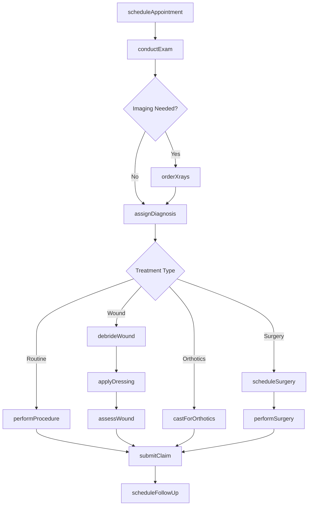
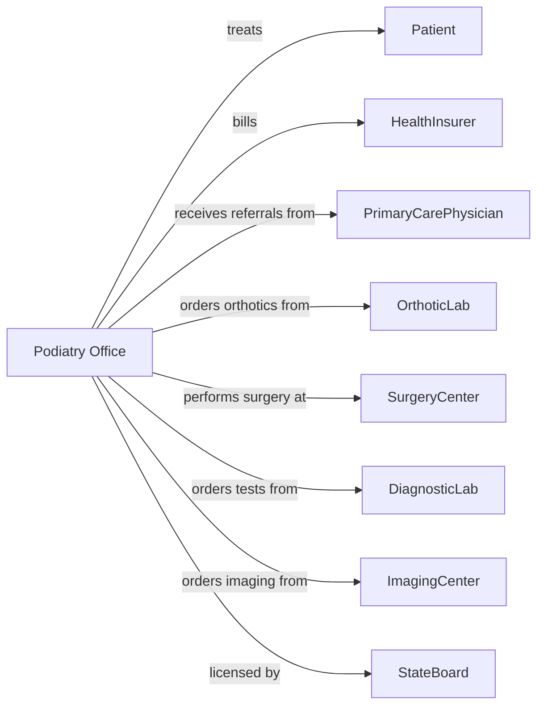

# Offices of Podiatrists

> Business-as-Code definition for podiatric practice operations. Models the complete foot care lifecycle from examination through surgical intervention and follow-up.

## Overview

Podiatric offices provide comprehensive foot and ankle care including examinations, wound care, surgical procedures, and custom orthotics. This definition exposes actions for patient assessment, treatment delivery, and diabetic foot management, with events for recall scheduling and insurance coordination.

## Actors

| Actor | Description |
|-------|-------------|
| Patient | Individual seeking foot and ankle care |
| HealthInsurer | Provides coverage and reimburses for services |
| PrimaryCarePhysician | Refers patients and coordinates diabetes management |
| OrthoticLab | Fabricates custom foot orthoses and braces |
| SurgeryCenter | Provides facility for outpatient surgical procedures |
| DiagnosticLab | Performs wound cultures and blood tests |
| ImagingCenter | Provides X-rays, MRI, and CT studies |
| WoundCareSupplier | Provides dressings and wound care products |
| StateBoard | Licenses podiatrists and regulates practice |

## Roles

| Role | Description |
|------|-------------|
| Podiatrist | Diagnoses and treats foot and ankle conditions |
| PodiatricAssistant | Assists with procedures and patient care |
| WoundCareSpecialist | Manages chronic wounds and ulcers |
| FrontDesk | Manages scheduling and patient check-in |
| Biller | Handles claims submission and authorizations |
| OfficeManager | Oversees practice operations and compliance |

## Entities

| Entity | Description |
|--------|-------------|
| Patient | Individual receiving podiatric care |
| Appointment | Scheduled podiatric visit |
| Examination | Comprehensive foot evaluation findings |
| Diagnosis | Foot condition using ICD codes |
| Procedure | Treatment performed using CPT codes |
| Wound | Documented ulcer or injury with measurements |
| Orthotic | Custom foot support device |
| Xray | Radiographic images of foot and ankle |
| Surgery | Scheduled surgical procedure |
| Claim | Insurance billing submission |
| Referral | Authorization from physician |
| CarePlan | Diabetic foot management protocol |

## Actions

| Action | Description |
|--------|-------------|
| scheduleAppointment | Book podiatric examination visit |
| conductExam | Perform comprehensive foot evaluation |
| orderXrays | Request radiographic imaging |
| assignDiagnosis | Identify condition and assign ICD codes |
| performProcedure | Execute treatment such as nail care or injection |
| debrideWound | Remove dead tissue from ulcer or wound |
| assessWound | Measure and document wound status |
| castForOrthotics | Take impression for custom foot supports |
| scheduleSurgery | Book surgical procedure |
| performSurgery | Execute surgical intervention |
| applyDressing | Apply wound care treatment |
| prescribeMedication | Write prescription for antibiotics or pain relief |
| educatePatient | Provide foot care instructions |
| submitClaim | Send billing claim to insurer |
| scheduleFollowUp | Book next appointment for ongoing care |

## Events

| Event | Description |
|-------|-------------|
| appointmentScheduled | Visit has been booked |
| examCompleted | Foot evaluation has been performed |
| xraysCompleted | Radiographic images have been captured |
| diagnosisAssigned | Condition has been identified |
| procedureCompleted | Treatment has been performed |
| woundDebrided | Dead tissue has been removed |
| woundAssessed | Ulcer status has been documented |
| orthoticcasted | Impression has been taken for custom device |
| orthoticReceived | Custom device has arrived from lab |
| surgeryScheduled | Procedure has been booked |
| surgeryCompleted | Surgical intervention has been performed |
| claimSubmitted | Billing claim has been sent |
| woundHealed | Ulcer has closed and epithelialized |
| infectionDetected | Wound infection has been identified |

## Searches

| Search | Description |
|--------|-------------|
| findPatients | List patients with filters for condition or status |
| getAppointments | Retrieve scheduled visits by date or provider |
| getActiveWounds | Find patients with open ulcers requiring care |
| getDiabeticPatients | List patients requiring foot monitoring |
| getPendingOrthotics | Find orthotic orders awaiting delivery |
| getScheduledSurgeries | Retrieve upcoming surgical procedures |
| getPendingClaims | List claims awaiting payment |
| getWoundHistory | Retrieve wound progression for patient |

## Workflow



## Actor Relationships



## Usage

### Calling Actions

```typescript
import { treatFeet } from '@headlessly/treat-feet'

const practice = treatFeet()

// Schedule diabetic foot exam
const appointment = await practice.scheduleAppointment({
  patientId: 'pat-67890',
  providerId: 'dr-miller',
  appointmentType: 'diabetic-foot-exam',
  dateTime: '2024-03-26T09:30:00',
  duration: 30
})

// Conduct exam and identify wound
await practice.conductExam({
  patientId: 'pat-67890',
  findings: {
    pulses: { dorsalisPedis: 'diminished', posteriorTibial: 'present' },
    sensation: { monofilament: 'absent-forefoot' },
    deformity: 'hammertoe-2nd',
    skin: 'callus-5th-metatarsal'
  }
})

// Document and treat wound
await practice.assessWound({
  patientId: 'pat-67890',
  location: 'plantar-5th-metatarsal',
  length: 2.5,
  width: 1.8,
  depth: 0.5,
  woundBed: '80% granulation, 20% slough',
  exudate: 'moderate-serous',
  periwound: 'macerated'
})

await practice.debrideWound({
  patientId: 'pat-67890',
  method: 'sharp',
  tissueRemoved: 'slough and callus',
  bleeding: 'minimal'
})

await practice.applyDressing({
  patientId: 'pat-67890',
  primaryDressing: 'hydrogel',
  secondaryDressing: 'foam',
  offloading: 'post-op shoe'
})
```

### Event-Driven Automation

```typescript
// Schedule frequent follow-up for active wounds
practice.woundAssessed(async ({ patientId, woundStatus }) => {
  const frequency = woundStatus.infected ? 'twice-weekly' : 'weekly'

  await practice.scheduleFollowUp({
    patientId,
    appointmentType: 'wound-care',
    frequency
  })
})

// Alert for infection detection
practice.infectionDetected(async ({ patientId, woundId }) => {
  await practice.prescribeMedication({
    patientId,
    medication: 'Augmentin',
    dosage: '875mg',
    frequency: 'BID',
    duration: 14
  })

  await practice.orderCulture({
    patientId,
    woundId,
    type: 'aerobic-anaerobic'
  })
})

// Notify when custom orthotics arrive
practice.orthoticReceived(async ({ patientId, deviceType }) => {
  await practice.notifyPatient({
    patientId,
    message: `Your custom ${deviceType} are ready for fitting`,
    method: 'phone'
  })

  await practice.scheduleAppointment({
    patientId,
    appointmentType: 'orthotic-delivery',
    duration: 20
  })
})
```
