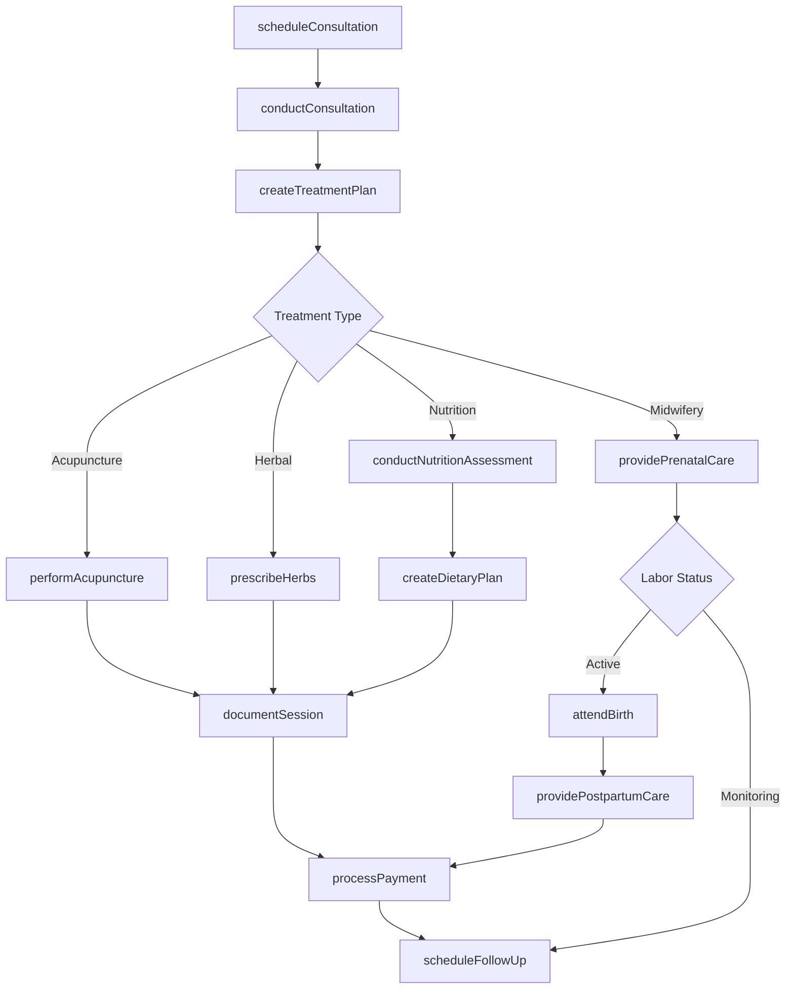
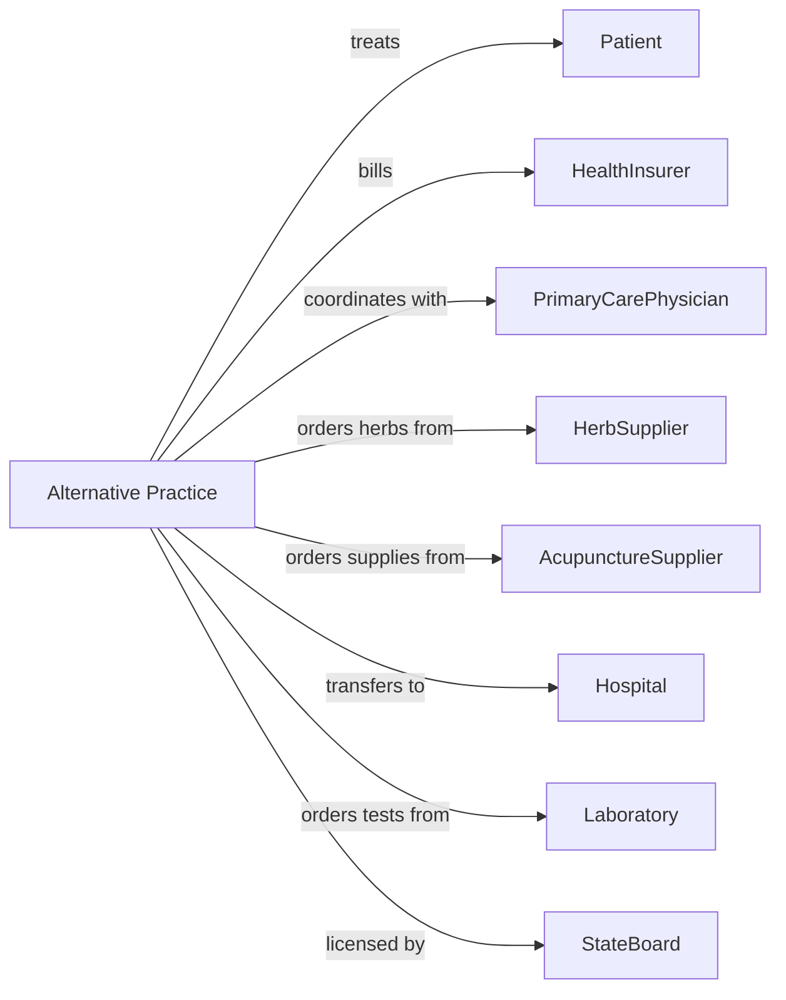

# Offices of All Other Miscellaneous Health Practitioners

> Business-as-Code definition for alternative and complementary health practice operations. Models the complete care lifecycle from consultation through treatment and wellness maintenance.

## Overview

Miscellaneous health practitioner offices provide alternative and complementary therapies including acupuncture, naturopathy, homeopathy, midwifery, and nutrition counseling. This definition exposes actions for patient assessment, treatment delivery, and wellness planning, with events for appointment scheduling and payment processing.

## Actors

| Actor | Description |
|-------|-------------|
| Patient | Individual seeking alternative or complementary care |
| HealthInsurer | Provides coverage for select alternative therapies |
| PrimaryCarePhysician | Refers patients and coordinates conventional care |
| HerbSupplier | Provides herbal medicines and supplements |
| AcupunctureSupplier | Provides needles, moxa, and treatment supplies |
| Hospital | Provides facility for births and emergencies |
| Laboratory | Performs functional and diagnostic testing |
| MidwiferyBoard | Licenses midwives and regulates practice |
| StateBoard | Licenses practitioners and regulates practice |

## Roles

| Role | Description |
|------|-------------|
| Acupuncturist | Provides Traditional Chinese Medicine treatments |
| Naturopath | Treats using natural therapies and nutrition |
| Midwife | Provides prenatal, birth, and postpartum care |
| NutritionCounselor | Provides dietary assessment and meal planning |
| Homeopath | Prescribes homeopathic remedies |
| Hypnotherapist | Provides therapeutic hypnosis sessions |
| FrontDesk | Manages scheduling and patient coordination |
| PracticeOwner | Oversees business operations and compliance |

## Entities

| Entity | Description |
|--------|-------------|
| Patient | Individual receiving complementary care |
| Appointment | Scheduled treatment session |
| Consultation | Initial assessment and health history |
| TreatmentPlan | Documented care protocol and recommendations |
| Session | Documented treatment visit |
| Prescription | Herbal or homeopathic remedy recommendation |
| BirthPlan | Documented preferences for labor and delivery |
| DietaryPlan | Nutrition recommendations and meal guidance |
| LabResult | Functional medicine test results |
| Claim | Insurance billing submission |
| Consent | Patient authorization for treatment |
| WellnessGoal | Health objective with timeline |

## Actions

| Action | Description |
|--------|-------------|
| scheduleConsultation | Book initial assessment appointment |
| conductConsultation | Perform comprehensive health history and evaluation |
| createTreatmentPlan | Develop care protocol with recommendations |
| performAcupuncture | Deliver Traditional Chinese Medicine treatment |
| prescribeHerbs | Recommend herbal formulas or supplements |
| conductNutritionAssessment | Evaluate dietary habits and nutritional status |
| createDietaryPlan | Develop meal plan and nutrition recommendations |
| performHypnotherapy | Conduct therapeutic hypnosis session |
| providePrenatalCare | Deliver pregnancy monitoring and education |
| attendBirth | Provide labor support and delivery services |
| providePostpartumCare | Deliver newborn and maternal follow-up care |
| orderLabWork | Request functional medicine testing |
| documentSession | Record treatment notes and observations |
| processPayment | Collect fees for services rendered |
| scheduleFollowUp | Book next treatment appointment |

## Events

| Event | Description |
|-------|-------------|
| consultationScheduled | Initial assessment has been booked |
| consultationCompleted | Health evaluation has been performed |
| treatmentPlanCreated | Care protocol has been documented |
| sessionCompleted | Treatment has been delivered |
| herbsPrescribed | Herbal formula has been recommended |
| dietaryPlanCreated | Nutrition recommendations have been provided |
| labResultsReceived | Test results are available |
| prenatalVisitCompleted | Pregnancy checkup has been performed |
| laborBegan | Patient has entered active labor |
| birthCompleted | Baby has been delivered |
| postpartumVisitCompleted | Follow-up care has been provided |
| paymentReceived | Fees have been collected |
| wellnessGoalMet | Health objective has been achieved |

## Searches

| Search | Description |
|--------|-------------|
| findPatients | List patients with filters for condition or practitioner |
| getAppointments | Retrieve scheduled sessions by date or provider |
| getActiveTreatmentPlans | Find patients with ongoing care |
| getPrenatalPatients | List pregnant patients requiring monitoring |
| getUpcomingDueDates | Find patients nearing expected delivery |
| getLabResults | Retrieve test results for patient |
| getPaymentHistory | Find payment records for patient |
| getSupplementInventory | Retrieve stock levels for dispensary |

## Workflow



## Actor Relationships



## Usage

### Calling Actions

```typescript
import { treatPatients } from '@headlessly/treat-patients'

const practice = treatPatients()

// Schedule acupuncture consultation
const consultation = await practice.scheduleConsultation({
  patientId: 'pat-78901',
  practitionerId: 'ap-chen',
  practiceType: 'acupuncture',
  dateTime: '2024-03-27T15:00:00',
  duration: 90
})

// Conduct TCM consultation
await practice.conductConsultation({
  patientId: 'pat-78901',
  chiefComplaint: 'Chronic low back pain',
  tcmAssessment: {
    tongue: 'pale, thin white coat',
    pulse: 'deep, weak',
    pattern: 'Kidney Yang deficiency'
  },
  westernDiagnosis: 'Chronic lumbar strain'
})

// Create treatment plan with acupuncture and herbs
await practice.createTreatmentPlan({
  patientId: 'pat-78901',
  modalities: ['acupuncture', 'herbal-medicine', 'moxibustion'],
  frequency: 'weekly for 6 weeks',
  goals: ['Reduce pain to 3/10', 'Improve energy levels']
})

await practice.performAcupuncture({
  patientId: 'pat-78901',
  points: ['BL23', 'BL40', 'KI3', 'GV4', 'ST36'],
  technique: 'tonification',
  needleRetention: 25,
  adjunctTherapies: ['moxa-BL23', 'cupping-lower-back']
})

await practice.prescribeHerbs({
  patientId: 'pat-78901',
  formula: 'Jin Gui Shen Qi Wan',
  dosage: '8 pills',
  frequency: 'TID',
  duration: '2 weeks'
})
```

### Event-Driven Automation

```typescript
// Schedule prenatal visits based on gestational age
practice.prenatalVisitCompleted(async ({ patientId, gestationalAge }) => {
  let nextVisit
  if (gestationalAge < 28) {
    nextVisit = '4 weeks'
  } else if (gestationalAge < 36) {
    nextVisit = '2 weeks'
  } else {
    nextVisit = '1 week'
  }

  await practice.scheduleFollowUp({
    patientId,
    appointmentType: 'prenatal',
    interval: nextVisit
  })
})

// Alert for labor onset
practice.laborBegan(async ({ patientId, laborStatus }) => {
  const patient = await practice.findPatients({ id: patientId })

  await practice.notifyPractitioner({
    practitionerId: patient.primaryMidwife,
    urgency: 'immediate',
    message: `Labor active: ${patient.name}, contractions ${laborStatus.frequency}`
  })
})

// Process payment after session
practice.sessionCompleted(async ({ patientId, services }) => {
  const fees = calculateFees(services)

  await practice.processPayment({
    patientId,
    amount: fees.total,
    services
  })
})
```
