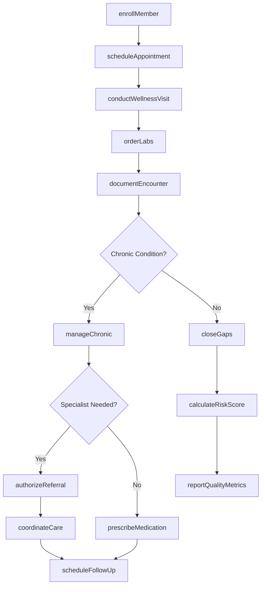
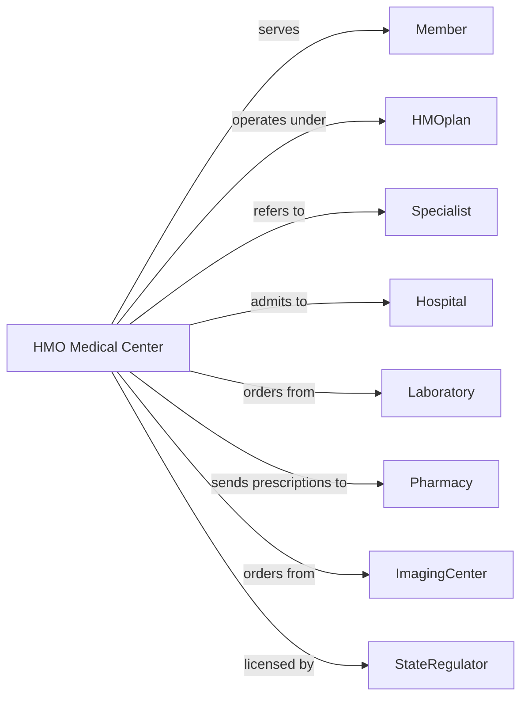

# HMO Medical Centers

> Business-as-Code definition for HMO medical center operations. Models the complete member care lifecycle from enrollment through ongoing primary and preventive care.

## Overview

HMO medical centers provide comprehensive outpatient services to health maintenance organization members, emphasizing primary care, preventive services, and care coordination. This definition exposes actions for member management, clinical care delivery, and utilization oversight, with events for quality metrics and population health monitoring.

## Actors

| Actor | Description |
|-------|-------------|
| Member | Individual enrolled in the HMO health plan |
| HMOplan | Parent organization providing insurance coverage |
| Specialist | Provides referral consultations outside primary care |
| Hospital | Provides inpatient and emergency services |
| Laboratory | Performs diagnostic testing for members |
| Pharmacy | Fills prescriptions under formulary guidelines |
| ImagingCenter | Provides diagnostic imaging services |
| UrgentCare | Provides after-hours and non-emergency care |
| StateRegulator | Oversees HMO licensure and compliance |

## Roles

| Role | Description |
|------|-------------|
| PrimaryCarePhysician | Serves as member's main provider and care coordinator |
| NursePractitioner | Provides clinical care and manages chronic conditions |
| MedicalAssistant | Assists with clinical tasks and patient preparation |
| CareCoordinator | Manages referrals and coordinates specialty care |
| QualityAnalyst | Monitors metrics and improves care outcomes |
| MemberServices | Handles enrollment, questions, and complaints |
| UtilizationReviewer | Evaluates referral and service appropriateness |

## Entities

| Entity | Description |
|--------|-------------|
| Member | Individual enrolled in HMO receiving care |
| Enrollment | Member plan registration with coverage details |
| Appointment | Scheduled medical visit |
| Encounter | Documented clinical visit with services |
| Referral | Authorization for specialist consultation |
| Prescription | Medication order under formulary |
| LabOrder | Diagnostic test request |
| CarePlan | Chronic disease management protocol |
| QualityMeasure | HEDIS or other performance metric |
| Authorization | Approval for services outside center |
| Capitation | Per-member-per-month payment record |
| RiskScore | Member health status and cost prediction |

## Actions

| Action | Description |
|--------|-------------|
| enrollMember | Register new member with PCP assignment |
| scheduleAppointment | Book visit for member with provider |
| conductWellnessVisit | Perform preventive care examination |
| manageChronic | Deliver ongoing care for chronic conditions |
| orderLabs | Request diagnostic testing |
| prescribeMedication | Write prescription per formulary |
| authorizeReferral | Approve specialist consultation |
| coordinateCare | Manage transitions and specialist follow-up |
| documentEncounter | Record visit notes and diagnoses |
| closeGaps | Address overdue preventive care measures |
| calculateRiskScore | Assess member health status for care planning |
| reviewUtilization | Evaluate service appropriateness and cost |
| reportQualityMetrics | Submit HEDIS and performance data |
| handleGrievance | Process member complaints and appeals |
| reconcileCapitation | Process monthly per-member payments |

## Events

| Event | Description |
|-------|-------------|
| memberEnrolled | New member has been registered |
| memberDisenrolled | Member has left the plan |
| appointmentScheduled | Visit has been booked |
| wellnessVisitCompleted | Preventive exam has been performed |
| chronicVisitCompleted | Disease management visit has occurred |
| labsOrdered | Diagnostic tests have been requested |
| labResultsReceived | Test results are available |
| referralAuthorized | Specialist visit has been approved |
| referralDenied | Specialist request has been declined |
| prescriptionFilled | Medication has been dispensed |
| careGapIdentified | Overdue preventive measure detected |
| careGapClosed | Preventive measure has been completed |
| qualityTargetMet | Performance goal has been achieved |
| grievanceFiled | Member complaint has been submitted |

## Searches

| Search | Description |
|--------|-------------|
| findMembers | List members with filters for PCP or condition |
| getAppointments | Retrieve scheduled visits by date or provider |
| getCareGaps | Find members with overdue preventive care |
| getHighRiskMembers | List members with elevated risk scores |
| getPendingReferrals | Find referrals awaiting authorization |
| getChronicPatients | List members with chronic conditions |
| getQualityMetrics | Retrieve HEDIS performance scores |
| getUtilizationReport | Get service usage and cost data |

## Workflow



## Actor Relationships



## Usage

### Calling Actions

```typescript
import { treatMembers } from '@headlessly/treat-members'

const center = treatMembers()

// Enroll new member with PCP assignment
const member = await center.enrollMember({
  memberId: 'HMO-456789',
  planType: 'gold',
  effectiveDate: '2024-04-01',
  assignedPCP: 'dr-patel',
  demographics: {
    name: 'John Smith',
    dob: '1975-06-15',
    address: '123 Main St'
  }
})

// Conduct annual wellness visit
const wellness = await center.conductWellnessVisit({
  memberId: 'HMO-456789',
  providerId: 'dr-patel',
  examFindings: {
    vitals: { bp: '128/82', bmi: 27.5 },
    screening: { depression: 'negative', alcohol: 'low-risk' }
  },
  preventiveCare: ['flu-vaccine', 'colonoscopy-referral'],
  healthEducation: ['diet', 'exercise']
})

// Order labs and close care gaps
await center.orderLabs({
  memberId: 'HMO-456789',
  tests: ['lipid-panel', 'A1C', 'CBC'],
  indication: 'annual-screening'
})

await center.closeGaps({
  memberId: 'HMO-456789',
  measures: ['breast-cancer-screening', 'colorectal-screening'],
  actions: ['mammogram-ordered', 'colonoscopy-referred']
})

// Manage diabetes chronic care
await center.manageChronic({
  memberId: 'HMO-456789',
  condition: 'type-2-diabetes',
  intervention: {
    A1C: 7.2,
    medicationReview: 'compliant',
    footExam: 'completed',
    eyeExamReferral: 'ordered'
  }
})
```

### Event-Driven Automation

```typescript
// Alert for high-risk members
center.memberEnrolled(async ({ memberId }) => {
  const riskScore = await center.calculateRiskScore({ memberId })

  if (riskScore.level === 'high') {
    await center.assignCareCoordinator({
      memberId,
      program: 'complex-care-management',
      outreach: 'immediate'
    })
  }
})

// Close care gaps automatically
center.careGapIdentified(async ({ memberId, measure }) => {
  await center.sendReminder({
    memberId,
    type: 'care-gap',
    measure,
    message: `You are due for: ${measure}`
  })

  await center.scheduleAppointment({
    memberId,
    visitType: 'preventive',
    reason: measure
  })
})

// Track quality performance
center.qualityTargetMet(async ({ measure, rate }) => {
  await center.reportQualityMetrics({
    measure,
    rate,
    reportingPeriod: 'current-year',
    status: 'goal-achieved'
  })
})
```
