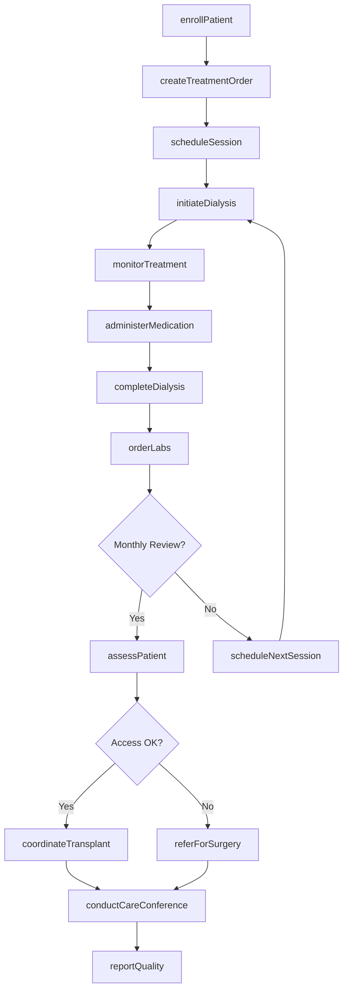
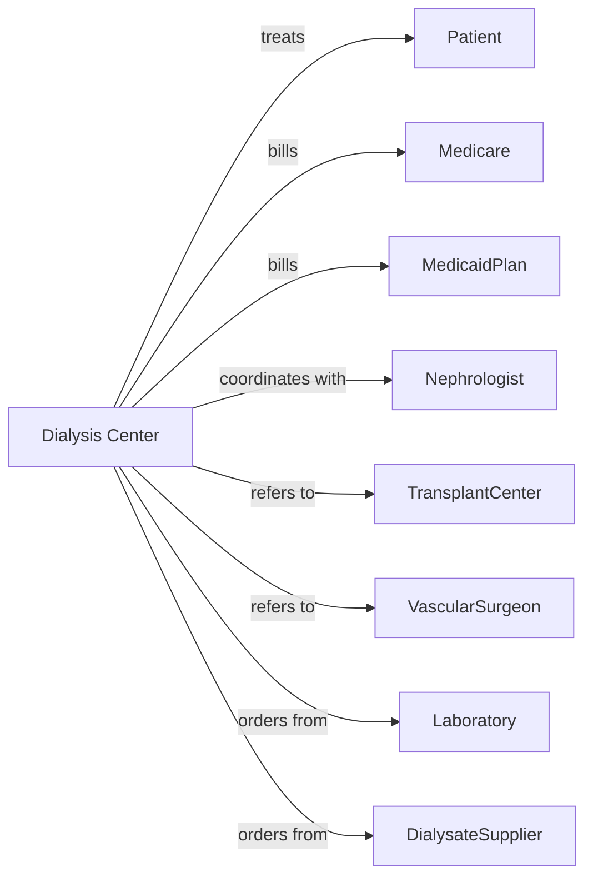

# Kidney Dialysis Centers

> Business-as-Code definition for dialysis center operations. Models the complete renal care lifecycle from patient onboarding through ongoing dialysis treatment and transplant coordination.

## Overview

Kidney dialysis centers provide life-sustaining outpatient hemodialysis and peritoneal dialysis services for patients with end-stage renal disease. This definition exposes actions for patient scheduling, treatment delivery, and quality monitoring, with events for clinical alerts and care coordination.

## Actors

| Actor | Description |
|-------|-------------|
| Patient | Individual receiving dialysis treatment |
| Medicare | Primary payer for most ESRD patients |
| MedicaidPlan | Secondary coverage for eligible patients |
| Nephrologist | Prescribes dialysis and manages renal care |
| TransplantCenter | Evaluates and lists patients for kidney transplant |
| VascularSurgeon | Creates and maintains dialysis access |
| Laboratory | Performs monthly and routine lab monitoring |
| DialysateSupplier | Provides dialysis solutions and consumables |
| CMSsurveyor | Inspects facility and enforces regulations |

## Roles

| Role | Description |
|------|-------------|
| MedicalDirector | Oversees clinical operations and quality |
| Nephrologist | Manages patient prescriptions and care plans |
| DialysisNurse | Administers treatments and monitors patients |
| PatientCareTechnician | Assists with treatment setup and monitoring |
| Dietitian | Provides nutrition counseling for renal patients |
| SocialWorker | Addresses psychosocial needs and care coordination |
| BiomedicalTechnician | Maintains dialysis machines and water systems |

## Entities

| Entity | Description |
|--------|-------------|
| Patient | Individual receiving dialysis services |
| TreatmentOrder | Nephrologist prescription for dialysis parameters |
| Session | Individual dialysis treatment record |
| Access | Vascular access site (fistula, graft, or catheter) |
| Machine | Dialysis equipment assigned to patient |
| LabResult | Monthly and treatment-related lab values |
| FluidRemoval | Ultrafiltration goal and actual removal |
| Medication | Dialysis-related drugs administered during treatment |
| Assessment | Monthly or quarterly patient evaluation |
| QualityMetric | CMS quality measures and outcomes |
| TransplantStatus | Waitlist and evaluation status |
| CareConference | Interdisciplinary team meeting record |

## Actions

| Action | Description |
|--------|-------------|
| enrollPatient | Register new patient and establish care plan |
| createTreatmentOrder | Set dialysis prescription parameters |
| scheduleSession | Book treatment slots for patient |
| initiateDialysis | Start treatment and record vital signs |
| monitorTreatment | Track vitals and parameters during session |
| administerMedication | Give EPO, iron, or other drugs during treatment |
| completeDialysis | End treatment and document outcomes |
| orderLabs | Request monthly or routine lab work |
| assessPatient | Conduct monthly care plan review |
| evaluateAccess | Check vascular access function and patency |
| referForSurgery | Send patient for access creation or repair |
| coordinateTransplant | Manage waitlist status and evaluation |
| conductCareConference | Hold interdisciplinary team meeting |
| reportQuality | Submit CMS quality measures |
| billMedicare | Submit bundled ESRD payment claim |

## Events

| Event | Description |
|-------|-------------|
| patientEnrolled | New patient has been registered |
| treatmentOrderCreated | Dialysis prescription has been set |
| sessionScheduled | Treatment slot has been booked |
| dialysisStarted | Treatment has been initiated |
| dialysisCompleted | Treatment has been finished |
| medicationAdministered | Drug has been given during treatment |
| labResultsReceived | Lab values are available |
| accessIssueDetected | Vascular access problem identified |
| hospitalizationOccurred | Patient has been admitted to hospital |
| transplantListingUpdated | Waitlist status has changed |
| careConferenceHeld | Team meeting has been conducted |
| qualityTargetMissed | Performance measure not achieved |
| patientDeceased | Patient has died |
| patientTransferred | Patient moved to another facility |

## Searches

| Search | Description |
|--------|-------------|
| findPatients | List patients with filters for shift or status |
| getSchedule | Retrieve treatment schedule by day and shift |
| getLabResults | Find lab values for patient |
| getAccessIssues | List patients with vascular access problems |
| getHospitalizations | Find recent inpatient admissions |
| getTransplantCandidates | List patients on or eligible for waitlist |
| getQualityMetrics | Retrieve CMS performance scores |
| getMissedTreatments | Find patients with treatment no-shows |

## Workflow



## Actor Relationships



## Usage

### Calling Actions

```typescript
import { treatKidneys } from '@headlessly/treat-kidneys'

const center = treatKidneys()

// Enroll new ESRD patient
const patient = await center.enrollPatient({
  patientId: 'DIA-123456',
  diagnosis: 'N18.6',
  startDate: '2024-04-01',
  shift: 'MWF-AM',
  access: {
    type: 'AV-fistula',
    location: 'left-forearm',
    creationDate: '2024-02-15'
  },
  nephrologist: 'dr-renal'
})

// Create dialysis prescription
await center.createTreatmentOrder({
  patientId: 'DIA-123456',
  modality: 'hemodialysis',
  frequency: '3x/week',
  duration: 240,
  bloodFlowRate: 400,
  dialysateFlowRate: 600,
  dryWeight: 75.0,
  potassiumBath: 2.0,
  anticoagulation: 'heparin-2000-units'
})

// Document treatment session
await center.initiateDialysis({
  patientId: 'DIA-123456',
  sessionDate: '2024-04-01',
  machine: 'HD-Station-5',
  preWeight: 77.5,
  preVitals: { bp: '148/88', pulse: 78 },
  accessSite: 'AV-fistula-left'
})

await center.completeDialysis({
  patientId: 'DIA-123456',
  sessionDate: '2024-04-01',
  postWeight: 75.2,
  postVitals: { bp: '132/78', pulse: 82 },
  fluidRemoved: 2.3,
  ktV: 1.45,
  complications: 'none'
})
```

### Event-Driven Automation

```typescript
// Alert for access issues
center.accessIssueDetected(async ({ patientId, issue }) => {
  if (issue.severity === 'critical') {
    await center.referForSurgery({
      patientId,
      reason: issue.description,
      urgency: 'urgent'
    })
  }

  await center.notifyNephrologist({
    patientId,
    alert: `Access issue: ${issue.description}`
  })
})

// Track hospitalizations
center.hospitalizationOccurred(async ({ patientId, admitDate }) => {
  await center.updateSchedule({
    patientId,
    status: 'hospitalized',
    holdTreatments: true
  })

  await center.coordinateCare({
    patientId,
    facility: 'hospital',
    action: 'request-discharge-summary'
  })
})

// Monitor quality metrics
center.dialysisCompleted(async ({ patientId, ktV }) => {
  if (ktV < 1.2) {
    await center.flagForReview({
      patientId,
      metric: 'inadequate-dialysis',
      value: ktV,
      action: 'review-prescription'
    })
  }
})
```
