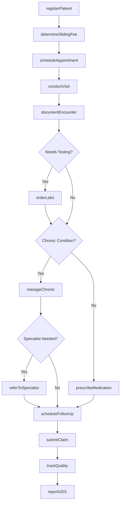
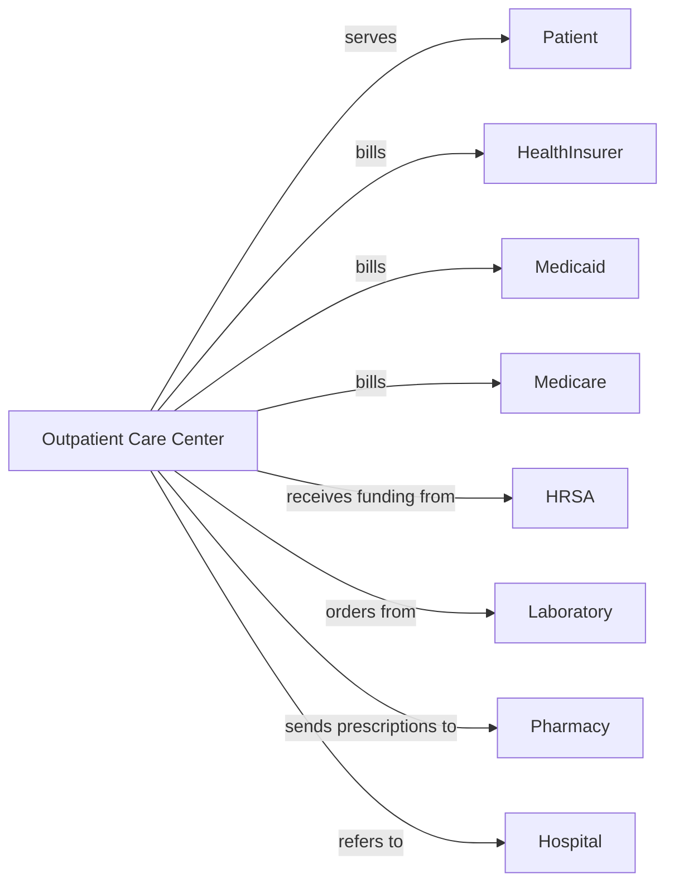

# All Other Outpatient Care Centers

> Business-as-Code definition for specialized outpatient care center operations. Models the complete patient care lifecycle for community health centers, sleep disorder clinics, and multi-specialty outpatient facilities.

## Overview

Other outpatient care centers provide specialized ambulatory services including federally qualified health centers, sleep disorder clinics, pain management centers, and multi-specialty clinics. This definition exposes actions for patient care delivery, sliding fee management, and quality reporting, with events for care coordination and population health.

## Actors

| Actor | Description |
|-------|-------------|
| Patient | Individual seeking outpatient care services |
| HealthInsurer | Provides coverage for outpatient services |
| Medicaid | Covers eligible low-income patients |
| Medicare | Covers eligible elderly and disabled patients |
| HRSA | Provides funding and oversight for FQHCs |
| Laboratory | Performs diagnostic testing |
| Pharmacy | Fills prescriptions including 340B drugs |
| Hospital | Receives referrals for inpatient care |
| StateHealthDepartment | Licenses facility and provides oversight |

## Roles

| Role | Description |
|------|-------------|
| MedicalDirector | Oversees clinical operations and quality |
| Physician | Provides medical diagnosis and treatment |
| NursePractitioner | Delivers primary and specialty care |
| MedicalAssistant | Assists with clinical procedures |
| CaseManager | Coordinates care and connects to resources |
| SlidingFeeCoordinator | Manages income-based fee determinations |
| QualityCoordinator | Tracks UDS and quality measures |
| OutreachWorker | Conducts community health education |

## Entities

| Entity | Description |
|--------|-------------|
| Patient | Individual receiving outpatient services |
| Appointment | Scheduled clinical visit |
| Encounter | Documented patient visit |
| SlidingFeeDiscount | Income-based fee reduction |
| Referral | Authorization for specialty care |
| Prescription | Medication order including 340B eligible |
| LabOrder | Diagnostic test request |
| QualityMeasure | UDS or HEDIS performance metric |
| Grant | Federal or state funding award |
| CarePlan | Chronic disease management protocol |
| Outreach | Community health activity record |
| Claim | Insurance billing submission |

## Actions

| Action | Description |
|--------|-------------|
| registerPatient | Enroll new patient and collect demographics |
| determineSlidingFee | Calculate income-based discount level |
| scheduleAppointment | Book clinical visit |
| conductVisit | Perform medical examination and treatment |
| orderLabs | Request diagnostic testing |
| prescribeMedication | Write prescription including 340B drugs |
| referToSpecialist | Send patient for specialty consultation |
| manageChronic | Deliver ongoing disease management |
| conductOutreach | Perform community health education |
| documentEncounter | Record visit notes and diagnoses |
| submitClaim | Send billing to payer |
| reportUDS | Submit Uniform Data System measures |
| applyForGrant | Request federal or state funding |
| trackQuality | Monitor clinical performance measures |
| conductCommunityNeeds | Assess local health priorities |

## Events

| Event | Description |
|-------|-------------|
| patientRegistered | New patient has been enrolled |
| slidingFeeAssigned | Discount level has been determined |
| appointmentScheduled | Visit has been booked |
| visitCompleted | Clinical encounter has been performed |
| labsOrdered | Diagnostic tests have been requested |
| labResultsReceived | Test results are available |
| prescriptionSent | Medication order transmitted |
| referralCreated | Specialty consultation authorized |
| chronicCareDelivered | Disease management visit completed |
| outreachCompleted | Community activity performed |
| claimSubmitted | Billing sent to payer |
| UDSreported | Annual data submission completed |
| grantAwarded | Funding has been received |
| qualityTargetMet | Performance goal achieved |

## Searches

| Search | Description |
|--------|-------------|
| findPatients | List patients with filters for payer or condition |
| getAppointments | Retrieve scheduled visits by date or provider |
| getSlidingFeePatients | Find patients with income-based discounts |
| getChronicPatients | List patients with ongoing disease management |
| getPendingReferrals | Find referrals awaiting completion |
| getQualityMetrics | Retrieve UDS and performance scores |
| getGrantStatus | Find active grants and funding |
| getUninsuredPatients | List self-pay and sliding fee patients |

## Workflow



## Actor Relationships



## Usage

### Calling Actions

```typescript
import { treatOutpatients } from '@headlessly/treat-outpatients'

const center = treatOutpatients()

// Register new patient with sliding fee
const patient = await center.registerPatient({
  patientId: 'OPC-567890',
  demographics: {
    name: 'Maria Garcia',
    dob: '1985-03-22',
    address: '456 Oak Street',
    language: 'Spanish'
  },
  insurance: 'uninsured',
  householdSize: 4,
  annualIncome: 32000
})

// Determine sliding fee discount
const discount = await center.determineSlidingFee({
  patientId: 'OPC-567890',
  federalPovertyLevel: 138,
  discountLevel: 'B',
  effectiveDate: '2024-04-01'
})

// Conduct comprehensive visit
await center.conductVisit({
  patientId: 'OPC-567890',
  visitType: 'comprehensive',
  chiefComplaint: 'Diabetes management',
  findings: {
    vitals: { bp: '138/88', weight: 185, bmi: 28.5 },
    A1C: 8.2,
    footExam: 'monofilament-normal'
  },
  diagnoses: ['E11.9', 'I10'],
  medications: ['Metformin-1000-BID', 'Lisinopril-10-daily']
})

// Prescribe 340B medication
await center.prescribeMedication({
  patientId: 'OPC-567890',
  medication: 'Metformin',
  dosage: '1000mg',
  frequency: 'BID',
  program340B: true,
  pharmacy: 'in-house-pharmacy'
})

// Track quality measures
await center.trackQuality({
  patientId: 'OPC-567890',
  measures: [
    { name: 'diabetes-A1C-control', value: 8.2, target: '<9' },
    { name: 'hypertension-control', value: '138/88', target: '<140/90' }
  ]
})
```

### Event-Driven Automation

```typescript
// Auto-assign sliding fee for new uninsured patients
center.patientRegistered(async ({ patientId, insurance }) => {
  if (insurance === 'uninsured') {
    await center.scheduleSlidingFeeAssessment({
      patientId,
      priority: 'high',
      documentation: ['income-verification', 'household-size']
    })
  }
})

// Coordinate chronic care
center.chronicCareDelivered(async ({ patientId, condition, metrics }) => {
  if (condition === 'diabetes' && metrics.A1C > 9) {
    await center.intensifyManagement({
      patientId,
      program: 'diabetes-intensive',
      frequency: 'monthly',
      education: ['nutrition', 'glucose-monitoring']
    })
  }
})

// Report UDS annually
center.qualityTargetMet(async ({ measure, rate }) => {
  await center.updateUDSdata({
    measure,
    rate,
    reportingYear: new Date().getFullYear()
  })
})
```
