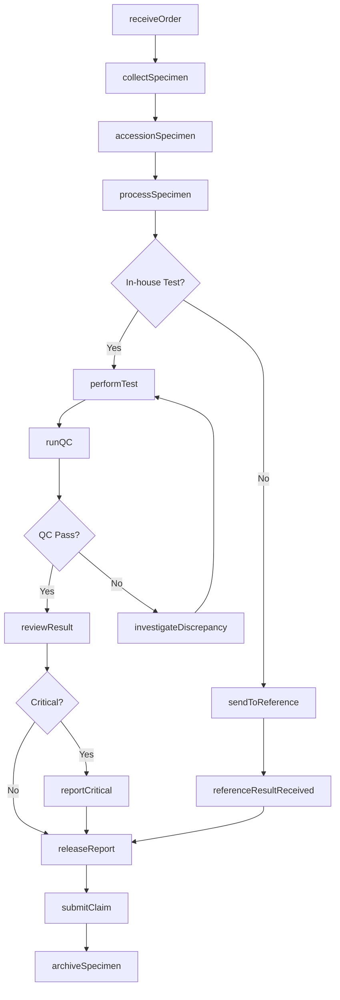
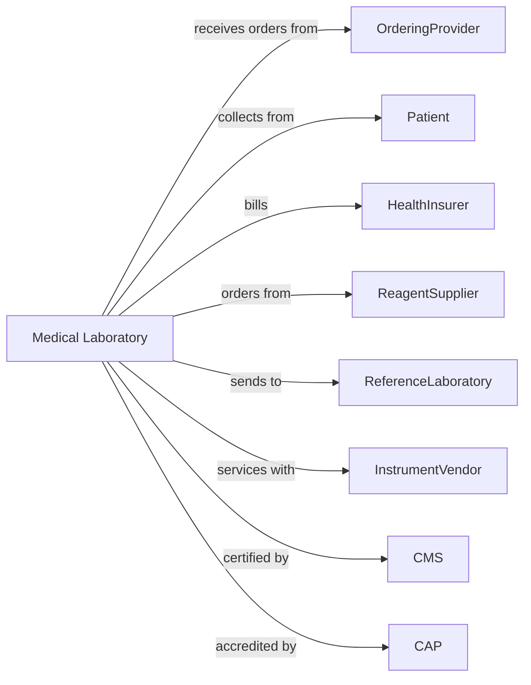

# Medical Laboratories

> Business-as-Code definition for clinical laboratory operations. Models the complete specimen processing lifecycle from collection through result reporting and quality assurance.

## Overview

Medical laboratories provide diagnostic testing services including blood analysis, microbiology, pathology, and molecular diagnostics. This definition exposes actions for specimen management, test processing, and result delivery, with events for quality control and regulatory compliance.

## Actors

| Actor | Description |
|-------|-------------|
| OrderingProvider | Physician or practitioner requesting tests |
| Patient | Individual providing specimens for testing |
| HealthInsurer | Provides coverage for laboratory services |
| ReagentSupplier | Provides testing chemicals and consumables |
| ReferenceLabratory | Performs send-out testing for specialized assays |
| InstrumentVendor | Provides and services analytical equipment |
| CMS | Oversees CLIA certification and compliance |
| StateHealthDepartment | Licenses laboratory and conducts inspections |
| CAP | Provides accreditation and proficiency testing |

## Roles

| Role | Description |
|------|-------------|
| LaboratoryDirector | Oversees operations and maintains CLIA certification |
| Pathologist | Interprets results and provides clinical consultation |
| MedicalTechnologist | Performs testing and validates results |
| Phlebotomist | Collects blood and other specimens |
| LabAssistant | Processes specimens and manages workflow |
| QualityManager | Maintains quality control and accreditation |
| LaboratoryInformationSpecialist | Manages LIS and interfaces |
| BillingSpecialist | Handles claims and reimbursement |

## Entities

| Entity | Description |
|--------|-------------|
| Order | Test requisition from ordering provider |
| Specimen | Collected sample with unique identifier |
| Test | Individual assay or panel to be performed |
| Result | Analytical value with reference ranges |
| Report | Finalized results document for provider |
| QCmaterial | Control sample for quality verification |
| Instrument | Analytical equipment performing tests |
| Reagent | Chemical used in testing with lot tracking |
| Accession | Laboratory tracking number for specimen |
| CriticalValue | Result requiring immediate notification |
| ProficiencyTest | External quality assessment sample |
| Claim | Insurance billing submission |

## Actions

| Action | Description |
|--------|-------------|
| receiveOrder | Accept test requisition from provider |
| collectSpecimen | Draw blood or obtain sample from patient |
| accessionSpecimen | Log specimen and assign tracking number |
| processSpecimen | Centrifuge, aliquot, or prepare sample |
| performTest | Run analytical assay on specimen |
| reviewResult | Validate result against QC and delta checks |
| reportCritical | Notify provider of critical value |
| releaseReport | Finalize and transmit results |
| sendToReference | Forward specimen for specialized testing |
| runQC | Perform quality control testing |
| calibrateInstrument | Adjust equipment for accurate measurement |
| submitProficiency | Complete external quality assessment |
| submitClaim | Send billing to insurance payer |
| investigateDiscrepancy | Research and resolve result issues |
| archiveSpecimen | Store sample per retention requirements |

## Events

| Event | Description |
|-------|-------------|
| orderReceived | Test requisition has been accepted |
| specimenCollected | Sample has been obtained from patient |
| specimenAccessioned | Tracking number has been assigned |
| specimenProcessed | Sample preparation has been completed |
| testPerformed | Analytical assay has been run |
| resultValidated | Result has passed review checks |
| criticalValueDetected | Result requires immediate notification |
| criticalValueReported | Provider has been notified |
| reportReleased | Results have been transmitted |
| sentToReference | Specimen forwarded to external lab |
| referenceResultReceived | External lab results received |
| QCfailed | Quality control outside acceptable limits |
| instrumentMalfunction | Equipment error detected |
| claimSubmitted | Billing has been sent |

## Searches

| Search | Description |
|--------|-------------|
| findOrders | List orders with filters for status or provider |
| getResults | Retrieve test results for patient |
| getPendingTests | Find specimens awaiting analysis |
| getCriticalValues | List unreported critical results |
| getQCstatus | Retrieve quality control data by test |
| getInstrumentStatus | Find equipment maintenance and alerts |
| getTurnaroundTime | Get test completion statistics |
| getPendingClaims | List claims awaiting payment |

## Workflow



## Actor Relationships



## Usage

### Calling Actions

```typescript
import { diagnoseSamples } from '@headlessly/diagnose-samples'

const lab = diagnoseSamples()

// Receive and accession order
const order = await lab.receiveOrder({
  orderId: 'ORD-789012',
  orderingProvider: 'dr-smith',
  patient: {
    mrn: 'PAT-456789',
    name: 'John Doe',
    dob: '1960-05-15'
  },
  tests: ['CBC', 'CMP', 'TSH', 'Lipid-Panel'],
  priority: 'routine',
  clinicalInfo: 'Annual wellness exam'
})

// Collect and process specimen
const specimen = await lab.collectSpecimen({
  orderId: 'ORD-789012',
  collectionTime: '2024-04-02T08:30:00',
  collectionSite: 'antecubital-right',
  tubes: ['lavender-EDTA', 'gold-SST'],
  phlebotomist: 'tech-jones',
  fastingStatus: 'fasting-12-hours'
})

await lab.accessionSpecimen({
  specimenId: specimen.id,
  accessionNumber: 'ACC-240402-001',
  receivedCondition: 'acceptable',
  temperature: 'ambient'
})

// Perform tests and report results
await lab.performTest({
  accessionNumber: 'ACC-240402-001',
  test: 'CBC',
  instrument: 'Sysmex-XN-2000',
  results: {
    WBC: { value: 7.2, unit: 'K/uL', flag: 'normal' },
    RBC: { value: 4.8, unit: 'M/uL', flag: 'normal' },
    HGB: { value: 14.5, unit: 'g/dL', flag: 'normal' },
    PLT: { value: 245, unit: 'K/uL', flag: 'normal' }
  }
})

await lab.releaseReport({
  accessionNumber: 'ACC-240402-001',
  tests: ['CBC', 'CMP', 'TSH', 'Lipid-Panel'],
  validatedBy: 'tech-brown',
  releaseTime: '2024-04-02T14:30:00'
})
```

### Event-Driven Automation

```typescript
// Alert for critical values
lab.criticalValueDetected(async ({ accessionNumber, test, value }) => {
  await lab.reportCritical({
    accessionNumber,
    test,
    value,
    callbackRequired: true,
    notifyProvider: true,
    documentReadBack: true
  })
})

// Handle QC failures
lab.QCfailed(async ({ instrument, test, qcLevel }) => {
  await lab.holdResults({
    instrument,
    test,
    reason: 'QC-failure'
  })

  await lab.investigateDiscrepancy({
    type: 'QC-out-of-range',
    instrument,
    test,
    qcLevel,
    action: 'recalibrate-and-repeat'
  })
})

// Auto-bill after report release
lab.reportReleased(async ({ accessionNumber, tests }) => {
  await lab.submitClaim({
    accessionNumber,
    tests,
    diagnosis: await lab.getDiagnosisCodes({ accessionNumber }),
    submissionDate: new Date()
  })
})
```
