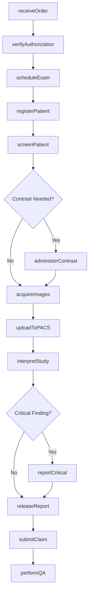
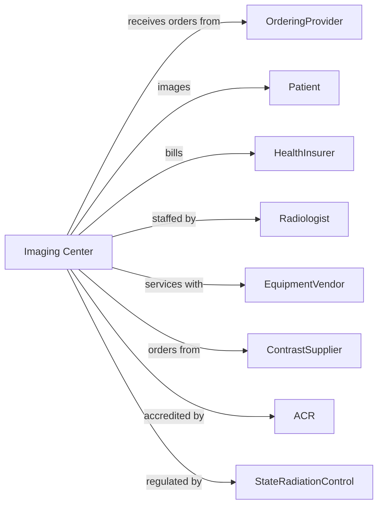

# Diagnostic Imaging Centers

> Business-as-Code definition for diagnostic imaging center operations. Models the complete imaging lifecycle from scheduling through interpretation and result delivery.

## Overview

Diagnostic imaging centers provide radiological services including X-ray, CT, MRI, ultrasound, and mammography. This definition exposes actions for patient scheduling, image acquisition, and interpretation, with events for quality assurance and regulatory compliance.

## Actors

| Actor | Description |
|-------|-------------|
| OrderingProvider | Physician requesting imaging study |
| Patient | Individual undergoing imaging examination |
| HealthInsurer | Provides coverage for imaging services |
| Radiologist | Interprets images and provides reports |
| EquipmentVendor | Provides and services imaging equipment |
| ContrastSupplier | Provides contrast agents and consumables |
| ACR | Provides accreditation for imaging facilities |
| StateRadiationControl | Regulates radiation safety and equipment |
| PACS vendor | Provides image storage and distribution |

## Roles

| Role | Description |
|------|-------------|
| MedicalDirector | Oversees clinical operations and quality |
| Radiologist | Interprets images and dictates reports |
| RadiologyTechnologist | Operates equipment and acquires images |
| MammographyTechnologist | Performs breast imaging examinations |
| CTtechnologist | Operates CT scanner and administers contrast |
| MRItechnologist | Operates MRI and screens for contraindications |
| FrontDesk | Schedules appointments and registers patients |
| RadiologyNurse | Administers contrast and monitors patients |

## Entities

| Entity | Description |
|--------|-------------|
| Order | Imaging requisition from ordering provider |
| Appointment | Scheduled imaging examination |
| Study | Completed imaging examination with images |
| Image | Individual radiographic or digital image |
| Report | Radiologist interpretation document |
| PACS | Picture archiving and communication system |
| Modality | Imaging equipment (CT, MRI, X-ray, etc.) |
| Contrast | Agent administered for enhanced imaging |
| Protocol | Standardized imaging acquisition parameters |
| PriorAuthorization | Insurance approval for imaging |
| CriticalFinding | Result requiring immediate communication |
| Claim | Insurance billing submission |

## Actions

| Action | Description |
|--------|-------------|
| receiveOrder | Accept imaging requisition from provider |
| verifyAuthorization | Confirm insurance approval for study |
| scheduleExam | Book imaging appointment |
| registerPatient | Check in patient and verify information |
| screenPatient | Assess for contraindications and allergies |
| acquireImages | Perform imaging examination |
| administerContrast | Inject contrast agent for enhanced study |
| uploadToPACS | Store images in archive system |
| interpretStudy | Radiologist reviews and dictates report |
| reportCritical | Communicate urgent findings to provider |
| releaseReport | Finalize and transmit interpretation |
| submitClaim | Send billing to insurance payer |
| performQA | Conduct quality assurance review |
| maintainEquipment | Perform equipment calibration and service |
| submitACRdata | Report accreditation quality metrics |

## Events

| Event | Description |
|-------|-------------|
| orderReceived | Imaging requisition has been accepted |
| authorizationVerified | Insurance approval has been confirmed |
| examScheduled | Appointment has been booked |
| patientRegistered | Patient has checked in |
| patientScreened | Contraindications have been assessed |
| imagesAcquired | Examination has been completed |
| contrastAdministered | Contrast agent has been injected |
| imagesUploaded | Study stored in PACS |
| studyInterpreted | Radiologist has completed reading |
| criticalFindingDetected | Urgent result requires notification |
| criticalFindingReported | Provider has been notified |
| reportReleased | Interpretation has been transmitted |
| claimSubmitted | Billing has been sent |
| QAcompleted | Quality review has been performed |

## Searches

| Search | Description |
|--------|-------------|
| findOrders | List orders with filters for status or modality |
| getSchedule | Retrieve appointments by date or modality |
| getPendingReads | Find studies awaiting interpretation |
| getCriticalFindings | List unreported urgent results |
| getStudyHistory | Retrieve prior imaging for patient |
| getModalityStatus | Find equipment availability and utilization |
| getTurnaroundTime | Get interpretation completion statistics |
| getPendingClaims | List claims awaiting payment |

## Workflow



## Actor Relationships



## Usage

### Calling Actions

```typescript
import { diagnoseImaging } from '@headlessly/diagnose-imaging'

const center = diagnoseImaging()

// Receive and schedule imaging order
const order = await center.receiveOrder({
  orderId: 'IMG-345678',
  orderingProvider: 'dr-ortho',
  patient: {
    mrn: 'PAT-567890',
    name: 'Jane Smith',
    dob: '1975-08-20'
  },
  study: 'MRI-Knee-without-contrast',
  clinicalHistory: 'Right knee pain, rule out meniscal tear',
  priority: 'routine'
})

await center.verifyAuthorization({
  orderId: 'IMG-345678',
  insurer: 'blue-cross',
  authNumber: 'AUTH-789012',
  approvedCPT: '73721'
})

const appointment = await center.scheduleExam({
  orderId: 'IMG-345678',
  modality: 'MRI-1',
  dateTime: '2024-04-05T14:00:00',
  duration: 45,
  protocol: 'knee-standard'
})

// Perform examination
await center.screenPatient({
  orderId: 'IMG-345678',
  mriSafetyForm: 'completed',
  contraindications: 'none',
  implants: 'none',
  claustrophobia: 'mild-managed'
})

await center.acquireImages({
  orderId: 'IMG-345678',
  technologist: 'tech-williams',
  startTime: '2024-04-05T14:05:00',
  endTime: '2024-04-05T14:40:00',
  sequences: ['T1-sagittal', 'T2-sagittal', 'PD-fat-sat-coronal', 'T2-axial'],
  imageQuality: 'diagnostic'
})

// Interpret and report
await center.interpretStudy({
  orderId: 'IMG-345678',
  radiologist: 'dr-radiology',
  findings: 'Posterior horn medial meniscus tear. Moderate joint effusion.',
  impression: 'Medial meniscus tear with joint effusion',
  recommendations: 'Orthopedic consultation recommended'
})
```

### Event-Driven Automation

```typescript
// Alert for critical findings
center.criticalFindingDetected(async ({ orderId, finding }) => {
  await center.reportCritical({
    orderId,
    finding,
    urgency: 'immediate',
    contactProvider: true,
    documentCallback: true
  })
})

// Auto-upload to PACS
center.imagesAcquired(async ({ orderId, technologist }) => {
  await center.uploadToPACS({
    orderId,
    verifyUpload: true,
    notifyRadiologist: true
  })
})

// Submit claims after report release
center.reportReleased(async ({ orderId, cptCode }) => {
  await center.submitClaim({
    orderId,
    technicalComponent: true,
    professionalComponent: true,
    cptCode,
    modifiers: ['TC', '26']
  })
})

// Monitor turnaround time
center.studyInterpreted(async ({ orderId, interpretationTime }) => {
  const metrics = await center.getTurnaroundTime({ orderId })

  if (metrics.hoursToRead > 24) {
    await center.alertQuality({
      type: 'tat-exceeded',
      orderId,
      actualTAT: metrics.hoursToRead,
      targetTAT: 24
    })
  }
})
```
