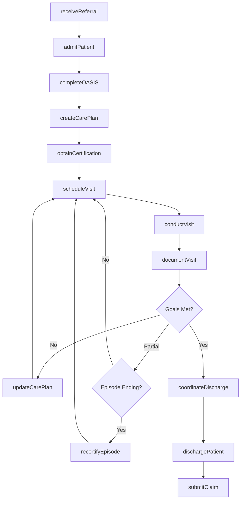
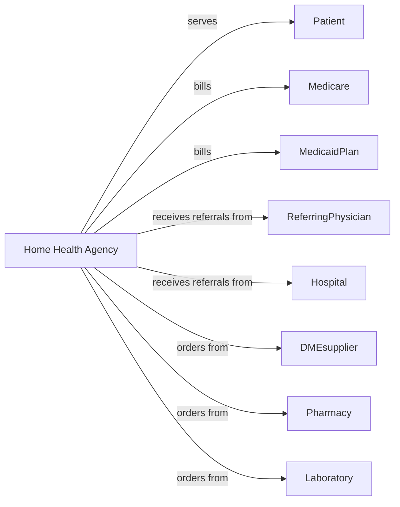

# Home Health Care Services

> Business-as-Code definition for home health agency operations. Models the complete home care lifecycle from referral through discharge with skilled and non-skilled services.

## Overview

Home health care agencies provide skilled nursing, therapy, and personal care services to patients in their homes. This definition exposes actions for patient admission, care planning, visit documentation, and OASIS assessment, with events for care coordination and Medicare compliance.

## Actors

| Actor | Description |
|-------|-------------|
| Patient | Individual receiving home health services |
| Medicare | Primary payer for skilled home health services |
| MedicaidPlan | Provides coverage for eligible patients |
| ReferringPhysician | Orders home health services and signs plans |
| Hospital | Discharges patients requiring home health |
| DMEsupplier | Provides medical equipment for home use |
| Pharmacy | Provides medications and infusion supplies |
| Laboratory | Performs home specimen collection and testing |
| CMSsurveyor | Inspects agency and enforces conditions of participation |

## Roles

| Role | Description |
|------|-------------|
| Administrator | Oversees agency operations and compliance |
| DirectorOfNursing | Manages clinical staff and quality |
| RegisteredNurse | Provides skilled nursing visits and assessments |
| PhysicalTherapist | Delivers PT services and evaluations |
| OccupationalTherapist | Provides OT services and home safety |
| SpeechTherapist | Delivers speech-language pathology services |
| HomeHealthAide | Provides personal care and ADL assistance |
| MedicalSocialWorker | Addresses psychosocial needs and resources |
| Scheduler | Coordinates visit schedules and staffing |

## Entities

| Entity | Description |
|--------|-------------|
| Patient | Individual receiving home health care |
| Referral | Order for home health services from physician |
| Episode | 60-day care period for Medicare billing |
| CarePlan | Physician-signed plan of care with services |
| OASIS | Outcome assessment information set data |
| Visit | Individual home care encounter |
| Order | Physician order for services or supplies |
| Certification | Physician attestation of homebound status |
| Recertification | Renewal of care plan for continued services |
| Claim | Medicare or insurance billing submission |
| SupplyOrder | Request for medical supplies or equipment |
| DischargeNote | Documentation of care completion |

## Actions

| Action | Description |
|--------|-------------|
| receiveReferral | Accept order for home health services |
| admitPatient | Complete intake and start of care assessment |
| completeOASIS | Document comprehensive outcome assessment |
| createCarePlan | Develop plan of care with physician |
| obtainCertification | Secure physician signature on plan of care |
| scheduleVisit | Assign clinician and time for home visit |
| conductVisit | Perform skilled or non-skilled home service |
| documentVisit | Record visit notes and observations |
| updateCarePlan | Modify services based on patient progress |
| orderSupplies | Request DME or medical supplies |
| recertifyEpisode | Renew care plan for additional 60 days |
| coordinateDischarge | Plan transition to next level of care |
| dischargePatient | Complete care and document outcomes |
| submitClaim | Send billing to Medicare or insurer |
| conductSupervisoryVisit | RN oversight of home health aide |

## Events

| Event | Description |
|-------|-------------|
| referralReceived | Order for services has been received |
| patientAdmitted | Start of care has been completed |
| OASIScompleted | Assessment data has been documented |
| carePlanCreated | Plan of care has been established |
| certificationObtained | Physician has signed care plan |
| visitScheduled | Home visit has been assigned |
| visitCompleted | Home service has been provided |
| visitMissed | Patient was unavailable for visit |
| carePlanUpdated | Services have been modified |
| suppliesOrdered | Equipment or supplies requested |
| episodeRecertified | Care plan renewed for 60 days |
| dischargeInitiated | Transition planning has begun |
| patientDischarged | Care has been completed |
| claimSubmitted | Billing has been sent |

## Searches

| Search | Description |
|--------|-------------|
| findPatients | List patients with filters for status or clinician |
| getSchedule | Retrieve visits by date or staff member |
| getPendingAdmissions | Find referrals awaiting start of care |
| getDueRecertifications | List patients needing care plan renewal |
| getMissedVisits | Find visits requiring rescheduling |
| getOASISstatus | Retrieve assessment completion status |
| getDischargeReady | List patients approaching discharge |
| getProductivityReport | Get clinician visit statistics |

## Workflow



## Actor Relationships



## Usage

### Calling Actions

```typescript
import { careHomebound } from '@headlessly/care-homebound'

const agency = careHomebound()

// Receive and process referral
const referral = await agency.receiveReferral({
  patientId: 'HH-123456',
  referralSource: 'regional-medical-center',
  diagnosis: 'S72.001A',
  services: ['skilled-nursing', 'physical-therapy', 'home-health-aide'],
  startOfCare: '2024-04-08',
  physiciansOrders: {
    nursing: 'Wound care to surgical site, medication management',
    pt: 'Gait training, strengthening exercises',
    hha: 'ADL assistance 3x/week'
  }
})

// Complete OASIS assessment
await agency.completeOASIS({
  patientId: 'HH-123456',
  assessmentType: 'start-of-care',
  functionalStatus: {
    ambulation: 2,
    bathing: 3,
    dressing: 2,
    toileting: 1
  },
  clinicalStatus: {
    wounds: 'surgical-incision-healing',
    pain: 'moderate-controlled',
    medications: 12
  },
  homeboundStatus: 'requires-assistive-device-and-assistance'
})

// Create and certify care plan
await agency.createCarePlan({
  patientId: 'HH-123456',
  certificationPeriod: '2024-04-08 to 2024-06-06',
  services: [
    { discipline: 'SN', frequency: '2W2, 1W4', duration: '60 days' },
    { discipline: 'PT', frequency: '3W1, 2W5', duration: '60 days' },
    { discipline: 'HHA', frequency: '3W8', duration: '60 days' }
  ],
  goals: ['Wound healed', 'Independent ambulation with cane', 'Independent with bathing']
})

// Document skilled nursing visit
await agency.conductVisit({
  patientId: 'HH-123456',
  visitDate: '2024-04-10',
  discipline: 'SN',
  clinician: 'rn-johnson',
  services: ['wound-care', 'medication-review', 'vital-signs'],
  findings: {
    wound: 'Incision clean, dry, approximated. No signs of infection.',
    vitals: { bp: '128/78', pulse: 72, temp: 98.4 },
    medications: 'Patient taking all medications as prescribed'
  },
  patientResponse: 'Tolerating well, pain 3/10'
})
```

### Event-Driven Automation

```typescript
// Schedule recertification before episode ends
agency.episodeEnding(async ({ patientId, episodeEndDate, daysRemaining }) => {
  if (daysRemaining <= 5) {
    await agency.recertifyEpisode({
      patientId,
      assessmentType: 'recertification',
      scheduledDate: episodeEndDate
    })
  }
})

// Alert for missed visits
agency.visitMissed(async ({ patientId, visitDate, reason }) => {
  await agency.notifyCase({
    patientId,
    alert: 'Missed visit',
    reason,
    action: 'reschedule-or-document'
  })
})

// Coordinate discharge planning
agency.goalsMet(async ({ patientId, goals }) => {
  await agency.coordinateDischarge({
    patientId,
    disposition: 'discharged-to-community',
    followUp: 'PCP appointment in 1 week',
    teachingCompleted: true
  })
})
```
