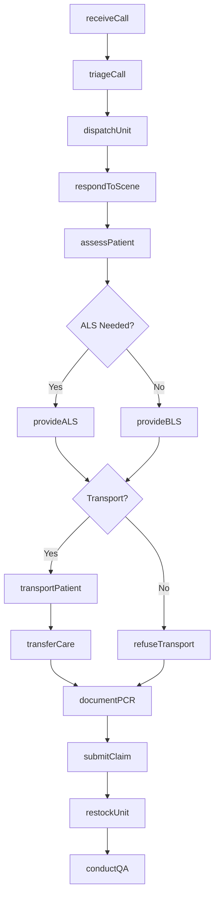
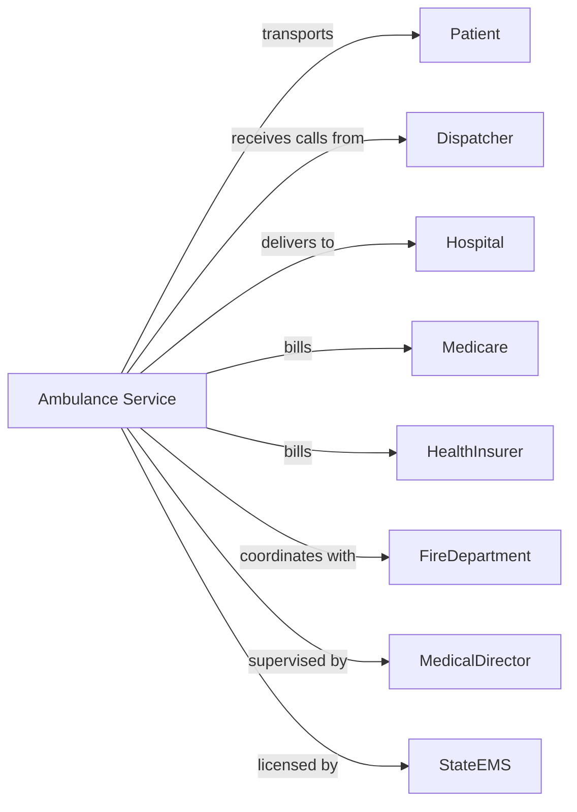

# Ambulance Services

> Business-as-Code definition for ambulance service operations. Models the complete emergency and non-emergency transport lifecycle from dispatch through patient handoff and billing.

## Overview

Ambulance services provide emergency and non-emergency medical transportation by ground and air, delivering life-saving care during transport. This definition exposes actions for dispatch, patient assessment, treatment, and transport documentation, with events for call management and crew coordination.

## Actors

| Actor | Description |
|-------|-------------|
| Patient | Individual requiring medical transport |
| Dispatcher | Receives calls and coordinates ambulance response |
| Hospital | Receives transported patients and provides feedback |
| Medicare | Reimburses for medical necessity transports |
| HealthInsurer | Provides coverage for ambulance services |
| FireDepartment | Provides first response and coordination |
| MedicalDirector | Provides protocols and medical oversight |
| StateEMS | Licenses ambulances and certifies personnel |
| EquipmentVendor | Provides ambulances and medical equipment |

## Roles

| Role | Description |
|------|-------------|
| EMSDirector | Oversees ambulance operations and compliance |
| Paramedic | Provides advanced life support interventions |
| EMT | Provides basic life support and transport |
| FlightNurse | Delivers critical care during air transport |
| Dispatcher | Manages call intake and unit assignment |
| QualityCoordinator | Reviews calls and monitors protocols |
| BillingSpecialist | Handles claims and reimbursement |
| FleetManager | Maintains vehicles and equipment |

## Entities

| Entity | Description |
|--------|-------------|
| Call | Incoming request for ambulance service |
| Unit | Ambulance vehicle with crew assignment |
| Patient | Individual receiving emergency care |
| Incident | Event with location, nature, and response |
| PCR | Patient care report documentation |
| Protocol | Medical treatment guideline |
| Dispatch | Unit assignment to incident |
| Transport | Patient movement from scene to facility |
| Medication | Drug administered during care |
| Procedure | Medical intervention performed |
| Claim | Insurance billing submission |
| Mileage | Distance traveled for billing |

## Actions

| Action | Description |
|--------|-------------|
| receiveCall | Accept incoming request for service |
| triageCall | Assess urgency and determine response level |
| dispatchUnit | Assign ambulance and crew to incident |
| respondToScene | Travel to incident location |
| assessPatient | Evaluate patient condition and vital signs |
| provideALS | Deliver advanced life support interventions |
| provideBLS | Deliver basic life support care |
| transportPatient | Move patient to appropriate facility |
| transferCare | Hand off patient to receiving facility |
| documentPCR | Complete patient care report |
| submitClaim | Send billing to payer |
| restockUnit | Replenish supplies and medications |
| conductQA | Review call for protocol compliance |
| certifyNecessity | Document medical necessity for transport |
| coordinateMutualAid | Request assistance from other agencies |

## Events

| Event | Description |
|-------|-------------|
| callReceived | Request for service has been logged |
| callTriaged | Response priority has been assigned |
| unitDispatched | Ambulance has been sent to scene |
| unitEnroute | Ambulance is traveling to incident |
| unitOnScene | Ambulance has arrived at location |
| patientContact | Crew has made contact with patient |
| patientAssessed | Evaluation has been completed |
| treatmentProvided | Medical care has been delivered |
| transportInitiated | Patient movement has begun |
| hospitalArrival | Ambulance has reached facility |
| careTransferred | Patient has been handed off |
| unitAvailable | Ambulance is ready for next call |
| PCRcompleted | Documentation has been finished |
| claimSubmitted | Billing has been sent |

## Searches

| Search | Description |
|--------|-------------|
| getActiveCalls | List incidents with open responses |
| getUnitStatus | Find ambulance availability and location |
| getCallHistory | Retrieve calls by date or location |
| getPCRs | Find patient care reports by criteria |
| getPendingClaims | List claims awaiting payment |
| getResponseTimes | Get performance metrics by time period |
| getProtocolCompliance | Retrieve QA review results |
| getCrewSchedule | Find staff assignments and shifts |

## Workflow



## Actor Relationships



## Usage

### Calling Actions

```typescript
import { treatEmergencies } from '@headlessly/treat-emergencies'

const service = treatEmergencies()

// Receive and dispatch call
const call = await service.receiveCall({
  callTime: '2024-04-10T14:32:00',
  callerPhone: '555-123-4567',
  nature: 'chest-pain',
  location: '456 Oak Street, Apt 3B',
  additionalInfo: '65-year-old male, history of heart disease'
})

const triage = await service.triageCall({
  callId: call.id,
  priority: 'emergency',
  responseLevel: 'ALS',
  chiefComplaint: 'chest-pain',
  ageRange: '65+'
})

await service.dispatchUnit({
  callId: call.id,
  unitId: 'Medic-7',
  crew: ['paramedic-smith', 'emt-jones'],
  dispatchTime: '2024-04-10T14:33:00'
})

// Document patient care
await service.assessPatient({
  callId: call.id,
  contactTime: '2024-04-10T14:41:00',
  presentation: 'Diaphoretic, clutching chest',
  vitals: {
    bp: '168/98',
    pulse: 102,
    respirations: 22,
    spo2: 94,
    gcs: 15
  },
  history: 'HTN, CAD, MI 2019',
  medications: ['metoprolol', 'aspirin', 'lisinopril']
})

await service.provideALS({
  callId: call.id,
  interventions: [
    { procedure: '12-lead-ECG', finding: 'STEMI-anterior' },
    { procedure: 'IV-access', site: 'right-AC', gauge: 18 },
    { medication: 'aspirin', dose: '324mg', route: 'PO' },
    { medication: 'nitroglycerin', dose: '0.4mg', route: 'SL' }
  ],
  notification: 'STEMI-alert-activated'
})

// Transport and transfer
await service.transportPatient({
  callId: call.id,
  destination: 'cardiac-center-downtown',
  transportTime: '2024-04-10T14:48:00',
  enrouteVitals: { bp: '142/88', pulse: 88, spo2: 98 }
})

await service.transferCare({
  callId: call.id,
  arrivalTime: '2024-04-10T14:58:00',
  receivingUnit: 'cath-lab',
  receivingNurse: 'rn-chen',
  patientCondition: 'stable-improved'
})
```

### Event-Driven Automation

```typescript
// Auto-triage based on chief complaint
service.callReceived(async ({ callId, nature }) => {
  const priority = determineTriagePriority(nature)

  await service.triageCall({
    callId,
    priority,
    responseLevel: priority === 'emergency' ? 'ALS' : 'BLS'
  })
})

// Notify hospital of incoming patient
service.transportInitiated(async ({ callId, destination, eta }) => {
  await service.notifyHospital({
    facility: destination,
    callId,
    eta,
    patientCondition: 'STEMI',
    activations: ['cath-lab']
  })
})

// Trigger QA review for critical calls
service.careTransferred(async ({ callId, patientCondition }) => {
  if (['cardiac-arrest', 'trauma', 'stroke'].includes(patientCondition)) {
    await service.conductQA({
      callId,
      reviewType: 'critical-case',
      priority: 'immediate'
    })
  }
})
```
