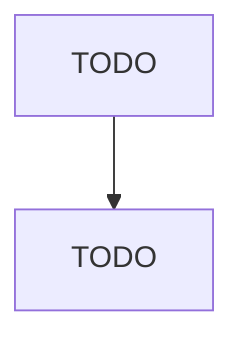

# Residential Intellectual and Developmental Disability Facilities

> TODO: Business-as-Code definition

## Overview

This industry comprises establishments (e.g., group homes, hospitals, intermediate care facilities) primarily engaged in providing residential care services for persons with intellectual and developmental disabilities. These facilities may provide some health care, though the focus is room, board, protective supervision, and counseling. Cross-References.

## Actors

| Actor | Description |
|-------|-------------|
| TODO | TODO |

## Entities

| Entity | Description |
|--------|-------------|
| TODO | TODO |

## Actions

| Action | Description |
|--------|-------------|
| TODO | TODO |

## Events

| Event | Description |
|-------|-------------|
| TODO | TODO |

## Searches

| Search | Description |
|--------|-------------|
| TODO | TODO |

## Workflow

## Actor Relationships

