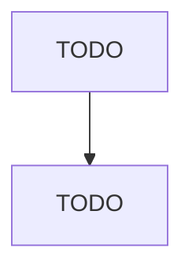

# Residential Mental Health and Substance Abuse Facilities

> TODO: Business-as-Code definition

## Overview

This industry comprises establishments primarily engaged in providing residential care and treatment for patients with mental health and substance abuse illnesses. These establishments provide room, board, supervision, and counseling services. Although medical services may be available at these establishments, they are incidental to the counseling, mental rehabilitation, and support services offered. These establishments generally provide a wide range of social services in addition to counseling

## Actors

| Actor | Description |
|-------|-------------|
| TODO | TODO |

## Entities

| Entity | Description |
|--------|-------------|
| TODO | TODO |

## Actions

| Action | Description |
|--------|-------------|
| TODO | TODO |

## Events

| Event | Description |
|-------|-------------|
| TODO | TODO |

## Searches

| Search | Description |
|--------|-------------|
| TODO | TODO |

## Workflow

## Actor Relationships

