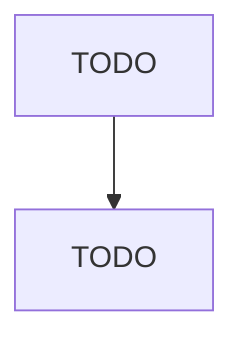
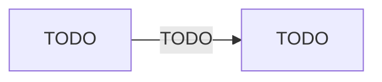

# Continuing Care Retirement Communities

> TODO: Business-as-Code definition

## Overview

This U.S. industry comprises establishments primarily engaged in providing a range of residential and personal care services with on-site nursing care facilities for (1) the elderly and other persons who are unable to fully care for themselves and/or (2) the elderly and other persons who do not desire to live independently. Individuals live in a variety of residential settings with meals, housekeeping, social, leisure, and other services available to assist residents in daily living. Assisted li

## Actors

| Actor | Description |
|-------|-------------|
| TODO | TODO |

## Entities

| Entity | Description |
|--------|-------------|
| TODO | TODO |

## Actions

| Action | Description |
|--------|-------------|
| TODO | TODO |

## Events

| Event | Description |
|-------|-------------|
| TODO | TODO |

## Searches

| Search | Description |
|--------|-------------|
| TODO | TODO |

## Workflow

## Actor Relationships

