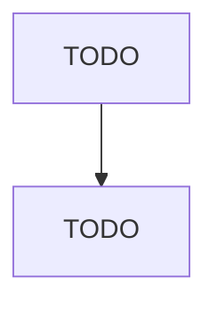

# Assisted Living Facilities for the Elderly

> TODO: Business-as-Code definition

## Overview

This U.S. industry comprises establishments primarily engaged in providing residential and personal care services without nursing care for (1) the elderly or other persons who are unable to fully care for themselves and/or (2) the elderly or other persons who do not desire to live independently. The care typically includes room, board, supervision, and assistance in daily living, such as housekeeping services. Illustrative Examples: Assisted living facilities for the elderly without nursing care

## Actors

| Actor | Description |
|-------|-------------|
| TODO | TODO |

## Entities

| Entity | Description |
|--------|-------------|
| TODO | TODO |

## Actions

| Action | Description |
|--------|-------------|
| TODO | TODO |

## Events

| Event | Description |
|-------|-------------|
| TODO | TODO |

## Searches

| Search | Description |
|--------|-------------|
| TODO | TODO |

## Workflow

## Actor Relationships

