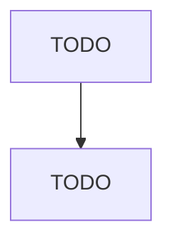

# Other Residential Care Facilities

> TODO: Business-as-Code definition

## Overview

This industry comprises establishments primarily engaged in providing residential care (except residential intellectual and developmental disability facilities, residential mental health and substance abuse facilities, continuing care retirement communities, and assisted living facilities for the elderly). These establishments also provide supervision and personal care services. Illustrative Examples: Boot or disciplinary camps (except correctional) for delinquent youth Group homes for the heari

## Actors

| Actor | Description |
|-------|-------------|
| TODO | TODO |

## Entities

| Entity | Description |
|--------|-------------|
| TODO | TODO |

## Actions

| Action | Description |
|--------|-------------|
| TODO | TODO |

## Events

| Event | Description |
|-------|-------------|
| TODO | TODO |

## Searches

| Search | Description |
|--------|-------------|
| TODO | TODO |

## Workflow

## Actor Relationships

