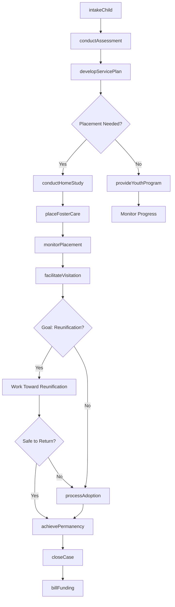
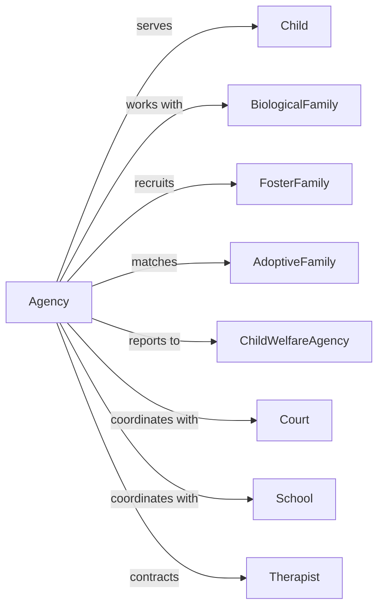

# Child and Youth Services

> Business-as-Code definition for child and youth social service operations. Models programs including adoption, foster care, youth development, and family support services.

## Overview

Child and youth services provide nonresidential social assistance for children and youth including adoption services, foster care placement, youth centers, and positive development programs. This definition exposes actions for case management, events for tracking outcomes, and searches for client and placement management.

## Actors

| Actor | Description |
|-------|-------------|
| Child | Youth receiving services |
| BiologicalFamily | Birth family of the child |
| FosterFamily | Licensed family providing temporary care |
| AdoptiveFamily | Family permanently adopting a child |
| ChildWelfareAgency | Government entity overseeing child welfare |
| Court | Legal authority in custody matters |
| School | Educational institution child attends |
| Therapist | Provides counseling services |

## Roles

| Role | Description |
|------|-------------|
| ExecutiveDirector | Oversees agency operations |
| CaseManager | Coordinates child services |
| AdoptionSpecialist | Facilitates adoption process |
| FosterCareCoordinator | Manages foster placements |
| YouthWorker | Leads youth programs |
| FamilyAdvocate | Supports family reunification |
| LicensingSpecialist | Approves foster and adoptive homes |
| IntakeCoordinator | Processes new referrals |

## Entities

| Entity | Description |
|--------|-------------|
| Child | Youth receiving services |
| Case | Service record for a child |
| FosterPlacement | Temporary care arrangement |
| AdoptionFile | Record for adoption process |
| FosterHome | Licensed family for placements |
| ServicePlan | Goals and interventions for child |
| CourtOrder | Legal directive regarding custody |
| HomeStudy | Assessment of prospective family |
| VisitationLog | Record of family contacts |
| YouthProgram | Structured activities for development |
| Assessment | Evaluation of child needs |
| FundingSource | Payment for services |

## Actions

| Action | Description |
|--------|-------------|
| intakeChild | Process new referral |
| conductAssessment | Evaluate child needs |
| developServicePlan | Create goals and interventions |
| placeFosterCare | Arrange temporary family placement |
| conductHomeStudy | Assess prospective family |
| licenseFosterHome | Approve family for placements |
| facilitateVisitation | Arrange family contact |
| processAdoption | Complete adoption legal process |
| provideYouthProgram | Deliver development activities |
| coordinateCourt | Manage legal proceedings |
| monitorPlacement | Check on child welfare |
| achievePermanency | Finalize permanent living situation |
| closeCase | Complete services |
| billFunding | Submit claims for reimbursement |

## Events

| Event | Description |
|-------|-------------|
| childIntaked | New referral processed |
| assessmentCompleted | Evaluation finished |
| servicePlanDeveloped | Goals documented |
| fosterPlacementMade | Child placed with family |
| homeStudyApproved | Family assessment passed |
| fosterHomeLicensed | Family approved for placements |
| visitationOccurred | Family contact completed |
| adoptionFinalized | Legal adoption completed |
| youthProgramCompleted | Development activity finished |
| courtHearingHeld | Legal proceeding occurred |
| placementMonitored | Welfare check completed |
| permanencyAchieved | Permanent situation established |
| caseClosed | Services completed |
| billingSubmitted | Claim sent |

## Searches

| Search | Description |
|--------|-------------|
| findChildren | List children by case status |
| getFosterPlacements | View active placements |
| findFosterHomes | List available licensed families |
| getAdoptionFiles | Retrieve adoption records |
| findServicePlans | List plans by review date |
| getCourtDates | View upcoming hearings |
| findYouthPrograms | List available activities |
| getBillingStatus | Check claim submissions |

## Workflow



## Actor Relationships



## Usage

### Calling Actions

```typescript
import { serveYouth } from '@headlessly/serve-youth'

const agency = serveYouth()

// Intake new child referral
const caseRecord = await agency.intakeChild({
  childName: 'Emma Johnson',
  dateOfBirth: '2015-08-20',
  referralSource: 'childWelfareAgency',
  reason: 'parentalAbuse',
  immediateNeeds: ['safeHousing', 'counseling']
})

// Conduct home study for foster family
const homeStudy = await agency.conductHomeStudy({
  familyId: 'family-456',
  studyType: 'fosterCare',
  assessor: 'ls-001',
  areas: ['homeEnvironment', 'background', 'parenting']
})

// Place child in foster care
await agency.placeFosterCare({
  caseId: caseRecord.id,
  fosterHomeId: homeStudy.familyId,
  placementDate: '2024-04-01',
  expectedDuration: 'shortTerm'
})
```

### Event-Driven Automation

```typescript
// Schedule review when placement made
agency.fosterPlacementMade(async ({ caseId, placementId, placementDate }) => {
  await agency.schedulePlacementReview({
    caseId,
    placementId,
    reviewDate: addDays(placementDate, 30)
  })

  await agency.monitorPlacement({
    placementId,
    frequency: 'weekly'
  })
})

// Celebrate permanency achievement
agency.adoptionFinalized(async ({ caseId, childId, adoptiveFamily }) => {
  await agency.achievePermanency({
    caseId,
    permanencyType: 'adoption',
    finalizedDate: new Date()
  })

  await agency.closeCase({
    caseId,
    outcome: 'adoptionFinalized',
    followUpPeriod: '12-months'
  })
})
```

## Related

- [Services for the Elderly and Persons with Disabilities](./624120-ServicesForTheElderlyAndPersonsWithDisabilities.mdx)
- [Other Individual and Family Services](./624190-OtherIndividualAndFamilyServices.mdx)
