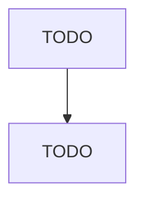

# Child and Youth Services

> TODO: Business-as-Code definition

## Overview

This industry comprises establishments primarily engaged in providing nonresidential social assistance services for children and youth. These establishments provide for the welfare of children in such areas as adoption and foster care, drug prevention, life skills training, and positive social development. Illustrative Examples: Adoption agencies Youth centers (except recreational only) Child guidance organizations Youth self-help organizations Foster care placement services Cross-References.

## Actors

| Actor | Description |
|-------|-------------|
| TODO | TODO |

## Entities

| Entity | Description |
|--------|-------------|
| TODO | TODO |

## Actions

| Action | Description |
|--------|-------------|
| TODO | TODO |

## Events

| Event | Description |
|-------|-------------|
| TODO | TODO |

## Searches

| Search | Description |
|--------|-------------|
| TODO | TODO |

## Workflow

## Actor Relationships

