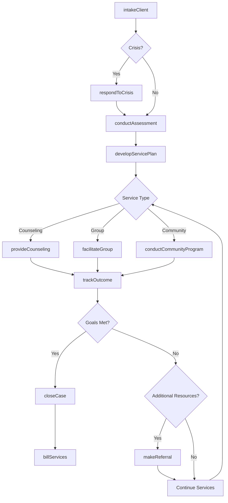
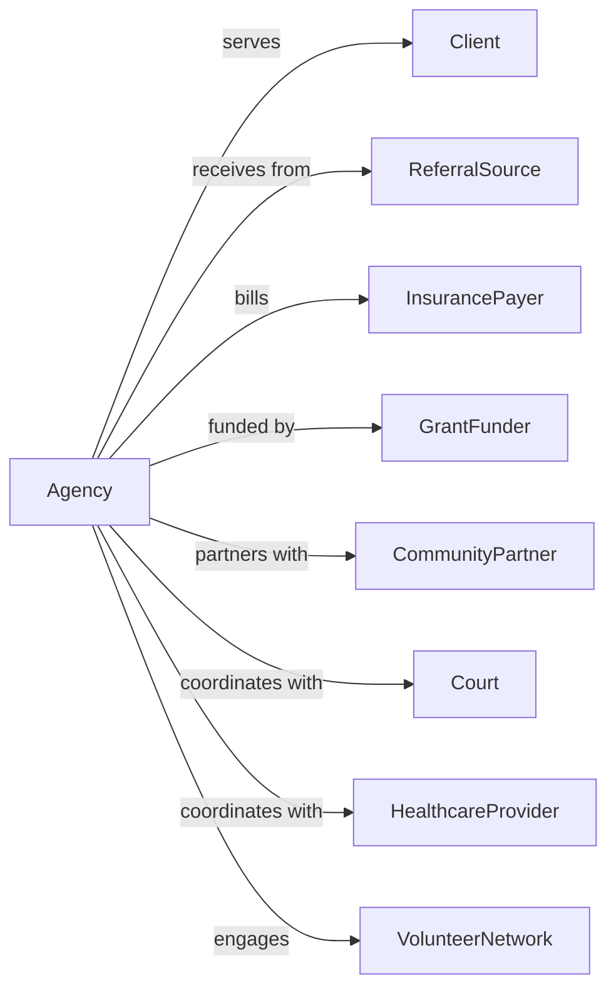

# Other Individual and Family Services

> Business-as-Code definition for individual and family social service operations. Models programs including crisis intervention, marriage counseling, and multi-purpose community centers.

## Overview

Other individual and family services provide nonresidential social assistance including crisis intervention, marriage and family counseling, community action programs, and multi-purpose social service centers. This definition exposes actions for client support, events for case tracking, and searches for service and outcome management.

## Actors

| Actor | Description |
|-------|-------------|
| Client | Individual or family receiving services |
| ReferralSource | Agency or professional making referral |
| InsurancePayer | Funds counseling services |
| GrantFunder | Provides program funding |
| CommunityPartner | Collaborating organization |
| Court | Legal authority in family matters |
| HealthcareProvider | Medical professional coordinating care |
| VolunteerNetwork | Community members providing support |

## Roles

| Role | Description |
|------|-------------|
| ExecutiveDirector | Oversees agency operations |
| ProgramDirector | Manages service programs |
| LicensedCounselor | Provides therapy and counseling |
| CrisisInterventionist | Handles emergency situations |
| CaseManager | Coordinates client services |
| CommunityOrganizer | Leads community action initiatives |
| IntakeSpecialist | Processes new clients |
| VolunteerCoordinator | Manages volunteer workforce |

## Entities

| Entity | Description |
|--------|-------------|
| Client | Individual or family receiving services |
| Case | Service record |
| CounselingSession | Therapy appointment |
| CrisisIntervention | Emergency response |
| ServicePlan | Goals and interventions |
| Assessment | Evaluation of client needs |
| Referral | Connection to other resources |
| CommunityProgram | Group or community initiative |
| Invoice | Bill for services |
| Grant | Funding award |
| Outcome | Measured result of services |
| WaitList | Queue for services |

## Actions

| Action | Description |
|--------|-------------|
| intakeClient | Process new service request |
| conductAssessment | Evaluate client needs |
| developServicePlan | Create goals and interventions |
| provideCounseling | Deliver therapy session |
| respondToCrisis | Handle emergency situation |
| facilitateGroup | Lead support group |
| makeReferral | Connect to other resources |
| coordinateServices | Arrange multiple supports |
| conductCommunityProgram | Deliver community initiative |
| trackOutcome | Measure service results |
| manageVolunteers | Coordinate volunteer activities |
| billServices | Submit claims for payment |
| reportToGrantor | Document grant activities |
| closeCase | Complete services |

## Events

| Event | Description |
|-------|-------------|
| clientIntaked | New service request processed |
| assessmentCompleted | Evaluation finished |
| servicePlanDeveloped | Goals documented |
| counselingProvided | Session completed |
| crisisResponded | Emergency handled |
| groupFacilitated | Support group held |
| referralMade | Resource connection completed |
| servicesCoordinated | Multiple supports arranged |
| communityProgramHeld | Initiative delivered |
| outcomeTracked | Results measured |
| volunteerAssigned | Community member placed |
| billingSubmitted | Claim sent |
| grantReported | Documentation submitted |
| caseClosed | Services completed |

## Searches

| Search | Description |
|--------|-------------|
| findClients | List clients by status or service |
| getCases | Retrieve service records |
| getCounselingSessions | List scheduled appointments |
| findCrisisInterventions | View emergency responses |
| getServicePlans | Retrieve goals documentation |
| findReferrals | List resource connections |
| getCommunityPrograms | View scheduled initiatives |
| getOutcomes | Retrieve measured results |

## Workflow



## Actor Relationships



## Usage

### Calling Actions

```typescript
import { counselFamily } from '@headlessly/counsel-family'

const agency = counselFamily()

// Intake family in crisis
const caseRecord = await agency.intakeClient({
  clientType: 'family',
  members: ['John Smith', 'Jane Smith'],
  presentingIssue: 'maritalConflict',
  urgency: 'routine',
  referralSource: 'self'
})

// Conduct assessment
const assessment = await agency.conductAssessment({
  caseId: caseRecord.id,
  assessmentType: 'comprehensive',
  domains: ['relationship', 'communication', 'stressors'],
  assessor: 'lc-001'
})

// Develop service plan
await agency.developServicePlan({
  caseId: caseRecord.id,
  assessmentId: assessment.id,
  goals: [
    { area: 'communication', objective: 'improveActiveListening', sessions: 8 },
    { area: 'conflict', objective: 'developResolutionSkills', sessions: 6 }
  ]
})
```

### Event-Driven Automation

```typescript
// Respond to crisis immediately
agency.crisisReported(async ({ clientId, crisisType, severity }) => {
  await agency.respondToCrisis({
    clientId,
    crisisType,
    responseLevel: severity === 'imminent' ? 'immediate' : 'sameDay',
    interventionist: await getAvailableInterventionist()
  })

  if (severity === 'imminent') {
    await notifyEmergencyServices({
      clientId,
      crisisType
    })
  }
})

// Track outcomes at milestones
agency.milestonReached(async ({ caseId, milestone, sessionCount }) => {
  await agency.trackOutcome({
    caseId,
    milestone,
    measurementTools: ['satisfactionSurvey', 'goalProgress'],
    sessionCount
  })
})
```

## Related

- [Child and Youth Services](./624110-ChildAndYouthServices.mdx)
- [Services for the Elderly and Persons with Disabilities](./624120-ServicesForTheElderlyAndPersonsWithDisabilities.mdx)
