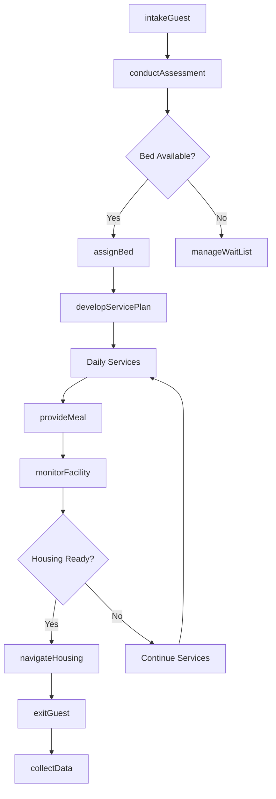
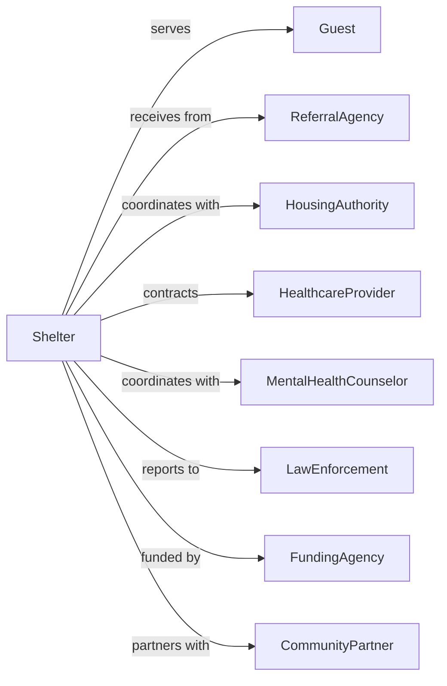

# Temporary Shelters

> Business-as-Code definition for temporary shelter operations. Models emergency shelters for homeless individuals, domestic violence survivors, runaway youth, and families in crisis.

## Overview

Temporary shelters provide short-term emergency housing for individuals and families experiencing homelessness, domestic violence, or other crises. Services include overnight accommodations, meals, case management, and connections to permanent housing. This definition exposes actions for intake and shelter management, events for occupancy tracking, and searches for bed availability and client outcomes.

## Actors

| Actor | Description |
|-------|-------------|
| Guest | Individual receiving shelter services |
| ReferralAgency | Organization sending clients for housing |
| HousingAuthority | Public agency managing subsidized housing |
| HealthcareProvider | Delivers medical services to guests |
| MentalHealthCounselor | Provides behavioral health support |
| LawEnforcement | Coordinates on safety and missing persons |
| FundingAgency | Government or private funder |
| CommunityPartner | Local organization providing support |

## Roles

| Role | Description |
|------|-------------|
| ExecutiveDirector | Oversees shelter operations |
| ShelterManager | Manages daily facility operations |
| CaseManager | Coordinates guest services and housing plans |
| IntakeSpecialist | Processes new arrivals |
| OvernightMonitor | Provides nighttime supervision |
| SecurityStaff | Ensures facility safety |
| HousingNavigator | Assists with permanent housing placement |
| VolunteerCoordinator | Manages volunteer workforce |

## Entities

| Entity | Description |
|--------|-------------|
| Guest | Individual staying at shelter |
| Bed | Available sleeping accommodation |
| Intake | Admission record for guest |
| ServicePlan | Goals and resources for guest |
| Meal | Food provided to guests |
| Incident | Safety or behavioral event |
| HousingReferral | Connection to permanent housing |
| Shift | Staff work period |
| Donation | Contributed items or funds |
| WaitList | Queue for bed availability |
| ExitOutcome | Record of departure status |
| Room | Shared or private sleeping space |

## Actions

| Action | Description |
|--------|-------------|
| intakeGuest | Process new arrival |
| assignBed | Allocate sleeping accommodation |
| conductAssessment | Evaluate guest needs |
| developServicePlan | Create goals and resource connections |
| provideMeal | Serve food to guests |
| monitorFacility | Supervise shelter environment |
| documentIncident | Record safety or behavioral events |
| navigateHousing | Assist with permanent housing search |
| makeReferral | Connect to external services |
| exitGuest | Process departure |
| manageWaitList | Track bed requests |
| coordinateSecurity | Ensure guest and staff safety |
| collectData | Gather outcome metrics |
| manageDonations | Process contributed items |

## Events

| Event | Description |
|-------|-------------|
| guestIntaked | New arrival processed |
| bedAssigned | Accommodation allocated |
| assessmentCompleted | Needs evaluation finished |
| servicePlanDeveloped | Goals documented |
| mealProvided | Food served |
| incidentOccurred | Safety event documented |
| housingFound | Permanent placement identified |
| referralMade | External connection completed |
| guestExited | Departure processed |
| waitListUpdated | Bed queue modified |
| donationReceived | Items or funds accepted |
| capacityReached | All beds occupied |
| emergencyDeclared | Crisis situation activated |
| shiftChanged | Staff rotation completed |

## Searches

| Search | Description |
|--------|-------------|
| findGuests | List guests by status or need |
| getAvailableBeds | View open accommodations |
| getWaitList | Retrieve bed request queue |
| findIncidents | List events by type or date |
| getServicePlans | Retrieve guest goals |
| findHousingReferrals | List housing placements |
| getOccupancy | View current census |
| getExitOutcomes | Retrieve departure statistics |

## Workflow



## Actor Relationships



## Usage

### Calling Actions

```typescript
import { aidHomeless } from '@headlessly/aid-homeless'

const shelter = aidHomeless()

// Intake new guest
const guest = await shelter.intakeGuest({
  name: 'Robert Williams',
  dateOfBirth: '1975-03-22',
  reason: 'eviction',
  veteranStatus: true,
  specialNeeds: ['mobility'],
  referralSource: 'outreachTeam'
})

// Conduct needs assessment
const assessment = await shelter.conductAssessment({
  guestId: guest.id,
  domains: ['housing', 'employment', 'health', 'benefits'],
  assessor: 'cm-001'
})

// Develop service plan
await shelter.developServicePlan({
  guestId: guest.id,
  assessmentId: assessment.id,
  goals: [
    { area: 'housing', objective: 'obtainVoucher', targetDate: '2024-05-01' },
    { area: 'income', objective: 'applySSI', targetDate: '2024-04-15' }
  ],
  referrals: ['vaHousing', 'benefitsEnrollment']
})
```

### Event-Driven Automation

```typescript
// Alert when capacity reached
shelter.capacityReached(async ({ currentOccupancy, bedCount }) => {
  await notifyOutreachTeams({
    status: 'atCapacity',
    alternativeShelters: await findNearbyOpenings()
  })

  await shelter.manageWaitList({
    action: 'activateOverflow',
    notifyPartners: true
  })
})

// Track housing outcomes
shelter.housingFound(async ({ guestId, housingType, moveInDate }) => {
  await shelter.exitGuest({
    guestId,
    exitType: 'permanentHousing',
    destination: housingType,
    effectiveDate: moveInDate
  })

  await shelter.collectData({
    metric: 'housingPlacement',
    guestId,
    outcome: 'success'
  })
})
```

## Related

- [Other Community Housing Services](./624229-OtherCommunityHousingServices.mdx)
- [Emergency and Other Relief Services](./624230-EmergencyAndOtherReliefServices.mdx)
