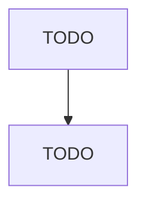

# Temporary Shelters

> TODO: Business-as-Code definition

## Overview

This U.S. industry comprises establishments primarily engaged in providing (1) short-term emergency shelter for victims of domestic violence, sexual assault, or child abuse and/or (2) temporary residential shelter for homeless individuals or families, runaway youth, and patients and families caught in medical crises. These establishments may operate their own shelters or may subsidize housing using existing homes, apartments, hotels, or motels. Cross-References.

## Actors

| Actor | Description |
|-------|-------------|
| TODO | TODO |

## Entities

| Entity | Description |
|--------|-------------|
| TODO | TODO |

## Actions

| Action | Description |
|--------|-------------|
| TODO | TODO |

## Events

| Event | Description |
|-------|-------------|
| TODO | TODO |

## Searches

| Search | Description |
|--------|-------------|
| TODO | TODO |

## Workflow

## Actor Relationships

