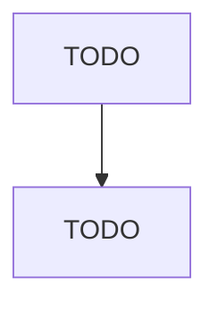

# Other Community Housing Services

> TODO: Business-as-Code definition

## Overview

This U.S. industry comprises establishments primarily engaged in providing one or more of the following community housing services: (1) transitional housing to low-income individuals and families; (2) volunteer construction or repair of low-cost housing, in partnership with the homeowner who may assist in the construction or repair work; and (3) the repair of homes for elderly or disabled homeowners. These establishments may subsidize housing using existing homes, apartments, hotels, or motels o

## Actors

| Actor | Description |
|-------|-------------|
| TODO | TODO |

## Entities

| Entity | Description |
|--------|-------------|
| TODO | TODO |

## Actions

| Action | Description |
|--------|-------------|
| TODO | TODO |

## Events

| Event | Description |
|-------|-------------|
| TODO | TODO |

## Searches

| Search | Description |
|--------|-------------|
| TODO | TODO |

## Workflow

## Actor Relationships

