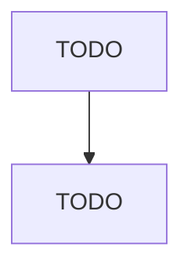

# Child Care Services

> TODO: Business-as-Code definition

## Overview

This industry comprises establishments primarily engaged in providing care and early learning opportunities for infants and children. These establishments generally care for children from birth through school age and may also offer pre-kindergarten, kindergarten, and/or before- or after-school educational programs. The care and early learning provided by these establishments may include opportunities for development in health, social and emotional learning, and family engagement. Illustrative Ex

## Actors

| Actor | Description |
|-------|-------------|
| TODO | TODO |

## Entities

| Entity | Description |
|--------|-------------|
| TODO | TODO |

## Actions

| Action | Description |
|--------|-------------|
| TODO | TODO |

## Events

| Event | Description |
|-------|-------------|
| TODO | TODO |

## Searches

| Search | Description |
|--------|-------------|
| TODO | TODO |

## Workflow

## Actor Relationships

