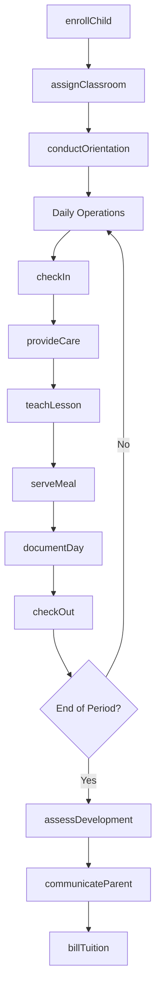
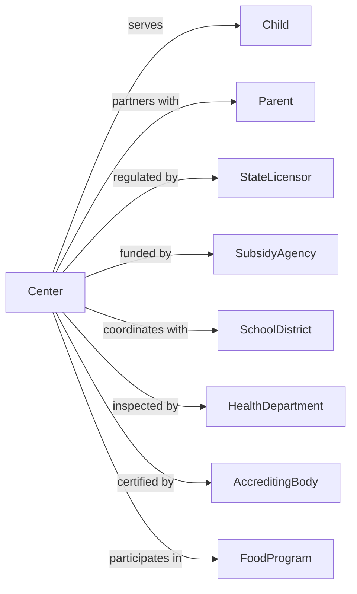

# Child Care Services

> Business-as-Code definition for child care operations. Models daycare centers, preschools, after-school programs, and early learning facilities serving infants through school-age children.

## Overview

Child care services provide care, supervision, and early learning opportunities for infants, toddlers, preschoolers, and school-age children. Programs include full-day daycare, preschool education, before and after school care, and summer programs. This definition exposes actions for enrollment and daily care, events for child development tracking, and searches for classroom and family management.

## Actors

| Actor | Description |
|-------|-------------|
| Parent | Guardian enrolling and paying for care |
| Child | Individual receiving care services |
| StateLicensor | Regulates child care facilities |
| SubsidyAgency | Government program funding care |
| SchoolDistrict | Partner for before/after school programs |
| HealthDepartment | Oversees health and safety compliance |
| AccreditingBody | Certifies quality standards |
| FoodProgram | CACFP provider for nutrition funding |

## Roles

| Role | Description |
|------|-------------|
| CenterDirector | Oversees facility operations |
| AssistantDirector | Supports daily management |
| LeadTeacher | Manages classroom instruction |
| AssistantTeacher | Supports classroom activities |
| InfantCaregiver | Specializes in baby care |
| CurriculumCoordinator | Plans educational programming |
| AdminCoordinator | Handles enrollment and billing |
| CookNutritionist | Prepares meals and snacks |

## Entities

| Entity | Description |
|--------|-------------|
| Child | Individual enrolled in program |
| Classroom | Age-grouped learning space |
| Enrollment | Child registration record |
| DailyReport | Documentation of child's day |
| LessonPlan | Educational activity schedule |
| Meal | Food service provision |
| Attendance | Daily presence record |
| Incident | Injury or behavioral event |
| Assessment | Developmental evaluation |
| Invoice | Tuition billing statement |
| WaitList | Queue for enrollment |
| Staff | Employee record |

## Actions

| Action | Description |
|--------|-------------|
| enrollChild | Register new child |
| assignClassroom | Place child in age group |
| conductOrientation | Introduce family to program |
| checkIn | Record daily arrival |
| provideCare | Deliver supervision and nurturing |
| teachLesson | Implement educational activity |
| serveMeal | Provide food service |
| documentDay | Create daily report |
| assessDevelopment | Evaluate child progress |
| communicateParent | Share information with family |
| checkOut | Record daily departure |
| manageIncident | Document and respond to events |
| billTuition | Send payment requests |
| maintainCompliance | Meet regulatory requirements |

## Events

| Event | Description |
|-------|-------------|
| childEnrolled | New child registered |
| classroomAssigned | Child placed in group |
| orientationCompleted | Family introduced |
| childCheckedIn | Daily arrival recorded |
| careProvided | Supervision given |
| lessonTaught | Activity completed |
| mealServed | Food provided |
| dayDocumented | Daily report created |
| developmentAssessed | Progress evaluated |
| parentCommunicated | Family updated |
| childCheckedOut | Departure recorded |
| incidentOccurred | Event documented |
| tuitionBilled | Payment requested |
| licenseRenewed | Regulatory approval updated |

## Searches

| Search | Description |
|--------|-------------|
| findChildren | List enrolled children |
| getClassrooms | View classroom assignments |
| getAttendance | Retrieve daily presence records |
| findIncidents | List documented events |
| getAssessments | View developmental evaluations |
| getWaitList | Retrieve enrollment queue |
| getBillingStatus | Check payment history |
| getStaffSchedule | View employee assignments |

## Workflow



## Actor Relationships



## Usage

### Calling Actions

```typescript
import { careChildren } from '@headlessly/care-children'

const center = careChildren()

// Enroll new child
const enrollment = await center.enrollChild({
  childName: 'Emma Wilson',
  dateOfBirth: '2021-06-15',
  parentId: 'parent-456',
  program: 'fullDayPreschool',
  startDate: '2024-08-15',
  schedule: ['monday', 'tuesday', 'wednesday', 'thursday', 'friday'],
  subsidyEligible: true
})

// Assign to classroom
await center.assignClassroom({
  enrollmentId: enrollment.id,
  classroomId: 'preschool-2',
  primaryTeacher: 'lt-003',
  startDate: enrollment.startDate
})

// Document daily activities
await center.documentDay({
  childId: enrollment.childId,
  date: '2024-08-15',
  activities: ['circleTime', 'artProject', 'outdoorPlay'],
  meals: ['breakfast', 'lunch', 'snack'],
  naps: { startTime: '12:30', endTime: '14:30' },
  mood: 'happy',
  notes: 'Great first day! Made friends quickly.'
})
```

### Event-Driven Automation

```typescript
// Notify parents at pickup time
center.pickupTimeApproaching(async ({ childId, scheduledPickup }) => {
  const attendance = await center.getAttendance({ childId, date: today() })

  if (!attendance.checkedOut) {
    await center.communicateParent({
      childId,
      messageType: 'pickupReminder',
      scheduledTime: scheduledPickup
    })
  }
})

// Schedule developmental assessment at milestones
center.enrollmentAnniversary(async ({ childId, enrollmentId, monthsEnrolled }) => {
  if (monthsEnrolled % 6 === 0) {
    await center.assessDevelopment({
      childId,
      assessmentType: 'comprehensive',
      domains: ['cognitive', 'socialEmotional', 'physical', 'language'],
      dueDate: addDays(new Date(), 14)
    })

    await center.communicateParent({
      childId,
      messageType: 'conferenceRequest',
      purpose: 'developmentalReview'
    })
  }
})
```

## Related

- [Child and Youth Services](../6241-IndividualAndFamilyServices/624110-ChildAndYouthServices.mdx)
- [Other Individual and Family Services](../6241-IndividualAndFamilyServices/624190-OtherIndividualAndFamilyServices.mdx)
