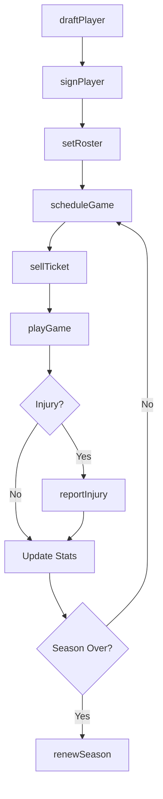
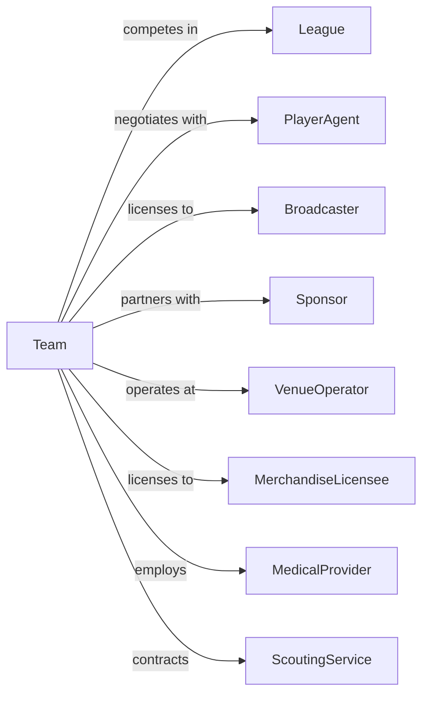

# Sports Teams and Clubs

> Business-as-Code definition for professional sports team operations. Models the complete lifecycle from roster management through competition, fan engagement, and revenue generation.

## Overview

Sports teams and clubs participate in live sporting events across leagues including baseball, basketball, football, hockey, and soccer. This definition exposes actions for player acquisition, game operations, ticket sales, and business management, with events for workflow automation and searches for performance analytics and operations.

## Actors

| Actor | Description |
|-------|-------------|
| League | Governs competition rules, schedules, and standards |
| PlayerAgent | Represents athletes in contract negotiations |
| Broadcaster | Distributes games through television and streaming |
| Sponsor | Provides funding in exchange for brand exposure |
| VenueOperator | Manages stadium or arena operations |
| MerchandiseLicensee | Produces and sells team-branded products |
| TicketReseller | Facilitates secondary market ticket sales |
| MedicalProvider | Delivers healthcare and rehabilitation services |
| ScoutingService | Provides player evaluation and talent reports |

## Roles

| Role | Description |
|------|-------------|
| Owner | Holds equity stake and sets organizational direction |
| GeneralManager | Oversees roster construction and player transactions |
| HeadCoach | Directs game strategy and player development |
| Athlete | Competes in games and represents the team |
| AthleticTrainer | Manages player health, conditioning, and recovery |
| TicketSalesManager | Oversees season tickets, group sales, and box office |

## Entities

| Entity | Description |
|--------|-------------|
| Team | The competitive organization and its identity |
| Player | An athlete on the roster |
| Contract | Employment agreement with player or staff |
| Game | A scheduled competitive event |
| Season | The full schedule of games for a year |
| Ticket | Admission pass for a specific game |
| Suite | Premium seating area for corporate clients |
| Roster | The current list of active players |
| Injury | A physical condition affecting player availability |
| Trade | An exchange of player rights between teams |

## Actions

| Action | Description |
|--------|-------------|
| draftPlayer | Select a player through league draft process |
| signPlayer | Execute a contract with a free agent |
| tradePlayer | Exchange player rights with another team |
| releasePlayer | Terminate a player contract |
| setRoster | Finalize the active player list for competition |
| scheduleGame | Confirm game date, time, and opponent |
| playGame | Compete in a scheduled contest |
| sellTicket | Process ticket purchase for a game |
| sellSuite | Contract premium seating for season or single games |
| reportInjury | Document player injury and update availability |
| renewSeason | Process season ticket holder renewals |
| negotiateBroadcast | Establish media rights agreements |
| signSponsor | Execute partnership with corporate sponsor |

## Events

| Event | Description |
|-------|-------------|
| playerDrafted | Athlete selected through draft process |
| playerSigned | Contract executed with athlete |
| playerTraded | Rights exchanged with another team |
| playerReleased | Contract terminated |
| rosterSet | Active player list finalized |
| gameScheduled | Contest date and opponent confirmed |
| gameCompleted | Contest finished with result recorded |
| ticketSold | Game admission purchased |
| suiteSold | Premium seating contracted |
| injuryReported | Player health status updated |
| seasonRenewed | Ticket holder commitment confirmed |
| broadcastSigned | Media rights deal executed |
| sponsorSigned | Corporate partnership confirmed |

## Searches

| Search | Description |
|--------|-------------|
| getRoster | List current players with contract and status details |
| getSchedule | Retrieve upcoming games with dates and opponents |
| getStandings | Check current league position and record |
| findTickets | Search available seats for specific games |
| getInjuryReport | List player health status and availability |
| getSalesReport | Retrieve ticket revenue by game or period |
| getPlayerStats | Access performance statistics for players |
| findFreeAgents | Search available players by position or skill |

## Workflow



## Actor Relationships



## Usage

### Calling Actions

```typescript
import { competeTeams } from '@headlessly/compete-teams'

const team = competeTeams()

// Sign a free agent
const contract = await team.signPlayer({
  playerId: 'player-123',
  terms: {
    years: 4,
    totalValue: 120000000,
    signingBonus: 20000000,
    noTradeClause: true
  },
  position: 'quarterback'
})

// Set the game day roster
await team.setRoster({
  gameId: 'game-456',
  active: ['player-001', 'player-002', 'player-003'],
  inactive: ['player-004'],
  injured: ['player-005']
})

// Sell tickets
await team.sellTicket({
  gameId: 'game-456',
  seats: ['Section-101-Row-A-Seat-1', 'Section-101-Row-A-Seat-2'],
  customerId: 'fan-789',
  type: 'single-game'
})
```

### Event-Driven Automation

```typescript
// Update depth chart when injury reported
team.injuryReported(async ({ playerId, severity, estimatedReturn }) => {
  const player = await team.getRoster({ playerId })

  if (severity === 'out') {
    await updateDepthChart({
      position: player.position,
      remove: playerId,
      promote: player.backup
    })

    await notifyCoachingStaff({
      message: `${player.name} out until ${estimatedReturn}`,
      adjustment: 'depth-chart-updated'
    })
  }
})

// Process season ticket renewals automatically
team.seasonRenewed(async ({ accountId, seats, price }) => {
  await processPayment({
    accountId,
    amount: price,
    plan: 'monthly-installments'
  })

  await sendConfirmation({
    to: accountId,
    seats,
    perks: getAccountPerks(accountId)
  })
})
```
