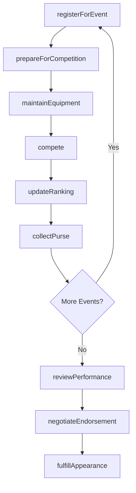
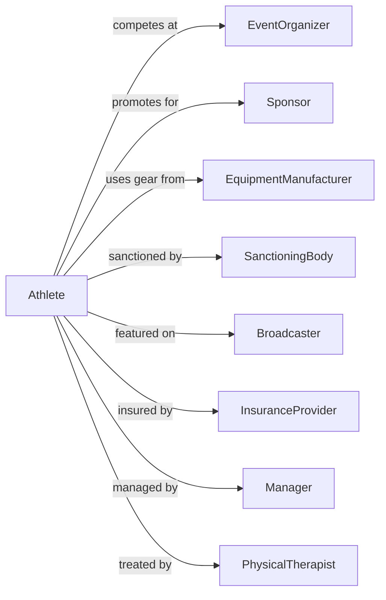

# Other Spectator Sports

> Business-as-Code definition for independent athletes and specialty sports operations. Models professional golfers, boxers, race car drivers, and sports trainers from event entry through competition and endorsements.

## Overview

Other spectator sports includes independent athletes competing in individual sports, owners of racing participants, and specialized sports training services. This definition exposes actions for event participation, endorsement management, and training operations, with events for workflow automation and searches for career and business tracking.

## Actors

| Actor | Description |
|-------|-------------|
| EventOrganizer | Produces tournaments, matches, and racing events |
| Sponsor | Provides financial support in exchange for brand exposure |
| EquipmentManufacturer | Supplies performance gear and apparel |
| SanctioningBody | Governs rules, rankings, and eligibility |
| Broadcaster | Distributes event coverage through media channels |
| InsuranceProvider | Covers liability and injury protection |
| Manager | Handles career strategy and business negotiations |
| PhysicalTherapist | Provides injury prevention and rehabilitation |
| Publicist | Manages media relations and public image |

## Roles

| Role | Description |
|------|-------------|
| IndependentAthlete | Competes professionally in individual sports |
| RacingOwner | Owns vehicles or animals entered in competition |
| SportsTrainer | Provides specialized coaching and conditioning |
| Caddie | Assists golfer with course strategy and club selection |
| PitCrew | Services vehicles during racing events |
| Corner | Provides in-competition support for combat sports |

## Entities

| Entity | Description |
|--------|-------------|
| Event | A scheduled competition or tournament |
| Entry | Registration for a specific event |
| Ranking | Position in sanctioning body standings |
| Purse | Prize money for event placement |
| Endorsement | Paid promotional agreement with sponsor |
| Equipment | Performance gear used in competition |
| TrainingProgram | Structured preparation regimen |
| Appearance | Paid promotional or speaking engagement |
| License | Authorization to compete in sanctioned events |
| Vehicle | Racing car, boat, or other competitive equipment |

## Actions

| Action | Description |
|--------|-------------|
| registerForEvent | Enter a competition or tournament |
| prepareForCompetition | Execute training and conditioning plans |
| compete | Participate in a sanctioned event |
| negotiateEndorsement | Establish promotional partnership terms |
| fulfillAppearance | Complete a paid promotional engagement |
| maintainEquipment | Service and prepare competitive gear |
| updateRanking | Record results and adjust standings |
| collectPurse | Receive prize money for event placement |
| renewLicense | Maintain eligibility for sanctioned competition |
| trainAthlete | Provide coaching services to clients |
| enterRacingParticipant | Register owned vehicle or animal for event |
| reviewPerformance | Analyze competition results for improvement |

## Events

| Event | Description |
|-------|-------------|
| eventRegistered | Entry confirmed for competition |
| trainingCompleted | Preparation phase finished |
| competitionCompleted | Event participation finished |
| endorsementSigned | Promotional partnership executed |
| appearanceFulfilled | Promotional engagement completed |
| equipmentServiced | Competitive gear prepared |
| rankingUpdated | Standings position changed |
| purseCollected | Prize money received |
| licenseRenewed | Eligibility maintained |
| athleteTrained | Coaching session completed |
| participantEntered | Owned vehicle or animal registered |

## Searches

| Search | Description |
|--------|-------------|
| getEventSchedule | List upcoming competitions with entry details |
| getRankings | Check current standings and points |
| getEarnings | Retrieve prize money and endorsement income |
| findEndorsements | List active promotional partnerships |
| getTrainingSchedule | Review upcoming preparation sessions |
| findAthletes | Search available athletes for representation or training |
| getResults | Access performance history by event or period |

## Workflow



## Actor Relationships



## Usage

### Calling Actions

```typescript
import { competeSports } from '@headlessly/compete-sports'

const athlete = competeSports()

// Register for an event
const entry = await athlete.registerForEvent({
  eventId: 'pga-championship-2024',
  category: 'professional',
  entryFee: 500,
  qualificationMethod: 'ranking'
})

// Negotiate an endorsement
const deal = await athlete.negotiateEndorsement({
  sponsorId: 'equipment-brand-123',
  terms: {
    duration: 24,
    annualValue: 500000,
    exclusivity: 'category',
    appearances: 6,
    socialPosts: 12
  }
})

// Train an athlete (as sports trainer)
await athlete.trainAthlete({
  clientId: 'athlete-789',
  sessionType: 'strength-conditioning',
  duration: 90,
  focus: ['core-stability', 'explosive-power']
})
```

### Event-Driven Automation

```typescript
// Auto-update rankings after competition
athlete.competitionCompleted(async ({ eventId, placement, points }) => {
  await athlete.updateRanking({
    eventId,
    placement,
    pointsEarned: points
  })

  if (placement <= 3) {
    await notifySponsors({
      message: `Podium finish at ${eventId}!`,
      placement
    })
  }
})

// Process endorsement obligations
athlete.endorsementSigned(async ({ dealId, requirements }) => {
  for (const appearance of requirements.appearances) {
    await scheduleAppearance({
      dealId,
      date: appearance.date,
      location: appearance.venue,
      type: appearance.type
    })
  }
})
```
