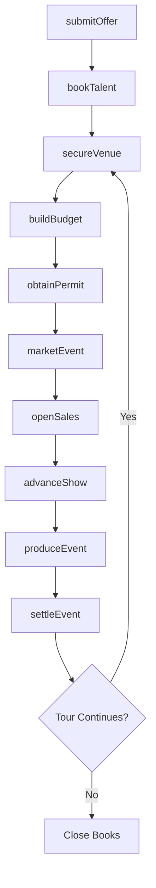
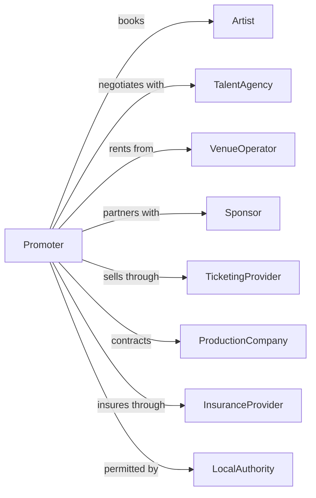

# Promoters of Performing Arts, Sports, and Similar Events without Facilities

> Business-as-Code definition for independent event promotion operations. Models booking agencies and promoters who produce events at third-party venues.

## Overview

Independent promoters organize, promote, and manage live events at facilities operated by others, including concerts, festivals, sports events, and theatrical productions. This definition exposes actions for talent booking, venue contracting, event production, and financial settlement, with events for workflow automation and searches for deal tracking and revenue management.

## Actors

| Actor | Description |
|-------|-------------|
| Artist | Talent booked for performances |
| TalentAgency | Represents performers in booking negotiations |
| VenueOperator | Manages facilities rented for events |
| Sponsor | Provides event funding for brand exposure |
| TicketingProvider | Processes ticket sales and distribution |
| ProductionCompany | Provides staging, sound, and lighting services |
| InsuranceProvider | Covers liability for event operations |
| LocalAuthority | Issues permits and enforces regulations |
| MediaOutlet | Provides advertising and promotional coverage |

## Roles

| Role | Description |
|------|-------------|
| Promoter | Books talent and produces events |
| BookingAgent | Secures talent engagements for clients |
| ProductionManager | Coordinates technical requirements with venues |
| MarketingCoordinator | Executes promotional campaigns |
| TourCoordinator | Manages logistics for multi-city events |
| FinanceManager | Handles budgets, settlements, and accounting |

## Entities

| Entity | Description |
|--------|-------------|
| Event | A scheduled performance or gathering |
| Booking | A confirmed engagement with talent |
| VenueRental | Agreement to use a facility for an event |
| Ticket | Admission pass for a specific event |
| Contract | Agreement with artists, venues, or vendors |
| Budget | Projected revenues and expenses for an event |
| Settlement | Final financial reconciliation for an event |
| Tour | A series of events across multiple locations |
| Sponsorship | Paid partnership with corporate brand |
| Offer | Proposed terms for talent engagement |

## Actions

| Action | Description |
|--------|-------------|
| submitOffer | Propose terms to talent or agency |
| bookTalent | Confirm engagement with artist |
| secureVenue | Contract facility for event use |
| buildBudget | Project revenues and expenses for event |
| obtainPermit | Secure required authorizations |
| openSales | Launch ticket availability |
| marketEvent | Execute promotional campaigns |
| advanceShow | Coordinate production details with venue |
| produceEvent | Execute event day operations |
| settleEvent | Reconcile revenues and expenses |
| routeTour | Plan logistics for multi-city engagements |
| processRefund | Handle ticket cancellations |
| renewSponsorship | Extend corporate partnership |

## Events

| Event | Description |
|-------|-------------|
| offerSubmitted | Proposed terms sent to talent |
| talentBooked | Engagement confirmed with artist |
| venueSecured | Facility contracted for event |
| budgetApproved | Financial projections confirmed |
| permitObtained | Required authorizations secured |
| salesOpened | Tickets available for purchase |
| eventMarketed | Promotional campaign launched |
| showAdvanced | Production coordination completed |
| eventProduced | Event successfully executed |
| eventSettled | Financial reconciliation completed |
| tourRouted | Multi-city logistics planned |
| refundProcessed | Ticket return completed |

## Searches

| Search | Description |
|--------|-------------|
| getEventCalendar | List scheduled events with status |
| findTalent | Search available artists by genre or date |
| findVenues | Search facilities by location and capacity |
| getTicketSales | Retrieve sales data by event |
| getBudgets | Access financial projections for events |
| getSettlements | Review completed financial reconciliations |
| getTourSchedule | List multi-city event routing |

## Workflow



## Actor Relationships



## Usage

### Calling Actions

```typescript
import { promoteEvents } from '@headlessly/promote-events'

const promoter = promoteEvents()

// Submit an offer to talent
const offer = await promoter.submitOffer({
  artistId: 'artist-123',
  dates: ['2024-08-15', '2024-08-17', '2024-08-19'],
  markets: ['new-york', 'philadelphia', 'boston'],
  guarantee: 50000,
  percentageSplit: 0.8,
  production: 'artist-provided'
})

// Secure a venue
const venue = await promoter.secureVenue({
  venueId: 'venue-456',
  date: '2024-08-15',
  configuration: 'general-admission',
  rentalFee: 15000,
  concessionSplit: 0.2,
  loadInTime: '14:00'
})

// Build event budget
const budget = await promoter.buildBudget({
  eventId: offer.events[0].id,
  projectedTickets: 3000,
  ticketPrice: 55,
  expenses: {
    talent: 50000,
    venue: 15000,
    production: 12000,
    marketing: 8000,
    insurance: 2000
  }
})
```

### Event-Driven Automation

```typescript
// Auto-generate settlement after event
promoter.eventProduced(async ({ eventId }) => {
  const sales = await promoter.getTicketSales({ eventId })
  const budget = await promoter.getBudgets({ eventId })

  const settlement = await promoter.settleEvent({
    eventId,
    grossRevenue: sales.total,
    actualExpenses: await getActualExpenses(eventId),
    artistPayment: calculateArtistPayment(sales.total, budget.terms)
  })

  if (settlement.profit < budget.projectedProfit * 0.5) {
    await sendAlert({
      to: 'finance-team',
      message: `Event ${eventId} underperformed: ${settlement.profit}`,
      action: 'review-marketing-strategy'
    })
  }
})

// Coordinate tour logistics when routing complete
promoter.tourRouted(async ({ tourId, dates }) => {
  for (const date of dates) {
    await promoter.advanceShow({
      eventId: date.eventId,
      venueId: date.venueId,
      technicalRequirements: getTechnicalRider(tourId),
      hospitalityRequirements: getHospitalityRider(tourId)
    })
  }
})
```
