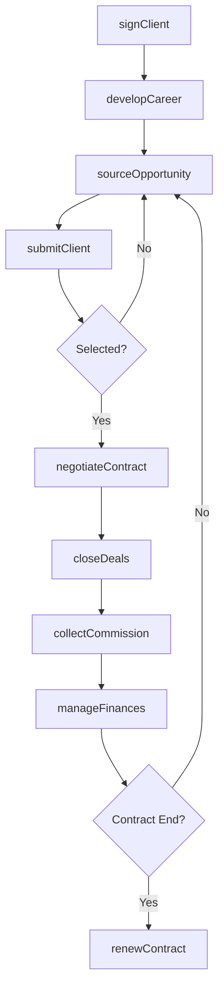
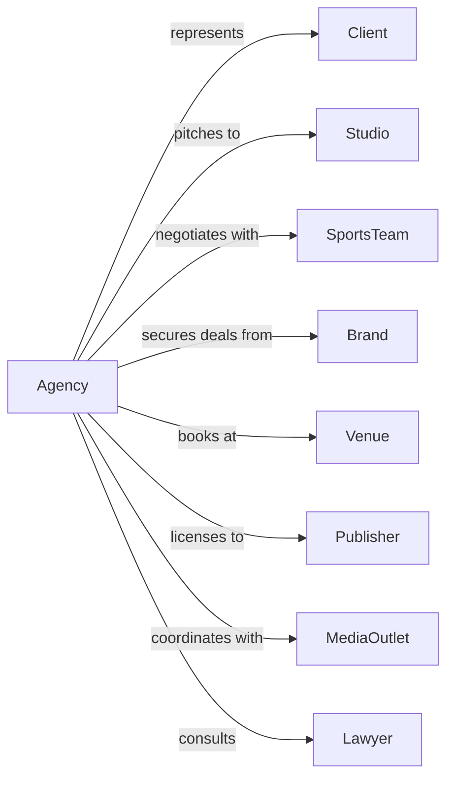

# Agents and Managers for Artists, Athletes, Entertainers, and Other Public Figures

> Business-as-Code definition for talent representation operations. Models the complete lifecycle from client acquisition through contract negotiation, career management, and financial oversight.

## Overview

Agents and managers represent creative artists, sports figures, entertainers, and public figures through contract negotiations, financial management, and career development. This definition exposes actions for client representation, deal negotiation, and business management, with events for workflow automation and searches for opportunity tracking and financial reporting.

## Actors

| Actor | Description |
|-------|-------------|
| Client | The talent being represented by the agency |
| Studio | Film, television, or recording production company |
| SportsTeam | Professional team seeking to sign athletes |
| Brand | Corporation seeking talent for endorsements |
| Venue | Performance space booking talent |
| Publisher | Company licensing intellectual property |
| MediaOutlet | Press and broadcast entities covering clients |
| Lawyer | Provides legal counsel for contracts |
| Accountant | Manages financial reporting and taxes |

## Roles

| Role | Description |
|------|-------------|
| TalentAgent | Secures work opportunities for clients |
| PersonalManager | Oversees career strategy and development |
| BusinessManager | Handles financial affairs and investments |
| PublicistRep | Manages media relations and public image |
| TouringAgent | Books live performance engagements |
| LiteraryAgent | Represents writers for publishing deals |

## Entities

| Entity | Description |
|--------|-------------|
| Client | A represented talent on the agency roster |
| Contract | Agreement securing work or endorsement |
| Commission | Agency fee from client earnings |
| Opportunity | A potential engagement or deal |
| Negotiation | Active discussion of deal terms |
| Portfolio | Collection of client work and achievements |
| Endorsement | Paid promotional partnership |
| Royalty | Ongoing income from licensed work |
| Appearance | Paid public engagement or event |
| Retainer | Ongoing management fee arrangement |

## Actions

| Action | Description |
|--------|-------------|
| signClient | Execute representation agreement with talent |
| sourceOpportunity | Identify and pursue potential engagements |
| submitClient | Present talent for consideration |
| negotiateContract | Establish terms for engagements |
| closeDeals | Finalize and execute agreements |
| manageFinances | Oversee client income and expenses |
| collectCommission | Process agency fee from client earnings |
| developCareer | Create and execute long-term strategy |
| coordinateAppearance | Arrange paid public engagements |
| managePublicity | Oversee media relations and image |
| reviewRoyalties | Audit and reconcile ongoing income |
| renewContract | Extend client representation agreement |

## Events

| Event | Description |
|-------|-------------|
| clientSigned | Representation agreement executed |
| opportunitySourced | Potential engagement identified |
| clientSubmitted | Talent presented for consideration |
| negotiationStarted | Deal discussions commenced |
| dealClosed | Agreement finalized and executed |
| commissionCollected | Agency fee processed |
| careerMilestone | Significant achievement reached |
| appearanceCompleted | Paid engagement fulfilled |
| publicityGenerated | Media coverage secured |
| royaltyReceived | Ongoing income processed |
| contractRenewed | Representation extended |

## Searches

| Search | Description |
|--------|-------------|
| getClients | List represented talent with status |
| findOpportunities | Search available engagements by type |
| getDeals | Retrieve active and pending negotiations |
| getCommissions | Access earnings and fee reports |
| getSubmissions | Track client presentations and responses |
| getRoyalties | Review ongoing income by client |
| getCalendar | List upcoming appearances and obligations |

## Workflow



## Actor Relationships



## Usage

### Calling Actions

```typescript
import { representTalent } from '@headlessly/represent-talent'

const agency = representTalent()

// Sign a new client
const client = await agency.signClient({
  name: 'Jane Smith',
  category: 'actor',
  terms: {
    commissionRate: 0.10,
    duration: 36,
    exclusivity: true,
    territories: ['north-america', 'europe']
  }
})

// Source and submit for opportunity
const opportunity = await agency.sourceOpportunity({
  type: 'film-role',
  project: 'Major Studio Feature',
  role: 'Lead',
  compensation: 'scale-plus'
})

await agency.submitClient({
  clientId: client.id,
  opportunityId: opportunity.id,
  materials: ['headshot', 'reel', 'resume'],
  availability: { start: '2024-06-01', end: '2024-10-15' }
})

// Negotiate a deal
const deal = await agency.negotiateContract({
  clientId: client.id,
  opportunityId: opportunity.id,
  initialOffer: 250000,
  counterTerms: {
    compensation: 400000,
    backend: 0.02,
    perDiem: 150,
    billing: 'second-position'
  }
})
```

### Event-Driven Automation

```typescript
// Auto-collect commission when deal closes
agency.dealClosed(async ({ clientId, dealId, compensation }) => {
  const client = await agency.getClients({ id: clientId })
  const commission = compensation * client.commissionRate

  await agency.collectCommission({
    dealId,
    amount: commission,
    schedule: getPaymentSchedule(dealId)
  })

  await notifyClient({
    clientId,
    message: `Deal closed! Your net: $${compensation - commission}`
  })
})

// Track career milestones
agency.dealClosed(async ({ clientId, dealType, compensation }) => {
  const history = await agency.getDeals({ clientId })

  if (compensation > getHighestPrevious(history)) {
    await agency.developCareer({
      clientId,
      milestone: 'career-high-deal',
      strategy: 'leverage-momentum',
      nextTargets: getTargetOpportunities(clientId, compensation * 1.5)
    })
  }
})
```
