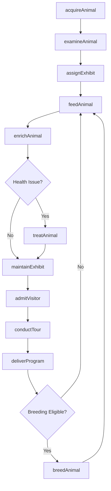
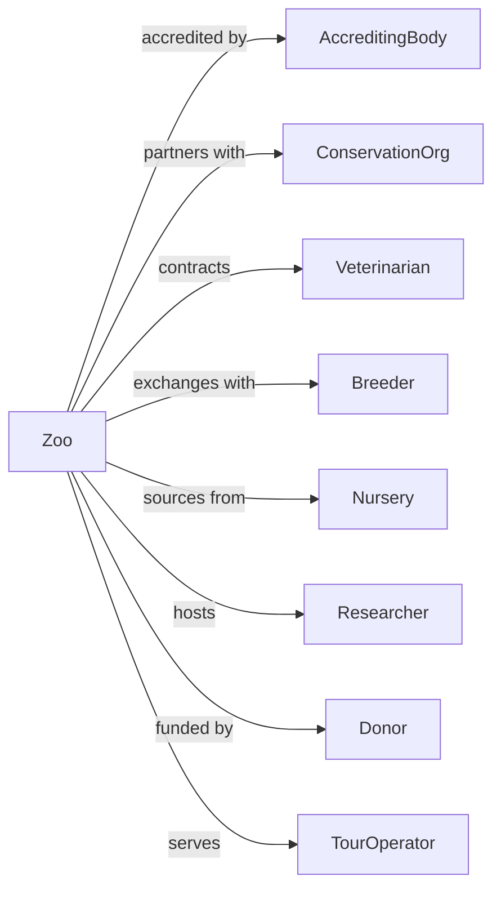

# Zoos and Botanical Gardens

> Business-as-Code definition for living collection operations. Models the complete lifecycle of animal and plant care, conservation programs, and visitor engagement.

## Overview

Zoos and botanical gardens preserve and exhibit live plant and animal collections including aquariums, wild animal parks, and arboreta. This definition exposes actions for animal husbandry, horticulture, conservation programs, and visitor services, with events for workflow automation and searches for collection management and operational tracking.

## Actors

| Actor | Description |
|-------|-------------|
| AccreditingBody | Certifies facility standards through AZA or similar |
| ConservationOrg | Partners on species preservation programs |
| Veterinarian | Provides animal medical care and oversight |
| Breeder | Supplies or receives animals for breeding programs |
| Nursery | Supplies plant specimens for collections |
| Researcher | Conducts studies on collection species |
| Donor | Provides funding for facilities and programs |
| TourOperator | Brings group visitors to the facility |
| EducationPartner | Collaborates on school and community programs |

## Roles

| Role | Description |
|------|-------------|
| Director | Leads overall institutional operations |
| Curator | Manages specific animal or plant collections |
| Zookeeper | Provides daily animal care and enrichment |
| Horticulturist | Maintains plant collections and grounds |
| VeterinaryStaff | Delivers animal medical care |
| Educator | Creates and delivers visitor programming |

## Entities

| Entity | Description |
|--------|-------------|
| Animal | A living creature in the collection |
| Plant | A living specimen in the botanical collection |
| Exhibit | A habitat or display area for visitors |
| Species | A category of animals or plants in the collection |
| BreedingProgram | Coordinated effort for species reproduction |
| Enrichment | Activities enhancing animal welfare |
| ConservationProject | Initiative for species preservation |
| MedicalRecord | Health history for collection animals |
| Tour | A guided visitor experience |
| Membership | Visitor subscription with benefits |

## Actions

| Action | Description |
|--------|-------------|
| acquireAnimal | Add an animal to the collection |
| acquirePlant | Add a plant specimen to the collection |
| feedAnimal | Provide nutrition to collection animals |
| enrichAnimal | Execute behavioral enrichment activities |
| examineAnimal | Conduct veterinary health assessment |
| treatAnimal | Provide medical care for illness or injury |
| breedAnimal | Manage reproduction for conservation |
| maintainExhibit | Care for habitat and display areas |
| admitVisitor | Process guest admission |
| conductTour | Lead guided visitor experience |
| deliverProgram | Execute educational activities |
| participateSSP | Engage in Species Survival Plan programs |
| transferAnimal | Move animal to or from another facility |

## Events

| Event | Description |
|-------|-------------|
| animalAcquired | New animal added to collection |
| plantAcquired | New specimen added to collection |
| animalFed | Nutrition provided to animal |
| animalEnriched | Behavioral activity completed |
| animalExamined | Health assessment completed |
| animalTreated | Medical care delivered |
| animalBorn | New offspring in collection |
| exhibitMaintained | Habitat care completed |
| visitorAdmitted | Guest processed for entry |
| tourCompleted | Guided experience finished |
| programDelivered | Educational activity completed |
| animalTransferred | Animal moved between facilities |

## Searches

| Search | Description |
|--------|-------------|
| getAnimals | List animals with species and status |
| getPlants | List specimens with location and condition |
| getExhibits | Retrieve display areas with status |
| getMedicalRecords | Access health history by animal |
| getBreedingStatus | Check reproduction program progress |
| getVisitorStats | Access attendance and demographics |
| getConservationPrograms | List active preservation initiatives |

## Workflow



## Actor Relationships



## Usage

### Calling Actions

```typescript
import { exhibitNature } from '@headlessly/exhibit-nature'

const zoo = exhibitNature()

// Acquire a new animal
const animal = await zoo.acquireAnimal({
  species: 'Panthera tigris sumatrae',
  commonName: 'Sumatran Tiger',
  name: 'Raja',
  sex: 'male',
  birthDate: '2020-04-15',
  source: 'ssp-transfer',
  originFacility: 'partner-zoo-123',
  geneticValue: 'high'
})

// Examine the animal
await zoo.examineAnimal({
  animalId: animal.id,
  examType: 'arrival-quarantine',
  veterinarianId: 'vet-456',
  tests: ['bloodwork', 'fecal', 'physical'],
  quarantineDays: 30
})

// Set up enrichment program
await zoo.enrichAnimal({
  animalId: animal.id,
  activities: [
    { type: 'scent-trail', frequency: 'daily' },
    { type: 'puzzle-feeder', frequency: 'twice-weekly' },
    { type: 'novel-object', frequency: 'weekly' }
  ],
  keeper: 'keeper-789'
})
```

### Event-Driven Automation

```typescript
// Auto-schedule follow-up care when animal treated
zoo.animalTreated(async ({ animalId, condition, treatment }) => {
  await zoo.examineAnimal({
    animalId,
    examType: 'follow-up',
    scheduledDate: getFollowUpDate(treatment.type),
    focus: condition
  })

  if (treatment.medication) {
    await scheduleMedicationReminders({
      animalId,
      medication: treatment.medication,
      schedule: treatment.dosageSchedule
    })
  }
})

// Celebrate and announce births
zoo.animalBorn(async ({ animalId, species, parentIds }) => {
  const animal = await zoo.getAnimals({ id: animalId })

  await zoo.examineAnimal({
    animalId,
    examType: 'neonatal',
    priority: 'urgent'
  })

  if (species.conservationStatus === 'endangered') {
    await announceToMedia({
      type: 'birth-announcement',
      species: species.commonName,
      conservationImpact: 'ssp-contribution'
    })
  }
})
```
