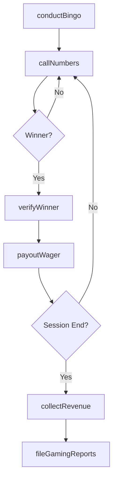
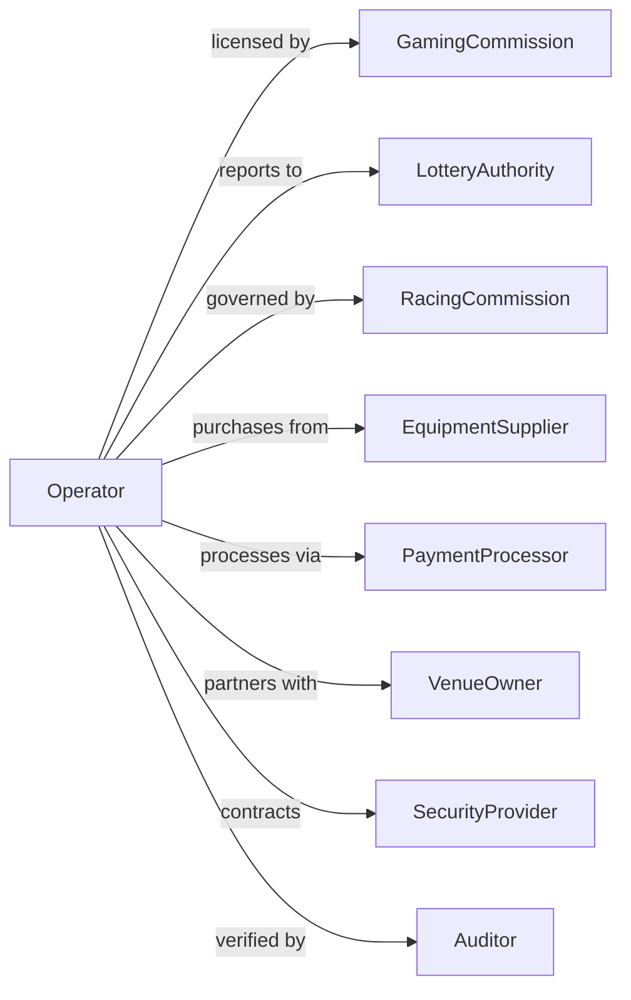

# Other Gambling Industries

> Business-as-Code definition for non-casino gambling operations. Models bingo halls, card rooms, lottery agents, and off-track betting facilities.

## Overview

Other gambling industries operate wagering facilities outside traditional casinos, including bingo parlors, poker rooms, off-track betting, lottery retailers, and slot machine concessions. This definition exposes actions for game operations, wagering services, and regulatory compliance, with events for workflow automation and searches for revenue and compliance tracking.

## Actors

| Actor | Description |
|-------|-------------|
| GamingCommission | Regulates licensing and operations |
| LotteryAuthority | Administers lottery games and payouts |
| RacingCommission | Governs pari-mutuel wagering |
| EquipmentSupplier | Provides gaming devices and systems |
| PaymentProcessor | Handles transactions and payouts |
| VenueOwner | Hosts gambling equipment on premises |
| SecurityProvider | Monitors operations and cash handling |
| Auditor | Verifies gaming and financial compliance |
| TaxAuthority | Collects gaming taxes and reports |

## Roles

| Role | Description |
|------|-------------|
| FacilityManager | Oversees gambling operations |
| GameCaller | Conducts bingo games |
| Dealer | Operates card room games |
| Teller | Processes wagers and payouts |
| CashierManager | Oversees cash operations |
| ComplianceOfficer | Ensures regulatory adherence |

## Entities

| Entity | Description |
|--------|-------------|
| BingoGame | A scheduled bingo session |
| CardGame | A poker or other card room game |
| LotteryTicket | A purchased lottery entry |
| OTBWager | An off-track betting slip |
| SlotConcession | Gaming machines placed in third-party venues |
| Payout | Winnings distributed to players |
| Session | A scheduled gambling period |
| Jackpot | A significant prize or progressive win |
| License | Authorization to operate gambling activities |
| Revenue | Income from gambling operations |

## Actions

| Action | Description |
|--------|-------------|
| conductBingo | Run bingo game sessions |
| callNumbers | Execute bingo number draws |
| verifyWinner | Confirm bingo winning card |
| operateCardRoom | Run poker or card games |
| sellLotteryTicket | Process lottery purchases |
| redeemLotteryWin | Pay out lottery prizes |
| acceptOTBWager | Process off-track betting |
| payoutWager | Settle winning bets |
| serviceSlotConcession | Maintain equipment in third-party venues |
| collectRevenue | Gather income from concession locations |
| fileGamingReports | Submit regulatory compliance documents |
| conductAudit | Verify operations and finances |

## Events

| Event | Description |
|-------|-------------|
| bingoSessionStarted | Bingo game period began |
| numbersCalled | Bingo draw executed |
| winnerVerified | Winning card confirmed |
| cardGameOperated | Poker session ran |
| lotteryTicketSold | Lottery purchase completed |
| lotteryWinRedeemed | Prize paid out |
| otbWagerAccepted | Off-track bet processed |
| wagerPaidOut | Winning bet settled |
| concessionServiced | Equipment maintained |
| revenueCollected | Income gathered from locations |
| reportFiled | Compliance document submitted |

## Searches

| Search | Description |
|--------|-------------|
| getBingoSchedule | List upcoming sessions |
| getCardGames | Retrieve active poker rooms |
| getLotteryResults | Check winning numbers and payouts |
| getOTBResults | Access race results and settlements |
| getConcessions | List slot locations with revenue |
| getRevenue | Access income by category or location |
| getCompliance | Review regulatory filing status |

## Workflow



## Actor Relationships



## Usage

### Calling Actions

```typescript
import { operateGambling } from '@headlessly/operate-gambling'

const facility = operateGambling()

// Conduct a bingo session
const session = await facility.conductBingo({
  sessionId: 'evening-session',
  games: [
    { pattern: 'regular', prize: 100 },
    { pattern: 'coverall', prize: 500, progressive: true }
  ],
  cardPrice: 5,
  startTime: '19:00'
})

// Call numbers and verify winner
await facility.callNumbers({
  sessionId: session.id,
  gameNumber: 1,
  numbers: [12, 45, 67, 23, 89]
})

await facility.verifyWinner({
  sessionId: session.id,
  gameNumber: 1,
  cardId: 'card-12345',
  pattern: 'regular'
})

// Sell lottery tickets
await facility.sellLotteryTicket({
  game: 'powerball',
  numbers: [5, 12, 23, 45, 67],
  powerball: 10,
  drawings: 1,
  payment: 2
})
```

### Event-Driven Automation

```typescript
// Auto-report large payouts
facility.wagerPaidOut(async ({ amount, playerId, gameType }) => {
  if (amount >= 1200) {
    await facility.fileGamingReports({
      reportType: 'w2g',
      playerId,
      amount,
      gameType,
      timestamp: new Date()
    })
  }
})

// Service concession locations on schedule
facility.revenueCollected(async ({ locationId, amount, lastService }) => {
  const daysSinceService = getDaysSince(lastService)

  if (daysSinceService >= 7 || amount >= 5000) {
    await facility.serviceSlotConcession({
      locationId,
      tasks: ['revenue-collection', 'maintenance-check', 'paper-refill'],
      technician: await getAvailableTechnician()
    })
  }
})
```
