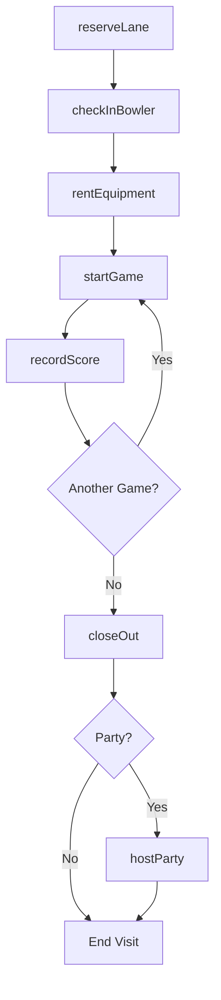
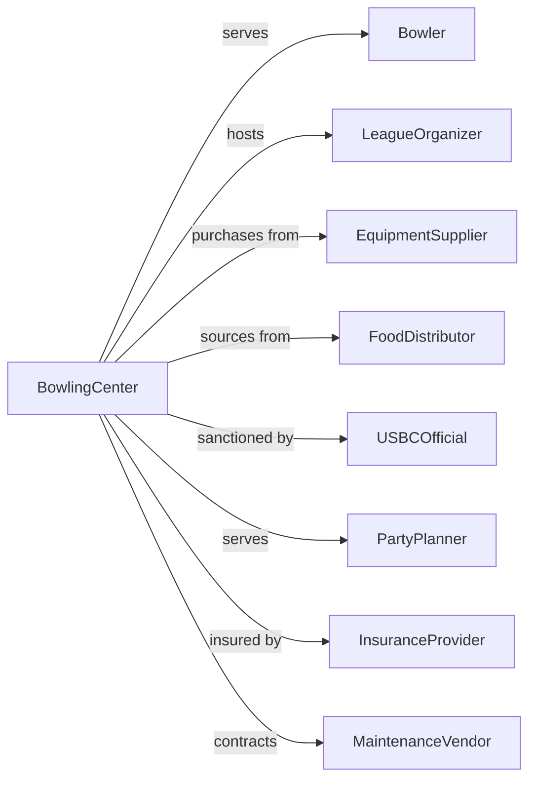

# Bowling Centers

> Business-as-Code definition for bowling center operations. Models lane reservations, league management, food service, and entertainment amenities.

## Overview

Bowling centers operate facilities featuring lanes, shoe rentals, pro shops, food service, and often additional entertainment. This definition exposes actions for lane management, league operations, equipment rentals, and event hosting, with events for workflow automation and searches for utilization and revenue tracking.

## Actors

| Actor | Description |
|-------|-------------|
| Bowler | Individual or group using lanes |
| LeagueOrganizer | Coordinates competitive bowling schedules |
| EquipmentSupplier | Provides balls, shoes, and lane maintenance |
| FoodDistributor | Supplies food and beverage operations |
| USBCOfficial | Sanctions leagues and certifies scores |
| PartyPlanner | Books birthday and corporate events |
| InsuranceProvider | Covers liability for operations |
| MaintenanceVendor | Services lanes and pin equipment |
| ArcadeSupplier | Provides games for entertainment area |

## Roles

| Role | Description |
|------|-------------|
| CenterManager | Oversees overall facility operations |
| FrontDesk | Processes lane rentals and check-ins |
| MechanicTechnician | Maintains lanes, pinsetters, and equipment |
| LeagueCoordinator | Manages competitive bowling programs |
| FoodServiceManager | Oversees dining operations |
| ProShopAttendant | Sells and drills bowling equipment |

## Entities

| Entity | Description |
|--------|-------------|
| Lane | A bowling surface with pinsetter |
| Game | A single bowling game session |
| League | Organized competitive bowling schedule |
| Team | A group competing in league play |
| Reservation | A booked lane time slot |
| RentalShoes | Footwear provided to bowlers |
| RentalBall | House ball provided to bowlers |
| Party | A booked group event or celebration |
| ProShopSale | Bowling equipment purchase |
| Score | Recorded game results |

## Actions

| Action | Description |
|--------|-------------|
| reserveLane | Book lane time for bowling |
| checkInBowler | Process arrival and assign lane |
| rentEquipment | Provide shoes and house balls |
| startGame | Begin bowling session on lane |
| recordScore | Track game results |
| manageLeague | Operate competitive bowling program |
| enrollTeam | Register team for league competition |
| hostParty | Execute group event or celebration |
| sellProShop | Process equipment purchase |
| maintainLane | Service lane and pinsetter equipment |
| processWaitlist | Handle lane demand overflow |
| closeOut | Process payment and end session |

## Events

| Event | Description |
|-------|-------------|
| laneReserved | Time slot booked |
| bowlerCheckedIn | Arrival processed and lane assigned |
| equipmentRented | Shoes and ball provided |
| gameStarted | Bowling session began |
| scoreRecorded | Game results tracked |
| leagueManaged | Competition program operated |
| teamEnrolled | Team registered for league |
| partyHosted | Group event completed |
| proShopSaleCompleted | Equipment sold |
| laneMaintained | Equipment serviced |
| sessionClosedOut | Payment processed |

## Searches

| Search | Description |
|--------|-------------|
| getLanes | List lanes with availability |
| getReservations | Check booked time slots |
| getLeagues | Retrieve competitive programs |
| getTeams | List registered league teams |
| getScores | Access historical game results |
| getParties | Review booked events |
| getRevenue | Access income by category |

## Workflow



## Actor Relationships



## Usage

### Calling Actions

```typescript
import { recreateBowling } from '@headlessly/recreate-bowling'

const center = recreateBowling()

// Reserve a lane
const reservation = await center.reserveLane({
  date: '2024-03-15',
  time: '19:00',
  duration: 2,
  lanes: 2,
  bowlers: 8,
  type: 'cosmic-bowling'
})

// Check in and start bowling
await center.checkInBowler({
  reservationId: reservation.id,
  bowlers: ['John', 'Jane', 'Bob', 'Alice'],
  rentals: {
    shoes: [10, 8, 11, 7],
    balls: [12, 10, 14, 10]
  }
})

await center.startGame({
  laneId: 'lane-15',
  bowlers: ['John', 'Jane', 'Bob', 'Alice'],
  scoring: 'automatic'
})

// Enroll a league team
await center.enrollTeam({
  leagueId: 'thursday-night-mixed',
  teamName: 'Pin Pals',
  captain: 'captain-123',
  members: ['member-1', 'member-2', 'member-3', 'member-4'],
  startWeek: '2024-01-04'
})
```

### Event-Driven Automation

```typescript
// Auto-record scores for league tracking
center.gameStarted(async ({ laneId, leagueId }) => {
  if (leagueId) {
    await enableAutoScoring({
      laneId,
      leagueId,
      sync: 'real-time'
    })
  }
})

// Manage lane maintenance schedule
center.laneMaintained(async ({ laneId, maintenanceType }) => {
  const lane = await center.getLanes({ id: laneId })

  await scheduleNextMaintenance({
    laneId,
    nextService: calculateNextService(maintenanceType),
    basedOn: lane.gamesPlayed
  })

  if (lane.gamesPlayed > 10000) {
    await alertMaintenance({
      laneId,
      message: 'High usage - schedule comprehensive inspection',
      priority: 'routine'
    })
  }
})
```
