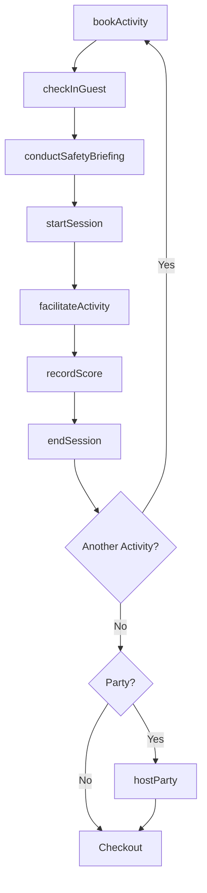
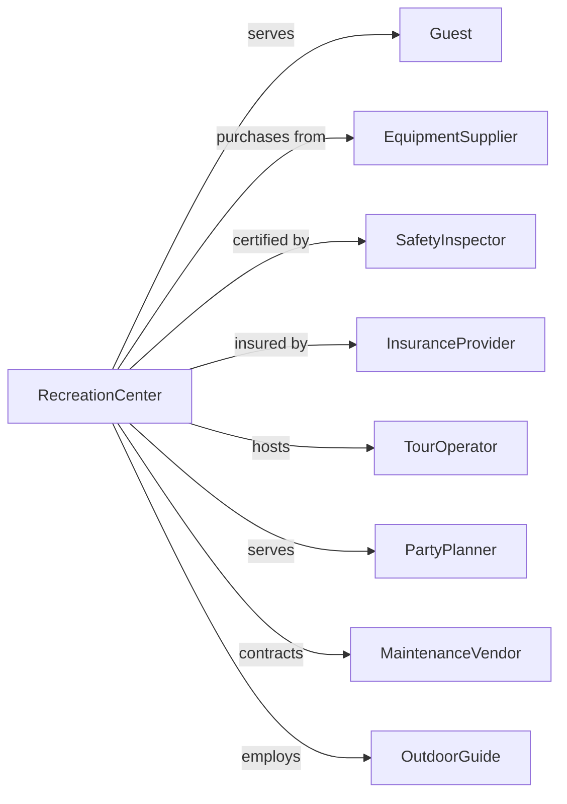

# All Other Amusement and Recreation Industries

> Business-as-Code definition for diverse recreational operations. Models outdoor adventures, escape rooms, laser tag, miniature golf, and specialty entertainment.

## Overview

All other amusement and recreation industries operate facilities providing diverse recreational services including outdoor adventures, escape rooms, batting cages, miniature golf, go-karts, and laser tag. This definition exposes actions for activity scheduling, equipment operations, and guest services, with events for workflow automation and searches for utilization and revenue tracking.

## Actors

| Actor | Description |
|-------|-------------|
| Guest | Individual or group participating in activities |
| EquipmentSupplier | Provides specialized recreational gear |
| SafetyInspector | Certifies equipment and operations compliance |
| InsuranceProvider | Covers liability for activities |
| TourOperator | Books group adventures and excursions |
| PartyPlanner | Books birthday and corporate events |
| MaintenanceVendor | Services and repairs equipment |
| OutdoorGuide | Leads adventure activities |
| LicensingAuthority | Issues permits for operations |

## Roles

| Role | Description |
|------|-------------|
| FacilityManager | Oversees overall operations |
| ActivityHost | Facilitates experiences and games |
| SafetyAttendant | Ensures guest safety during activities |
| EquipmentTech | Maintains specialized gear and systems |
| Reservations | Handles bookings and scheduling |
| PartyCoordinator | Manages group events |

## Entities

| Entity | Description |
|--------|-------------|
| Activity | A specific recreational experience |
| Session | A scheduled time slot for an activity |
| Reservation | A booked activity time |
| Equipment | Specialized gear for activities |
| Party | A booked group event or celebration |
| Waiver | Liability release signed by participants |
| Score | Recorded results for competitive activities |
| Pass | Multi-activity or season access |
| Concession | Location operator agreement |
| SafetyCheck | Equipment inspection record |

## Actions

| Action | Description |
|--------|-------------|
| bookActivity | Reserve time slot for experience |
| checkInGuest | Process arrival and verify waiver |
| conductSafetyBriefing | Deliver pre-activity safety instructions |
| startSession | Begin scheduled activity |
| facilitateActivity | Guide and monitor guest experience |
| recordScore | Track results for competitive activities |
| endSession | Complete activity and process checkout |
| hostParty | Execute group event |
| maintainEquipment | Service specialized gear |
| inspectSafety | Verify equipment compliance |
| sellPass | Process multi-activity access |
| operateConcession | Run equipment in third-party venue |

## Events

| Event | Description |
|-------|-------------|
| activityBooked | Time slot reserved |
| guestCheckedIn | Arrival processed and waiver verified |
| safetyBriefingCompleted | Instructions delivered |
| sessionStarted | Activity began |
| activityFacilitated | Experience conducted |
| scoreRecorded | Results tracked |
| sessionEnded | Activity completed |
| partyHosted | Group event concluded |
| equipmentMaintained | Gear serviced |
| safetyInspected | Compliance verified |
| passSold | Multi-activity access purchased |

## Searches

| Search | Description |
|--------|-------------|
| getActivities | List available experiences |
| getReservations | Check booked time slots |
| getEquipment | Review gear status and availability |
| getParties | List booked events |
| getScores | Access leaderboards and results |
| getRevenue | Retrieve income by activity or period |
| getSafetyRecords | Review inspection history |

## Workflow



## Actor Relationships



## Usage

### Calling Actions

```typescript
import { recreateRecreation } from '@headlessly/recreate-recreation'

const facility = recreateRecreation()

// Book an escape room
const reservation = await facility.bookActivity({
  activityType: 'escape-room',
  room: 'haunted-mansion',
  date: '2024-04-20',
  time: '15:00',
  participants: 6,
  difficulty: 'intermediate'
})

// Check in and start
await facility.checkInGuest({
  reservationId: reservation.id,
  participants: ['Guest 1', 'Guest 2', 'Guest 3', 'Guest 4', 'Guest 5', 'Guest 6'],
  waiversSigned: true
})

await facility.conductSafetyBriefing({
  reservationId: reservation.id,
  rules: ['no-phones', 'no-force', 'ask-for-hints'],
  duration: 5
})

await facility.startSession({
  reservationId: reservation.id,
  timeLimit: 60,
  hints: 3
})

// Book outdoor adventure
const adventure = await facility.bookActivity({
  activityType: 'zip-line-tour',
  date: '2024-05-15',
  time: '09:00',
  participants: 4,
  weightLimits: { min: 70, max: 250 },
  duration: 180
})
```

### Event-Driven Automation

```typescript
// Track competitive scores and update leaderboards
facility.scoreRecorded(async ({ activityId, participants, score, time }) => {
  const leaderboard = await facility.getScores({
    activityId,
    period: 'all-time',
    limit: 100
  })

  if (isTopScore(score, leaderboard)) {
    await updateLeaderboard({
      activityId,
      participants,
      score,
      time,
      rank: calculateRank(score, leaderboard)
    })

    await notifyGuest({
      participants,
      message: `Congratulations! You made the top 10!`,
      offer: 'free-return-visit'
    })
  }
})

// Coordinate safety inspections
facility.sessionEnded(async ({ activityId, sessionCount }) => {
  const activity = await facility.getActivities({ id: activityId })

  if (sessionCount % 50 === 0) {
    await facility.inspectSafety({
      activityId,
      type: 'routine',
      checkpoints: activity.safetyCheckpoints
    })
  }
})
```
