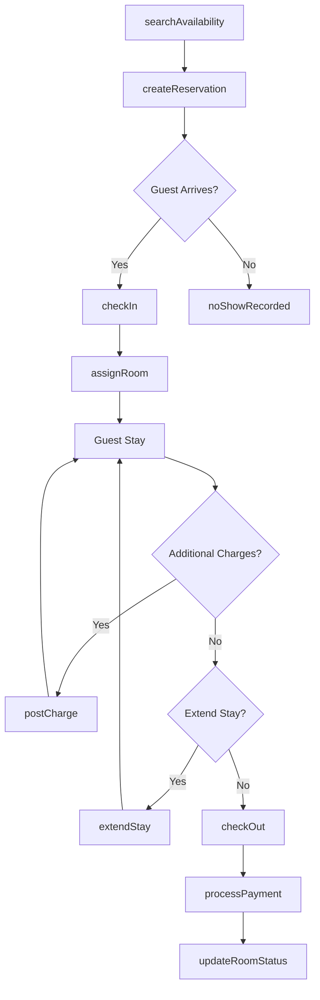
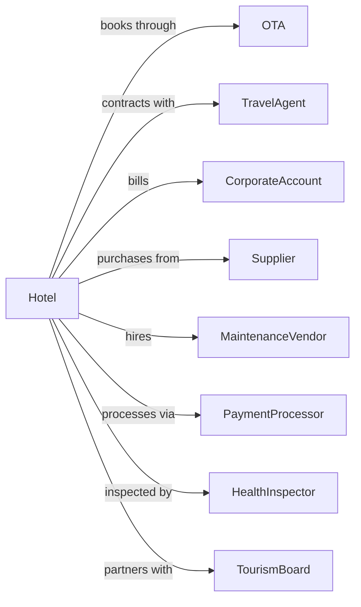

# Hotels (except Casino Hotels) and Motels

> Business-as-Code definition for hotel and motel operations. Models the complete guest lifecycle from reservation through checkout.

## Overview

Hotels and motels provide short-term lodging with services ranging from basic room accommodations to full-service amenities including restaurants, fitness centers, and meeting facilities. This definition exposes actions for reservation management, guest services, housekeeping operations, and revenue optimization.

## Actors

| Actor | Description |
|-------|-------------|
| Guest | Individual or group seeking temporary lodging accommodations |
| TravelAgent | Books rooms on behalf of travelers and negotiates group rates |
| CorporateAccount | Business entity with negotiated rates and billing arrangements |
| OTA | Online travel agency distributing inventory through digital channels |
| Supplier | Provides linens, toiletries, food, and operating supplies |
| MaintenanceVendor | Handles specialized repairs and equipment servicing |
| PaymentProcessor | Processes credit cards and manages payment transactions |
| HealthInspector | Conducts food safety and sanitation inspections |
| TourismBoard | Promotes local tourism and coordinates destination marketing |

## Roles

| Role | Description |
|------|-------------|
| GeneralManager | Oversees all hotel operations and P&L responsibility |
| FrontDeskAgent | Handles check-in, check-out, and guest inquiries |
| Housekeeper | Cleans and prepares guest rooms and public areas |
| RevenueManager | Optimizes pricing and inventory across channels |
| Concierge | Assists guests with recommendations and arrangements |
| NightAuditor | Reconciles daily transactions and prepares reports |

## Entities

| Entity | Description |
|--------|-------------|
| Room | Individual accommodation unit with type, rate, and status |
| Reservation | Booking record with dates, guest info, and rate details |
| Guest | Person or party staying at the property |
| Folio | Guest account tracking charges and payments |
| RoomType | Category defining bed configuration and amenities |
| Rate | Pricing structure based on season, demand, and channel |
| Amenity | Service or facility available to guests |
| Housekeeping | Room cleaning status and assignment tracking |
| Maintenance | Work order for repairs or preventive maintenance |
| Payment | Transaction record for deposits and settlements |

## Actions

| Action | Description |
|--------|-------------|
| searchAvailability | Check room availability for specified dates and room type |
| createReservation | Book a room with guest details and rate information |
| modifyReservation | Change dates, room type, or other booking details |
| cancelReservation | Cancel booking and process applicable fees or refunds |
| checkIn | Register guest arrival and assign room |
| assignRoom | Allocate specific room based on preferences and availability |
| postCharge | Add incidental charges to guest folio |
| processPayment | Collect payment via card, cash, or direct bill |
| checkOut | Complete guest departure and settle folio |
| updateRoomStatus | Mark room as clean, dirty, inspected, or out of order |
| createWorkOrder | Request maintenance or repair for room or facility |
| adjustRate | Apply discount, upgrade, or rate correction |
| extendStay | Add nights to existing reservation |
| transferFolio | Move charges between rooms or reservations |

## Events

| Event | Description |
|-------|-------------|
| reservationCreated | New booking has been confirmed in the system |
| reservationModified | Existing booking details have been changed |
| reservationCancelled | Booking has been cancelled with applicable policy applied |
| guestCheckedIn | Guest has arrived and been assigned a room |
| roomAssigned | Specific room allocated to reservation |
| chargePosted | Incidental charge added to guest folio |
| paymentProcessed | Payment transaction completed successfully |
| guestCheckedOut | Guest has departed and folio settled |
| roomStatusUpdated | Housekeeping status changed for a room |
| workOrderCreated | Maintenance request submitted |
| workOrderCompleted | Repair or maintenance task finished |
| rateAdjusted | Pricing modification applied to reservation |
| noShowRecorded | Guest did not arrive for confirmed reservation |
| overbookingDetected | Reservations exceed available inventory |

## Searches

| Search | Description |
|--------|-------------|
| findAvailableRooms | List rooms available for specified date range and criteria |
| getReservations | Retrieve bookings by date, guest name, or confirmation number |
| getArrivals | List expected check-ins for a given date |
| getDepartures | List expected check-outs for a given date |
| getInHouseGuests | List currently registered guests |
| getRoomStatus | Get housekeeping and maintenance status for rooms |
| getFolioCharges | Retrieve all charges for a guest folio |
| getOccupancyReport | Get occupancy statistics for date range |

## Workflow



## Actor Relationships



## Usage

### Calling Actions

```typescript
import { lodgeGuests } from '@headlessly/lodge-guests'

const hotel = lodgeGuests()

// Check availability for upcoming dates
const availability = await hotel.searchAvailability({
  checkIn: '2024-06-15',
  checkOut: '2024-06-18',
  roomType: 'king-suite',
  guests: 2
})

// Create a new reservation
const reservation = await hotel.createReservation({
  guestName: 'John Smith',
  email: 'john.smith@email.com',
  phone: '+1-555-0123',
  checkIn: '2024-06-15',
  checkOut: '2024-06-18',
  roomType: 'king-suite',
  rateCode: 'BAR',
  specialRequests: ['high-floor', 'late-checkout']
})

// Check in the guest
await hotel.checkIn({
  reservationId: reservation.id,
  idType: 'passport',
  idNumber: 'AB123456',
  paymentMethod: { type: 'card', token: 'tok_visa_4242' }
})
```

### Event-Driven Automation

```typescript
// Auto-assign rooms based on preferences
hotel.reservationCreated(async ({ reservationId, preferences }) => {
  const rooms = await hotel.findAvailableRooms({
    reservationId,
    filters: preferences
  })

  if (rooms.length > 0) {
    await hotel.assignRoom({
      reservationId,
      roomNumber: rooms[0].number
    })
  }
})

// Send checkout reminder and prepare folio
hotel.guestCheckedIn(async ({ reservationId, checkOutDate }) => {
  const dayBefore = new Date(checkOutDate)
  dayBefore.setDate(dayBefore.getDate() - 1)

  scheduleAt(dayBefore, async () => {
    const folio = await hotel.getFolioCharges({ reservationId })
    await sendCheckoutReminder({ reservationId, folio })
  })
})
```
