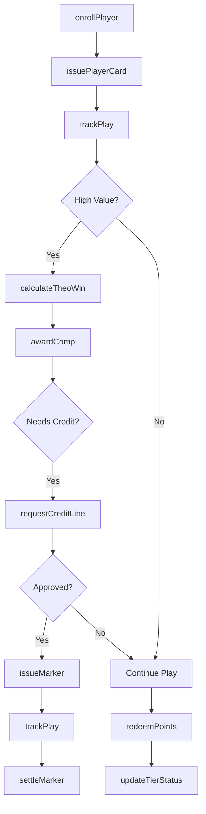
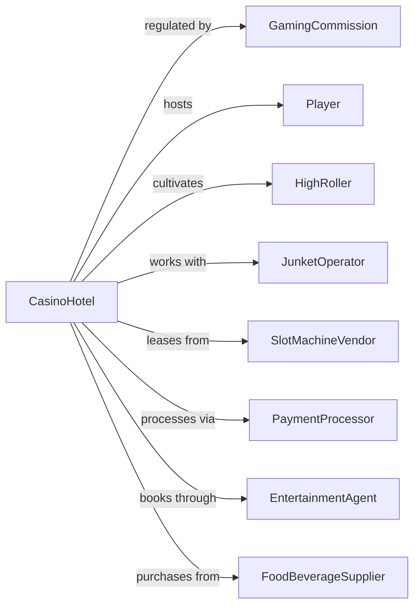

# Casino Hotels

> Business-as-Code definition for casino hotel operations. Models integrated gaming, lodging, and entertainment management.

## Overview

Casino hotels combine short-term lodging with on-premises gaming facilities including table games, slot machines, and sports betting. This definition exposes actions for player tracking, comps management, gaming operations, and integrated resort services across hotel, casino, dining, and entertainment venues.

## Actors

| Actor | Description |
|-------|-------------|
| Player | Guest who participates in gaming activities |
| HighRoller | VIP player with significant gaming activity and credit lines |
| JunketOperator | Organizes groups of players for gaming trips |
| GamingCommission | Regulates casino operations and enforces compliance |
| SlotMachineVendor | Supplies and maintains gaming machines |
| PaymentProcessor | Handles cage transactions and marker processing |
| EntertainmentAgent | Books performers and shows for the property |
| FoodBeverageSupplier | Provides inventory for multiple dining outlets |
| SecurityVendor | Provides surveillance equipment and monitoring services |

## Roles

| Role | Description |
|------|-------------|
| CasinoHost | Manages relationships with valued players and arranges comps |
| PitBoss | Supervises table games and dealers in assigned area |
| SlotAttendant | Assists players and handles jackpot payouts |
| SurveillanceOperator | Monitors gaming floor via camera systems |
| CageManager | Oversees cash operations and marker processing |
| ComplianceOfficer | Ensures adherence to gaming regulations |

## Entities

| Entity | Description |
|--------|-------------|
| Player | Individual with gaming account and activity history |
| PlayerCard | Loyalty card tracking play and earning rewards |
| Marker | Casino credit extended to qualified players |
| TableGame | Blackjack, craps, roulette, or other dealer-operated game |
| SlotMachine | Electronic gaming device with payout configuration |
| Jackpot | Large winning requiring W-2G tax documentation |
| Comp | Complimentary service awarded based on player value |
| Reservation | Room booking linked to player account |
| CreditLine | Pre-approved borrowing limit for gaming |
| Session | Tracked period of gaming activity |
| TierStatus | Loyalty level determining benefits and perks |

## Actions

| Action | Description |
|--------|-------------|
| enrollPlayer | Create new player card account with demographics |
| trackPlay | Record gaming session activity for rated play |
| issueMarker | Extend casino credit against approved credit line |
| settleMarker | Process payment for outstanding casino credit |
| awardComp | Grant complimentary room, food, or entertainment |
| calculateTheoWin | Compute theoretical win based on play duration and average bet |
| processJackpot | Verify winning, complete tax documentation, and pay |
| updateTierStatus | Promote or demote player based on earned points |
| requestCreditLine | Submit application for casino credit approval |
| redeemPoints | Convert loyalty points to free play or rewards |
| bookComped | Reserve complimentary room based on player value |
| issueFreeBet | Provide promotional betting credits |
| suspendPlayer | Restrict player access due to self-exclusion or cause |
| reconcileCage | Balance cage inventory and transaction records |

## Events

| Event | Description |
|-------|-------------|
| playerEnrolled | New player card account created |
| playTracked | Gaming session recorded to player account |
| markerIssued | Casino credit drawn by player |
| markerSettled | Outstanding marker paid in full |
| compAwarded | Complimentary benefit granted to player |
| jackpotHit | Large winning triggered on slot or table |
| jackpotPaid | Jackpot verified and paid to winner |
| tierStatusUpdated | Player loyalty level changed |
| creditLineApproved | New or increased credit line authorized |
| creditLineDenied | Credit application rejected |
| pointsRedeemed | Loyalty points converted to rewards |
| playerSuspended | Account restricted from gaming |
| shiftClosed | Cage shift reconciled and closed |
| highValueAlert | Unusual betting pattern detected by surveillance |

## Searches

| Search | Description |
|--------|-------------|
| getPlayerProfile | Retrieve player demographics, preferences, and history |
| getPlayerValue | Calculate theoretical value and actual results |
| findAvailableComps | List complimentary offers player qualifies for |
| getMarkerHistory | Retrieve outstanding and historical markers |
| getSlotPerformance | Analyze machine performance by location and type |
| getTableDropHandle | Get table game financial metrics |
| findHighValuePlayers | Identify players meeting activity thresholds |
| getJackpotLog | Retrieve jackpot history with tax documentation |

## Workflow



## Actor Relationships



## Usage

### Calling Actions

```typescript
import { lodgeCasinos } from '@headlessly/lodge-casinos'

const casino = lodgeCasinos()

// Enroll new player in rewards program
const player = await casino.enrollPlayer({
  firstName: 'James',
  lastName: 'Chen',
  email: 'james.chen@email.com',
  dateOfBirth: '1975-03-22',
  address: { city: 'Los Angeles', state: 'CA' }
})

// Track table game session
await casino.trackPlay({
  playerId: player.id,
  gameType: 'blackjack',
  tableNumber: 'BJ-15',
  buyIn: 5000,
  averageBet: 200,
  handsPlayed: 120,
  duration: 180
})

// Issue complimentary room based on play
await casino.awardComp({
  playerId: player.id,
  compType: 'room',
  value: 350,
  nights: 2,
  roomType: 'deluxe-suite',
  notes: 'Based on weekend play'
})
```

### Event-Driven Automation

```typescript
// Auto-calculate comps after significant play sessions
casino.playTracked(async ({ playerId, theoWin }) => {
  if (theoWin >= 500) {
    const player = await casino.getPlayerProfile({ playerId })
    const availableComps = await casino.findAvailableComps({ playerId })

    await notifyHost({
      playerId,
      player,
      theoWin,
      availableComps
    })
  }
})

// Process jackpot with tax documentation
casino.jackpotHit(async ({ machineId, amount, playerId }) => {
  if (amount >= 1200) {
    await casino.processJackpot({
      machineId,
      amount,
      playerId,
      requireW2G: true,
      requireIdVerification: true
    })
  }
})
```
