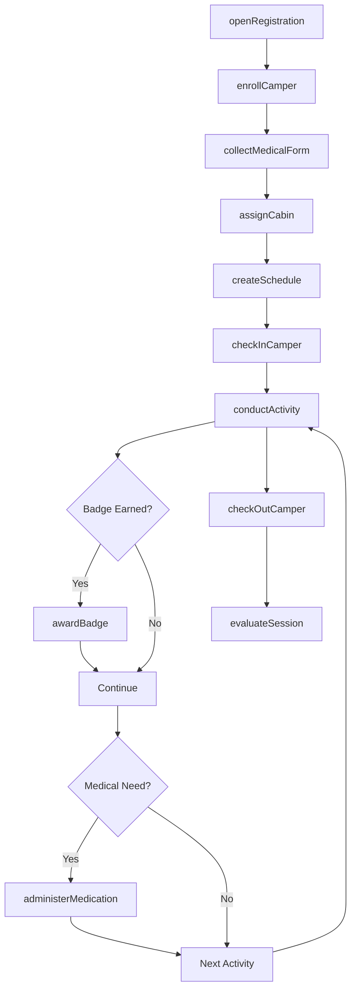
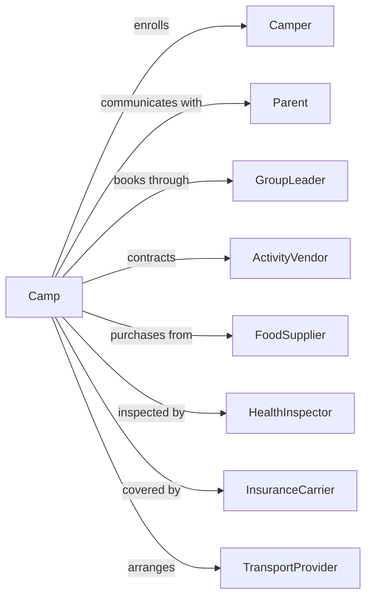

# Recreational and Vacation Camps (except Campgrounds)

> Business-as-Code definition for organized camp operations. Models children's camps, adventure retreats, and activity-based vacation camps.

## Overview

Recreational and vacation camps provide overnight accommodations with organized activities like outdoor adventures, sports, arts, and educational programs. This definition exposes actions for camper registration, activity scheduling, cabin assignments, and program management for children's camps, family camps, and adventure retreats.

## Actors

| Actor | Description |
|-------|-------------|
| Camper | Participant enrolled in camp program |
| Parent | Guardian responsible for minor camper |
| GroupLeader | Organizes group bookings for schools or organizations |
| ActivityVendor | Provides specialized equipment or instruction |
| FoodSupplier | Delivers provisions for camp meal service |
| HealthInspector | Ensures compliance with safety and food regulations |
| InsuranceCarrier | Provides liability and accident coverage |
| TransportProvider | Arranges bus service for camper pickup |

## Roles

| Role | Description |
|------|-------------|
| CampDirector | Oversees all camp operations and programs |
| CabinCounselor | Supervises camper group and living quarters |
| ActivityInstructor | Leads specific program activities |
| NurseHealthOfficer | Manages camper health and medications |
| KitchenManager | Oversees meal preparation and dietary needs |
| WaterfrontDirector | Supervises aquatic activities and safety |

## Entities

| Entity | Description |
|--------|-------------|
| Session | Camp period with specific dates and program |
| Cabin | Sleeping accommodation housing camper group |
| Camper | Enrolled participant with registration details |
| Activity | Scheduled program offering like archery or canoeing |
| MedicalForm | Health history and authorization documents |
| DietaryRestriction | Food allergy or special meal requirement |
| EmergencyContact | Guardian contact for urgent situations |
| Equipment | Gear assigned for activities like kayaks or horses |
| Badge | Achievement earned for skill completion |
| Schedule | Daily activity assignments for camper |

## Actions

| Action | Description |
|--------|-------------|
| openRegistration | Begin accepting enrollments for session |
| enrollCamper | Register participant with required forms |
| assignCabin | Place camper in sleeping accommodation |
| collectMedicalForm | Gather health history and authorizations |
| createSchedule | Build activity assignments for camper |
| checkInCamper | Process arrival and settle into cabin |
| conductActivity | Run scheduled program session |
| administerMedication | Dispense prescribed medications per schedule |
| awardBadge | Grant achievement for skill completion |
| contactParent | Communicate with guardian about camper |
| handleEmergency | Respond to health or safety incident |
| processRefund | Return fees for cancellation or early departure |
| checkOutCamper | Complete departure and return belongings |
| evaluateSession | Gather feedback and assess program quality |

## Events

| Event | Description |
|-------|-------------|
| registrationOpened | Enrollment began for camp session |
| camperEnrolled | Participant registered for session |
| cabinAssigned | Camper placed in sleeping accommodation |
| medicalFormReceived | Health documents collected and reviewed |
| scheduleCreated | Activity assignments generated |
| camperCheckedIn | Participant arrived and settled |
| activityCompleted | Program session finished |
| medicationAdministered | Scheduled medication given to camper |
| badgeAwarded | Achievement granted for skill mastery |
| parentContacted | Communication sent to guardian |
| incidentReported | Health or safety event documented |
| camperCheckedOut | Participant departed camp |
| sessionEvaluated | Program feedback collected |

## Searches

| Search | Description |
|--------|-------------|
| getAvailableSessions | List sessions with open enrollment |
| getCamperRoster | Retrieve enrolled participants for session |
| getCabinAssignments | View camper placement by cabin |
| getDailySchedule | Get activity assignments for date |
| getMedicalNeeds | List campers with health requirements |
| getDietaryRequirements | Retrieve food restrictions for meal planning |
| getActivityRoster | List participants for specific activity |
| getIncidentLog | View health and safety events |

## Workflow



## Actor Relationships



## Usage

### Calling Actions

```typescript
import { campCampers } from '@headlessly/camp-campers'

const camp = campCampers()

// Enroll camper for summer session
const enrollment = await camp.enrollCamper({
  sessionId: 'summer-adventure-week-3',
  firstName: 'Emma',
  lastName: 'Davis',
  dateOfBirth: '2012-04-15',
  grade: 6,
  parentName: 'Jennifer Davis',
  parentEmail: 'j.davis@email.com',
  parentPhone: '+1-555-0145',
  activityPreferences: ['horseback-riding', 'archery', 'swimming'],
  tshirtSize: 'youth-medium'
})

// Submit medical information
await camp.collectMedicalForm({
  camperId: enrollment.camperId,
  allergies: ['bee-stings'],
  medications: [{
    name: 'EpiPen',
    dosage: '0.3mg',
    instructions: 'Administer for anaphylaxis'
  }],
  dietaryRestrictions: ['nut-free'],
  physicianName: 'Dr. Smith',
  physicianPhone: '+1-555-0188',
  insuranceInfo: { carrier: 'BlueCross', policyNumber: 'BC123456' }
})

// Assign cabin based on age and preferences
await camp.assignCabin({
  camperId: enrollment.camperId,
  sessionId: 'summer-adventure-week-3',
  cabinPreferences: { friendRequest: 'sophia-wilson' }
})
```

### Event-Driven Automation

```typescript
// Create personalized schedule after cabin assignment
camp.cabinAssigned(async ({ camperId, sessionId }) => {
  const camper = await camp.getCamperDetails({ camperId })

  await camp.createSchedule({
    camperId,
    sessionId,
    preferences: camper.activityPreferences,
    restrictions: camper.medicalRestrictions
  })
})

// Notify parents when badges are earned
camp.badgeAwarded(async ({ camperId, badge, activityName }) => {
  const camper = await camp.getCamperDetails({ camperId })

  await camp.contactParent({
    camperId,
    messageType: 'achievement',
    subject: `${camper.firstName} earned a badge!`,
    message: `${camper.firstName} earned the ${badge} badge in ${activityName}!`
  })
})
```
