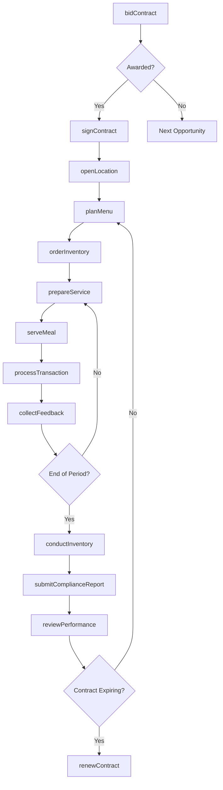
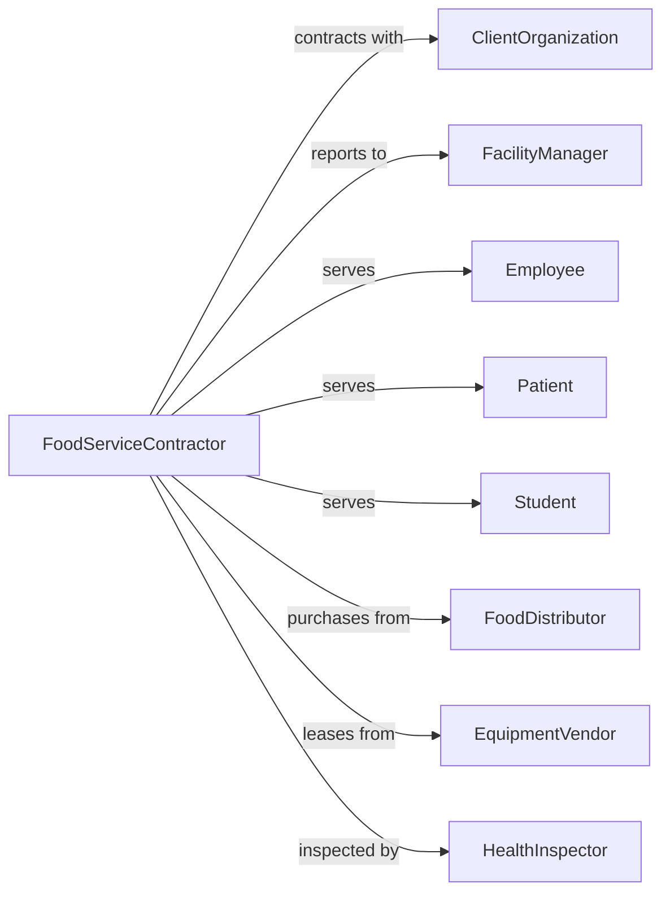

# Food Service Contractors

> Business-as-Code definition for contract food service operations. Models institutional dining programs for corporations, schools, and healthcare facilities.

## Overview

Food service contractors operate dining facilities at client locations including corporate offices, hospitals, universities, and government buildings under contractual arrangements. This definition exposes actions for contract management, menu planning, compliance tracking, and multi-site food service operations.

## Actors

| Actor | Description |
|-------|-------------|
| ClientOrganization | Entity contracting for on-site food services |
| FacilityManager | Client contact overseeing dining operations |
| Employee | End consumer at corporate dining facility |
| Patient | Consumer at healthcare food service location |
| Student | Consumer at educational institution |
| FoodDistributor | Supplies ingredients and provisions |
| EquipmentVendor | Provides and maintains kitchen equipment |
| HealthInspector | Conducts food safety and sanitation audits |
| Dietitian | Consults on nutrition and menu compliance |

## Roles

| Role | Description |
|------|-------------|
| AccountManager | Manages client relationship and contract performance |
| UnitManager | Oversees daily operations at single location |
| ExecutiveChef | Designs menus and manages culinary standards |
| LineWorker | Prepares and serves food to customers |
| Cashier | Processes customer payments and transactions |
| Dietitian | Ensures menu meets nutritional requirements |

## Entities

| Entity | Description |
|--------|-------------|
| Contract | Agreement defining service scope, terms, and pricing |
| Location | Client site where food service is provided |
| Menu | Planned offerings for meal period |
| Meal | Individual food service occasion |
| Transaction | Customer purchase record |
| Subsidy | Client contribution reducing customer price |
| Inventory | Food and supply stock at location |
| ComplianceReport | Documentation of regulatory adherence |
| NutritionLabel | Calorie and nutrient information for items |
| CustomerFeedback | Satisfaction survey or comment |

## Actions

| Action | Description |
|--------|-------------|
| bidContract | Submit proposal for food service agreement |
| signContract | Execute food service agreement with client |
| openLocation | Launch food service at new client site |
| planMenu | Design meal offerings for specified period |
| orderInventory | Procure ingredients and supplies |
| prepareService | Ready kitchen and stations for meal period |
| serveMeal | Provide food service during operating hours |
| processTransaction | Complete customer purchase |
| trackSubsidy | Monitor client contribution utilization |
| conductInventory | Count and value on-hand stock |
| submitComplianceReport | Document regulatory adherence |
| collectFeedback | Gather customer satisfaction data |
| reviewPerformance | Assess operational metrics against contract |
| renewContract | Extend or renegotiate service agreement |

## Events

| Event | Description |
|-------|-------------|
| contractBid | Proposal submitted for consideration |
| contractAwarded | Food service agreement executed |
| locationOpened | Service began at client site |
| menuPublished | Meal offerings finalized and communicated |
| inventoryOrdered | Purchase orders submitted to suppliers |
| inventoryReceived | Supplies delivered and stocked |
| mealServiceStarted | Meal period operations began |
| mealServiceEnded | Meal period concluded |
| transactionProcessed | Customer purchase completed |
| subsidyApplied | Client contribution credited to transaction |
| complianceAuditPassed | Health inspection completed successfully |
| complianceIssueFlagged | Regulatory concern identified |
| feedbackReceived | Customer comment or survey submitted |
| contractRenewed | Agreement extended for additional term |

## Searches

| Search | Description |
|--------|-------------|
| getContracts | List active service agreements |
| getLocationPerformance | Retrieve operational metrics by site |
| getCurrentMenu | Get active menu for location |
| getInventoryLevels | Check stock on hand at location |
| getTransactionHistory | Retrieve sales for date range |
| getSubsidyUtilization | Calculate client contribution usage |
| getComplianceStatus | View inspection and audit results |
| getCustomerFeedback | Retrieve satisfaction scores and comments |

## Workflow



## Actor Relationships



## Usage

### Calling Actions

```typescript
import { caterEvents } from '@headlessly/cater-events'

const contractor = caterEvents()

// Submit bid for corporate dining contract
const bid = await contractor.bidContract({
  clientName: 'TechCorp Industries',
  facilityType: 'corporate-campus',
  locations: 3,
  estimatedMeals: 2500,
  mealPeriods: ['breakfast', 'lunch', 'dinner'],
  proposedTerms: {
    duration: 36, // months
    managementFee: 85000,
    subsidyStructure: { breakfast: 3.00, lunch: 5.00, dinner: 4.00 }
  }
})

// Plan weekly menu for location
await contractor.planMenu({
  locationId: 'techcorp-building-a',
  weekOf: '2024-06-17',
  stations: [
    { name: 'grill', items: ['burger', 'chicken-sandwich', 'veggie-burger'] },
    { name: 'salad-bar', items: ['garden-salad', 'caesar-salad', 'grain-bowl'] },
    { name: 'hot-entree', items: ['pasta-primavera', 'salmon', 'beef-stir-fry'] }
  ],
  nutritionLabeling: true,
  allergenIndicators: true
})

// Process subsidized transaction
await contractor.processTransaction({
  locationId: 'techcorp-building-a',
  items: [
    { name: 'grilled-chicken-salad', price: 12.50 },
    { name: 'bottled-water', price: 2.00 }
  ],
  employeeId: 'EMP-12345',
  subsidyApplied: 5.00,
  paymentMethod: 'badge-payroll-deduct'
})
```

### Event-Driven Automation

```typescript
// Auto-reorder inventory based on usage
contractor.mealServiceEnded(async ({ locationId, date }) => {
  const levels = await contractor.getInventoryLevels({ locationId })

  for (const item of levels) {
    if (item.quantity <= item.reorderPoint) {
      await contractor.orderInventory({
        locationId,
        items: [{ sku: item.sku, quantity: item.parLevel - item.quantity }]
      })
    }
  }
})

// Alert on compliance issues
contractor.complianceIssueFlagged(async ({ locationId, issue, severity }) => {
  if (severity === 'critical') {
    await notifyAccountManager({
      locationId,
      issue,
      requiredAction: 'immediate-resolution'
    })

    await contractor.submitComplianceReport({
      locationId,
      type: 'corrective-action-plan',
      issue,
      plannedResolution: await generateResolutionPlan(issue)
    })
  }
})
```
