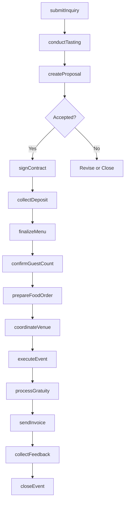
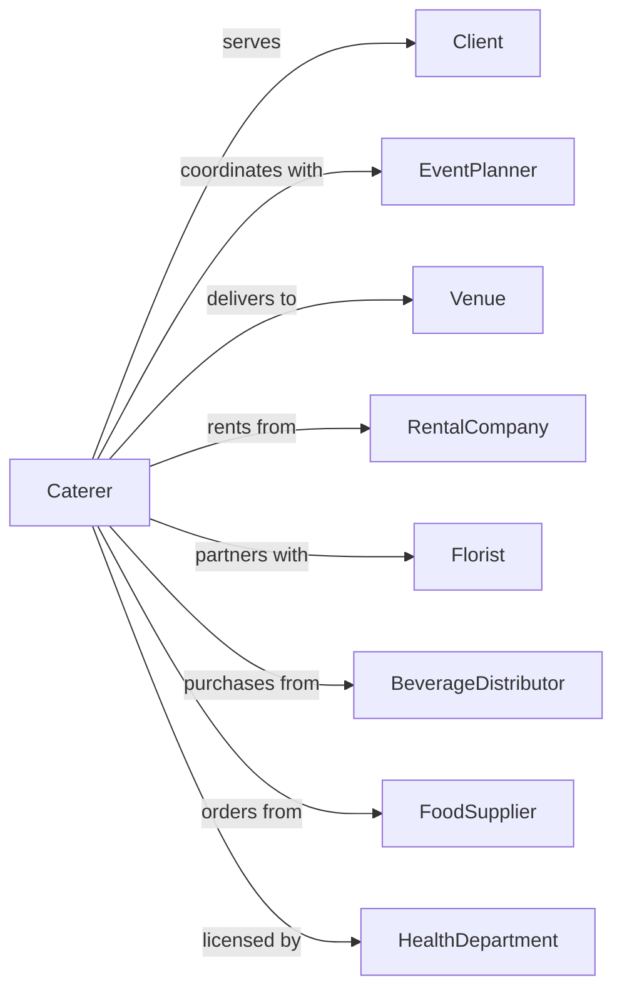

# Caterers

> Business-as-Code definition for event catering operations. Models single-event food services for weddings, corporate functions, and private parties.

## Overview

Caterers provide single event-based food services with equipment and vehicles to transport and serve meals at off-premise locations or on-site banquet facilities. This definition exposes actions for event planning, menu customization, logistics coordination, and day-of-event execution for weddings, corporate events, and social gatherings.

## Actors

| Actor | Description |
|-------|-------------|
| Client | Individual or organization booking catering services |
| EventPlanner | Coordinates overall event and vendor relationships |
| Venue | Location where catering services are delivered |
| RentalCompany | Provides tables, chairs, linens, and equipment |
| Florist | Supplies floral arrangements and decor |
| BeverageDistributor | Provides alcoholic and non-alcoholic beverages |
| FoodSupplier | Delivers ingredients and specialty items |
| HealthDepartment | Licenses and inspects food service operations |
| TransportService | Provides delivery vehicles and logistics |

## Roles

| Role | Description |
|------|-------------|
| CateringDirector | Manages sales and client relationships |
| EventCoordinator | Plans and executes individual events |
| ExecutiveChef | Designs menus and oversees food preparation |
| BanquetCaptain | Supervises service staff during events |
| LineCoook | Prepares food items for events |
| Server | Provides food and beverage service to guests |

## Entities

| Entity | Description |
|--------|-------------|
| Event | Scheduled catering occasion with date, venue, and details |
| Proposal | Quote document with menu options and pricing |
| Contract | Signed agreement specifying services and terms |
| Menu | Food and beverage selections for specific event |
| GuestCount | Number of attendees for portion planning |
| Deposit | Advance payment securing event date |
| FloorPlan | Layout showing table arrangement and service stations |
| DietaryAccommodation | Special meal requirement for individual guest |
| Invoice | Final billing with actual charges |
| EventTimeline | Schedule of service activities for event day |

## Actions

| Action | Description |
|--------|-------------|
| submitInquiry | Receive initial client request for catering |
| conductTasting | Host menu sampling session for client |
| createProposal | Generate pricing and menu options document |
| signContract | Execute service agreement with client |
| collectDeposit | Process advance payment to secure booking |
| finalizeMenu | Lock in food and beverage selections |
| confirmGuestCount | Obtain final attendance number |
| prepareFoodOrder | Generate ingredient and supply orders |
| coordinateVenue | Confirm logistics with event location |
| executeEvent | Deliver and serve catering at event |
| processGratuity | Collect and distribute service charges |
| sendInvoice | Issue final billing to client |
| collectFeedback | Gather client satisfaction review |
| closeEvent | Complete administrative wrap-up |

## Events

| Event | Description |
|-------|-------------|
| inquiryReceived | New catering request submitted |
| tastingScheduled | Menu sampling session booked |
| tastingCompleted | Client attended tasting session |
| proposalSent | Quote delivered to client |
| contractSigned | Service agreement executed |
| depositReceived | Advance payment processed |
| menuFinalized | Food and beverage selections confirmed |
| guestCountConfirmed | Final attendance number received |
| foodOrderPlaced | Ingredients and supplies ordered |
| venueCoordinated | Logistics confirmed with location |
| eventStarted | Catering service began |
| eventCompleted | Catering service concluded |
| invoiceSent | Final billing issued |
| paymentReceived | Outstanding balance collected |
| feedbackReceived | Client review submitted |

## Searches

| Search | Description |
|--------|-------------|
| getUpcomingEvents | List events scheduled in date range |
| getEventDetails | Retrieve full information for specific event |
| getPendingProposals | Find quotes awaiting client response |
| getDepositsDue | List events with outstanding deposits |
| getGuestCountsNeeded | Find events missing final headcount |
| getMenuSelections | Retrieve food choices for event |
| getDietaryNeeds | List special meal accommodations |
| getEventRevenue | Calculate income by event or period |

## Workflow



## Actor Relationships



## Usage

### Calling Actions

```typescript
import { caterCaterers } from '@headlessly/cater-caterers'

const caterer = caterCaterers()

// Create proposal for wedding reception
const proposal = await caterer.createProposal({
  clientName: 'Amanda & Michael Wilson',
  eventType: 'wedding-reception',
  eventDate: '2024-10-12',
  venue: 'Riverside Gardens',
  estimatedGuests: 150,
  menuOptions: [
    {
      name: 'Classic Elegance',
      courses: ['passed-appetizers', 'plated-salad', 'dual-entree', 'wedding-cake'],
      pricePerPerson: 125
    },
    {
      name: 'Garden Party',
      courses: ['station-appetizers', 'family-style-dinner', 'dessert-bar'],
      pricePerPerson: 95
    }
  ],
  barService: 'premium-open-bar',
  serviceStyle: 'formal-plated'
})

// Finalize menu after tasting
await caterer.finalizeMenu({
  eventId: proposal.eventId,
  selectedMenu: 'Classic Elegance',
  appetizers: ['bruschetta', 'shrimp-cocktail', 'stuffed-mushrooms'],
  salad: 'mixed-greens-champagne-vinaigrette',
  entrees: ['filet-mignon', 'herb-crusted-salmon'],
  dietaryMeals: [
    { guestName: 'Table 5 Seat 3', restriction: 'vegan', meal: 'grilled-vegetable-stack' },
    { guestName: 'Table 8 Seat 1', restriction: 'gluten-free', meal: 'gf-salmon' }
  ]
})

// Confirm final guest count
await caterer.confirmGuestCount({
  eventId: proposal.eventId,
  finalCount: 147,
  tableAssignments: true,
  kidsCount: 12,
  vendorMeals: 8
})
```

### Event-Driven Automation

```typescript
// Auto-send reminders for guest count confirmation
caterer.contractSigned(async ({ eventId, eventDate, clientEmail }) => {
  const reminderDate = subtractDays(eventDate, 14)

  scheduleAt(reminderDate, async () => {
    await sendGuestCountReminder({
      eventId,
      clientEmail,
      deadline: subtractDays(eventDate, 7)
    })
  })
})

// Generate food orders after guest count confirmed
caterer.guestCountConfirmed(async ({ eventId, finalCount }) => {
  const menu = await caterer.getMenuSelections({ eventId })
  const dietary = await caterer.getDietaryNeeds({ eventId })

  await caterer.prepareFoodOrder({
    eventId,
    guestCount: finalCount,
    menu,
    dietaryAccommodations: dietary,
    overage: 0.05 // 5% buffer
  })
})
```
