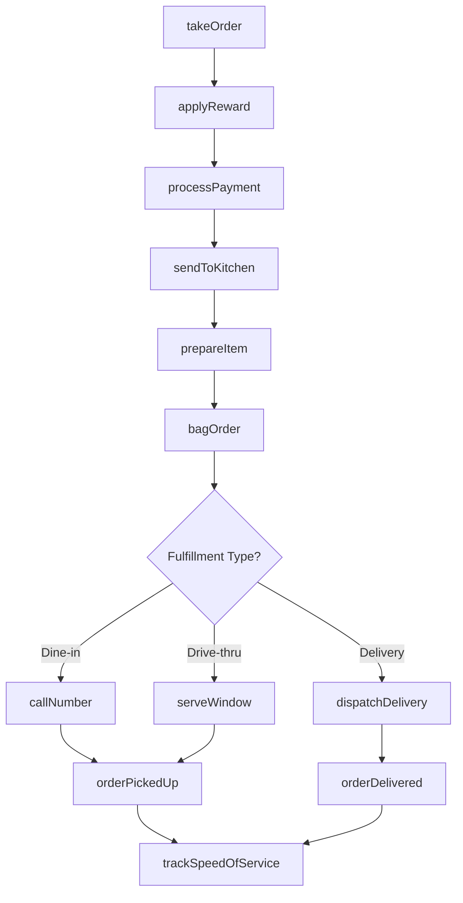
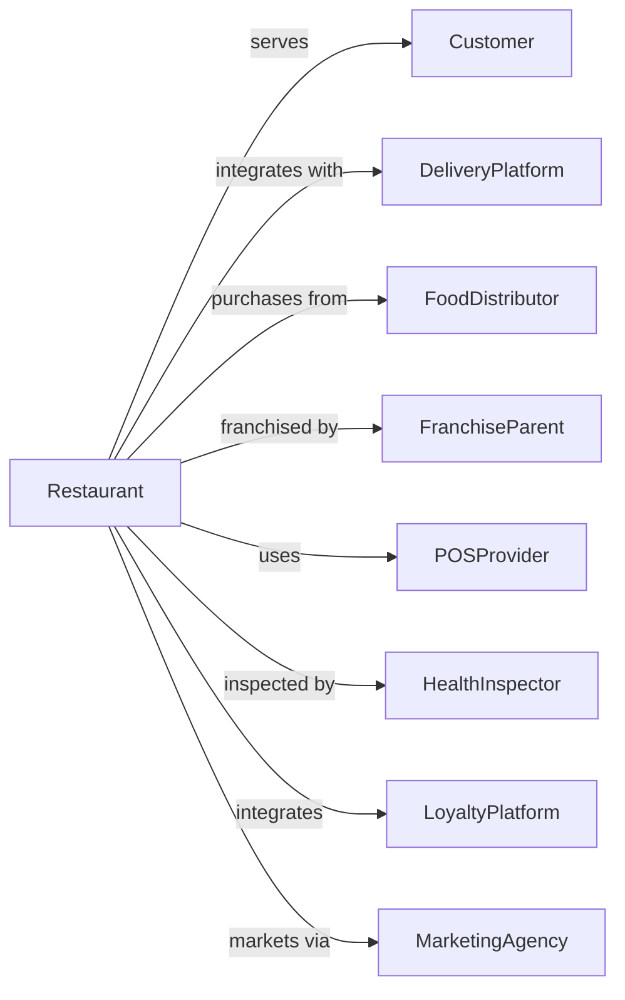

# Limited-Service Restaurants

> Business-as-Code definition for quick-service restaurant operations. Models counter service, drive-through, and delivery-focused dining.

## Overview

Limited-service restaurants provide food services where patrons order and pay before eating, with food consumed on premises, taken out, or delivered. This definition exposes actions for order management, kitchen display systems, drive-through operations, and third-party delivery integration for fast food, pizza delivery, and quick-casual concepts.

## Actors

| Actor | Description |
|-------|-------------|
| Customer | Patron ordering food for dine-in, takeout, or delivery |
| DeliveryPlatform | Third-party service like DoorDash or Uber Eats |
| FoodDistributor | Supplies ingredients, packaging, and supplies |
| FranchiseParent | Brand owner providing systems and standards |
| POSProvider | Supplies ordering and payment systems |
| HealthInspector | Conducts food safety audits |
| LoyaltyPlatform | Manages rewards program integration |
| KitchenEquipmentVendor | Provides and maintains cooking equipment |
| MarketingAgency | Creates promotional campaigns |

## Roles

| Role | Description |
|------|-------------|
| StoreManager | Oversees daily restaurant operations |
| ShiftLead | Supervises crew during service period |
| Cashier | Takes orders and processes payments |
| LineCook | Prepares food items per specifications |
| ExpeditorBagger | Assembles and packages orders |
| DriveThruOperator | Manages window service and timing |

## Entities

| Entity | Description |
|--------|-------------|
| Order | Customer purchase with items and fulfillment method |
| MenuItem | Standard offering with ingredients and price |
| Combo | Bundled meal deal with main, side, and drink |
| Ticket | Kitchen display order for preparation |
| DriveThruQueue | Line of vehicles awaiting service |
| DeliveryOrder | Third-party platform order for dispatch |
| LoyaltyAccount | Customer rewards program membership |
| Inventory | Ingredient and supply stock levels |
| SpeedOfService | Timing metrics for order fulfillment |
| Promotion | Limited-time offer or discount campaign |

## Actions

| Action | Description |
|--------|-------------|
| takeOrder | Capture customer selections and payment |
| sendToKitchen | Display ticket on kitchen screens |
| prepareItem | Cook or assemble menu item |
| bagOrder | Package items for pickup or delivery |
| callNumber | Announce ready order for customer pickup |
| serveWindow | Hand order to drive-through customer |
| dispatchDelivery | Release order to delivery driver |
| applyReward | Redeem loyalty points or offers |
| upsellItem | Suggest additional items or combo upgrade |
| voidOrder | Cancel and refund transaction |
| runPromotion | Activate limited-time offer |
| trackSpeedOfService | Monitor and report order timing |
| reorderStock | Replenish inventory from distributor |
| updateMenu | Modify available items and pricing |

## Events

| Event | Description |
|-------|-------------|
| orderPlaced | Customer transaction completed |
| ticketSent | Order displayed in kitchen |
| itemPrepared | Menu item ready for assembly |
| orderBagged | Items packaged for fulfillment |
| orderReady | Complete order available for pickup |
| orderPickedUp | Customer collected their order |
| orderDelivered | Delivery completed to customer |
| rewardApplied | Loyalty benefit redeemed |
| upsellAccepted | Additional item added to order |
| orderVoided | Transaction cancelled and refunded |
| promotionStarted | Limited-time offer activated |
| promotionEnded | Promotional period concluded |
| inventoryAlert | Stock level below threshold |
| speedTargetMissed | Order exceeded timing standard |

## Searches

| Search | Description |
|--------|-------------|
| getActiveOrders | List in-progress orders by status |
| getDriveThruQueue | View vehicles in drive-through line |
| getPendingDeliveries | List orders awaiting driver pickup |
| getSpeedOfService | Retrieve timing metrics for period |
| getInventoryLevels | Check current stock quantities |
| getSalesReport | Revenue by period, item, or channel |
| getLoyaltyActivity | View member transactions and points |
| getPromotionPerformance | Analyze offer redemption and impact |

## Workflow



## Actor Relationships



## Usage

### Calling Actions

```typescript
import { serveFastFood } from '@headlessly/serve-fast-food'

const restaurant = serveFastFood()

// Take counter order
const order = await restaurant.takeOrder({
  channel: 'counter',
  items: [
    { item: 'double-cheeseburger', quantity: 2 },
    { item: 'large-fries', quantity: 1 },
    { item: 'chicken-nuggets-10pc', quantity: 1 },
    { item: 'large-drink', quantity: 2, selection: 'coke' }
  ],
  loyaltyPhone: '+1-555-0156',
  paymentMethod: 'card'
})

// Process delivery platform order
const deliveryOrder = await restaurant.takeOrder({
  channel: 'doordash',
  externalOrderId: 'DD-789456',
  items: [
    { item: 'family-meal-deal', quantity: 1 },
    { item: 'extra-sauce', quantity: 2, type: 'ranch' }
  ],
  deliveryAddress: '123 Main St, Apt 4B',
  customerName: 'Sarah M',
  specialInstructions: 'Leave at door'
})

// Track drive-through speed
await restaurant.trackSpeedOfService({
  shift: 'lunch',
  metrics: {
    averageOrderTime: 185, // seconds
    averageWindowTime: 45,
    carsServed: 87,
    targetTime: 180
  }
})
```

### Event-Driven Automation

```typescript
// Auto-reorder on low inventory
restaurant.inventoryAlert(async ({ item, currentLevel, parLevel }) => {
  if (currentLevel <= parLevel * 0.2) {
    await restaurant.reorderStock({
      items: [{ sku: item.sku, quantity: parLevel - currentLevel }],
      priority: 'urgent',
      deliveryWindow: 'next-day'
    })
  }
})

// Notify manager when speed targets missed
restaurant.speedTargetMissed(async ({ orderId, actualTime, targetTime }) => {
  await notifyManager({
    alert: 'speed-of-service',
    orderId,
    variance: actualTime - targetTime,
    recommendation: 'review-staffing-levels'
  })
})
```
