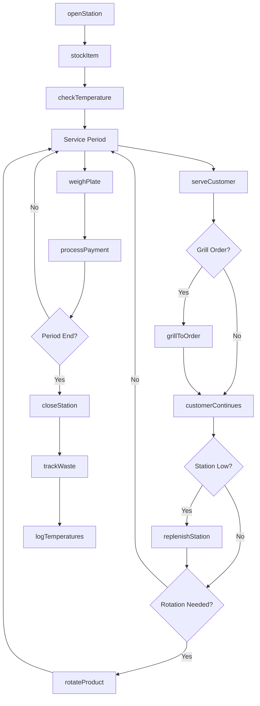
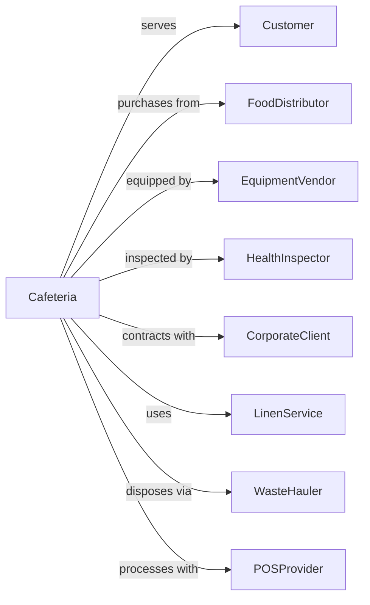

# Cafeterias, Grill Buffets, and Buffets

> Business-as-Code definition for self-service dining operations. Models cafeteria lines, buffet stations, and grill-to-order concepts.

## Overview

Cafeterias, grill buffets, and buffets prepare and serve meals for immediate consumption using self-service equipment like steam tables, display grills, and beverage dispensers. This definition exposes actions for station management, food replenishment, pricing models, and the unique food safety requirements of continuous service formats.

## Actors

| Actor | Description |
|-------|-------------|
| Customer | Diner selecting food from service stations |
| FoodDistributor | Supplies ingredients and prepared items |
| EquipmentVendor | Provides steam tables, sneeze guards, and displays |
| HealthInspector | Monitors food safety and temperature compliance |
| CorporateClient | Organization contracting cafeteria services |
| LinenService | Provides tablecloths and napkin service |
| WasteHauler | Handles food waste and recycling removal |
| POSProvider | Supplies weighing and payment systems |

## Roles

| Role | Description |
|------|-------------|
| CafeteriaManager | Oversees daily operations and food production |
| LineCook | Prepares items for service stations |
| GrillOperator | Cooks made-to-order items at display grill |
| ServerAttendant | Maintains stations and assists customers |
| Cashier | Processes payments at end of service line |
| DishwasherUtility | Cleans serviceware and maintains sanitation |

## Entities

| Entity | Description |
|--------|-------------|
| Station | Self-service area with specific food category |
| SteamTable | Heated display holding hot food items |
| ColdBar | Refrigerated display for salads and cold items |
| GrillStation | Made-to-order cooking area |
| MenuItem | Individual food offering with portion and price |
| TemperatureLog | Required food safety temperature records |
| PricingModel | By-item, by-weight, or all-you-can-eat structure |
| Tray | Customer serviceware for line progression |
| Replenishment | Restocking of depleted station items |
| WasteBin | Food waste tracking for production adjustment |

## Actions

| Action | Description |
|--------|-------------|
| openStation | Set up and stock service area for meal period |
| stockItem | Add food to steam table or display |
| checkTemperature | Verify and log food safety temperatures |
| serveCustomer | Assist diner with portions or made-to-order items |
| grillToOrder | Cook item on display grill per customer request |
| weighPlate | Measure customer selections for by-weight pricing |
| processPayment | Complete transaction at cashier station |
| replenishStation | Restock depleted items during service |
| rotateProduct | Replace items approaching hold time limits |
| closeStation | Break down and clean service area |
| trackWaste | Record discarded food for production planning |
| adjustProduction | Modify quantities based on demand patterns |
| logTemperatures | Document food safety compliance |
| calculateFoodCost | Analyze ingredient costs against revenue |

## Events

| Event | Description |
|-------|-------------|
| stationOpened | Service area set up and ready |
| itemStocked | Food added to service display |
| temperatureChecked | Food safety reading recorded |
| customerServed | Diner assisted at station |
| orderGrilled | Made-to-order item cooked |
| plateWeighed | Customer selections measured |
| paymentProcessed | Transaction completed |
| stationReplenished | Depleted items restocked |
| productRotated | Items replaced for freshness |
| stationClosed | Service area broken down |
| wasteRecorded | Discarded food documented |
| productionAdjusted | Quantities modified for demand |
| temperatureAlert | Food outside safe range detected |
| mealPeriodEnded | Service time concluded |

## Searches

| Search | Description |
|--------|-------------|
| getStationStatus | View current state of all service areas |
| getTemperatureLogs | Retrieve food safety records for audit |
| getInventoryLevels | Check ingredient stock quantities |
| getSalesbyStation | Revenue breakdown by service area |
| getWasteReport | Food waste analysis by item |
| getCustomerCount | Traffic volume by meal period |
| getFoodCostReport | Cost percentages by category |
| getReplenishmentHistory | Restocking patterns for planning |

## Workflow



## Actor Relationships



## Usage

### Calling Actions

```typescript
import { serveDiners } from '@headlessly/serve-diners'

const cafeteria = serveDiners()

// Open hot food station for lunch
await cafeteria.openStation({
  station: 'hot-entrees',
  mealPeriod: 'lunch',
  items: [
    { name: 'roasted-chicken', quantity: 40, unit: 'portions' },
    { name: 'beef-stroganoff', quantity: 30, unit: 'portions' },
    { name: 'vegetable-lasagna', quantity: 25, unit: 'portions' }
  ],
  steamTableTemp: 165
})

// Log temperature checks
await cafeteria.checkTemperature({
  station: 'hot-entrees',
  readings: [
    { item: 'roasted-chicken', temp: 167, time: '11:30' },
    { item: 'beef-stroganoff', temp: 165, time: '11:30' },
    { item: 'vegetable-lasagna', temp: 163, time: '11:30' }
  ],
  employeeId: 'EMP-456'
})

// Process by-weight sale
await cafeteria.processPayment({
  pricingModel: 'by-weight',
  weight: 0.85, // pounds
  ratePerPound: 9.99,
  beverages: [{ item: 'fountain-drink-lg', price: 2.49 }],
  paymentMethod: 'employee-badge',
  employeeId: 'CORP-12345'
})
```

### Event-Driven Automation

```typescript
// Auto-alert on temperature violations
cafeteria.temperatureChecked(async ({ station, readings }) => {
  const violations = readings.filter(r => r.temp < 140 || r.temp > 165)

  if (violations.length > 0) {
    await cafeteria.temperatureAlert({
      station,
      violations,
      action: 'immediate-correction-required'
    })

    await notifyManager({
      alert: 'food-safety',
      station,
      items: violations.map(v => v.item),
      temperatures: violations.map(v => v.temp)
    })
  }
})

// Adjust next-day production based on waste
cafeteria.mealPeriodEnded(async ({ date, mealPeriod }) => {
  const waste = await cafeteria.getWasteReport({ date, mealPeriod })
  const sales = await cafeteria.getSalesbyStation({ date, mealPeriod })

  await cafeteria.adjustProduction({
    nextDate: addDays(date, 1),
    mealPeriod,
    adjustments: waste.items.map(item => ({
      name: item.name,
      currentProduction: item.produced,
      suggestedProduction: item.sold * 1.1 // 10% buffer
    }))
  })
})
```
