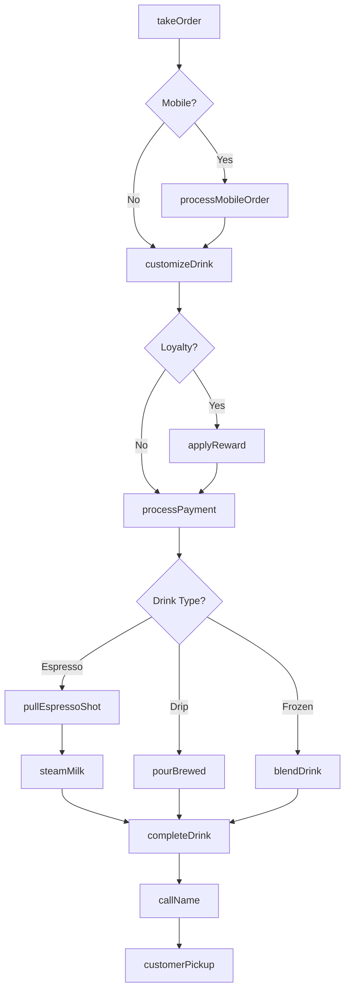
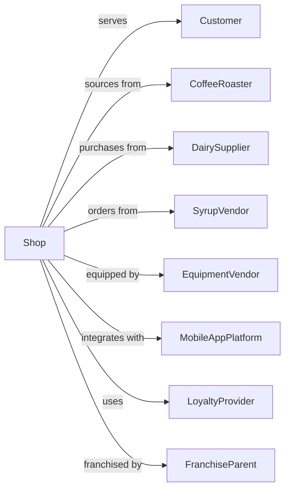

# Snack and Nonalcoholic Beverage Bars

> Business-as-Code definition for specialty snack and beverage operations. Models coffee shops, juice bars, ice cream parlors, and snack counters.

## Overview

Snack and nonalcoholic beverage bars specialize in preparing and serving specialty snacks like ice cream, frozen yogurt, cookies, or popcorn, and nonalcoholic beverages like coffee, juices, or sodas. This definition exposes actions for drink customization, loyalty programs, mobile ordering, and the high-volume, quick-service nature of specialty beverage retail.

## Actors

| Actor | Description |
|-------|-------------|
| Customer | Patron ordering beverages or snacks |
| CoffeeRoaster | Supplies specialty coffee beans |
| DairySupplier | Provides milk, cream, and ice cream base |
| SyrupVendor | Supplies flavoring syrups and sauces |
| EquipmentVendor | Provides espresso machines and blenders |
| MobileAppPlatform | Powers mobile ordering and payments |
| LoyaltyProvider | Manages rewards program infrastructure |
| FranchiseParent | Brand owner for franchised locations |
| HealthDepartment | Inspects food handling and safety |

## Roles

| Role | Description |
|------|-------------|
| StoreManager | Oversees daily operations and team |
| ShiftSupervisor | Leads crew during service period |
| Barista | Prepares specialty coffee and espresso drinks |
| ScoopServer | Serves ice cream and frozen desserts |
| Cashier | Processes orders and payments |
| InventoryClerk | Manages stock and restocking |

## Entities

| Entity | Description |
|--------|-------------|
| Drink | Beverage with size, customizations, and temperature |
| Snack | Food item like pastry, cookie, or ice cream |
| Customization | Modification like milk type, syrup, or topping |
| Order | Customer transaction with items and fulfillment |
| LoyaltyAccount | Member rewards program with points and status |
| MobileOrder | App-placed order for pickup |
| Recipe | Standardized preparation instructions |
| Inventory | Ingredient and supply stock levels |
| GiftCard | Prepaid store value card |
| SeasonalItem | Limited-time menu offering |

## Actions

| Action | Description |
|--------|-------------|
| takeOrder | Capture customer drink and snack selections |
| customizeDrink | Apply modifications to beverage order |
| prepareBeverage | Make drink per recipe and customizations |
| scoopIceCream | Serve frozen dessert with toppings |
| callName | Announce completed order for pickup |
| processMobileOrder | Receive and queue app-placed orders |
| applyReward | Redeem loyalty points or free item |
| reloadGiftCard | Add value to prepaid card |
| brewBatch | Prepare drip coffee or tea batch |
| cleanEquipment | Sanitize machines and workstations |
| stockDisplay | Replenish pastry case and merchandise |
| launchSeasonal | Introduce limited-time offerings |
| pullEspressoShot | Extract espresso from portafilter |
| steamMilk | Heat and texture milk for drinks |

## Events

| Event | Description |
|-------|-------------|
| orderPlaced | Customer transaction submitted |
| drinkCustomized | Modifications applied to beverage |
| beveragePrepared | Drink completed and ready |
| iceCreamServed | Frozen dessert provided to customer |
| orderCalled | Customer name announced |
| mobileOrderReceived | App order entered queue |
| rewardApplied | Loyalty benefit redeemed |
| giftCardReloaded | Value added to prepaid card |
| batchBrewed | Fresh coffee or tea ready |
| equipmentCleaned | Sanitation task completed |
| displayStocked | Pastry case replenished |
| seasonalLaunched | Limited-time item available |
| inventoryLow | Stock below threshold |
| rushHourStarted | High-volume period began |

## Searches

| Search | Description |
|--------|-------------|
| getActiveOrders | List in-progress drink orders |
| getMobileQueue | View pending app orders |
| getInventoryLevels | Check ingredient stock |
| getSalesByItem | Revenue breakdown by product |
| getLoyaltyStats | Member activity and redemption metrics |
| getGiftCardBalance | Check remaining card value |
| getSeasonalPerformance | Sales data for limited items |
| getBaristaMetrics | Drinks prepared per shift by employee |

## Workflow



## Actor Relationships



## Usage

### Calling Actions

```typescript
import { serveSnacks } from '@headlessly/serve-snacks'

const cafe = serveSnacks()

// Take customized coffee order
const order = await cafe.takeOrder({
  channel: 'counter',
  items: [
    {
      type: 'espresso-drink',
      base: 'latte',
      size: 'grande',
      customizations: [
        { type: 'milk', value: 'oat-milk' },
        { type: 'syrup', value: 'vanilla', pumps: 2 },
        { type: 'temperature', value: 'extra-hot' },
        { type: 'espresso', value: 'blonde', shots: 3 }
      ]
    },
    {
      type: 'pastry',
      item: 'butter-croissant',
      warmed: true
    }
  ],
  loyaltyId: 'GOLD-12345'
})

// Process mobile order for pickup
const mobileOrder = await cafe.processMobileOrder({
  orderId: 'MOB-789456',
  pickupTime: '08:15',
  customerName: 'Jennifer',
  items: [
    { base: 'cold-brew', size: 'venti', customizations: ['sweet-cream-foam'] },
    { base: 'iced-matcha', size: 'grande', milk: 'almond' }
  ],
  prepaid: true
})

// Prepare the drink
await cafe.prepareBeverage({
  orderId: order.id,
  steps: [
    await cafe.pullEspressoShot({ shots: 3, roast: 'blonde' }),
    await cafe.steamMilk({ type: 'oat', temp: 'extra-hot', texture: 'microfoam' })
  ]
})
```

### Event-Driven Automation

```typescript
// Alert baristas during rush hour
cafe.rushHourStarted(async ({ location, expectedVolume }) => {
  await notifyTeam({
    message: 'Rush hour starting - prep extra brew batch',
    urgency: 'high'
  })

  await cafe.brewBatch({
    type: 'pike-place',
    quantity: 'double'
  })
})

// Auto-restock alerts for popular items
cafe.inventoryLow(async ({ item, currentLevel, usageRate }) => {
  const hoursRemaining = currentLevel / usageRate

  if (hoursRemaining < 4) {
    await alertManager({
      item: item.name,
      urgency: 'critical',
      hoursRemaining,
      reorderSuggestion: item.parLevel - currentLevel
    })
  }
})
```
