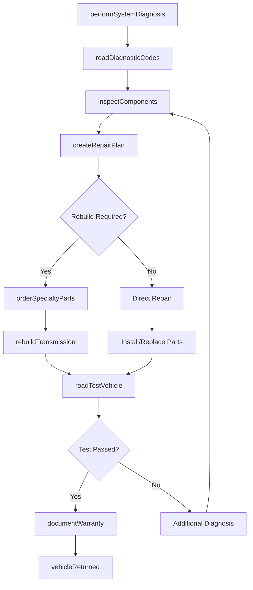
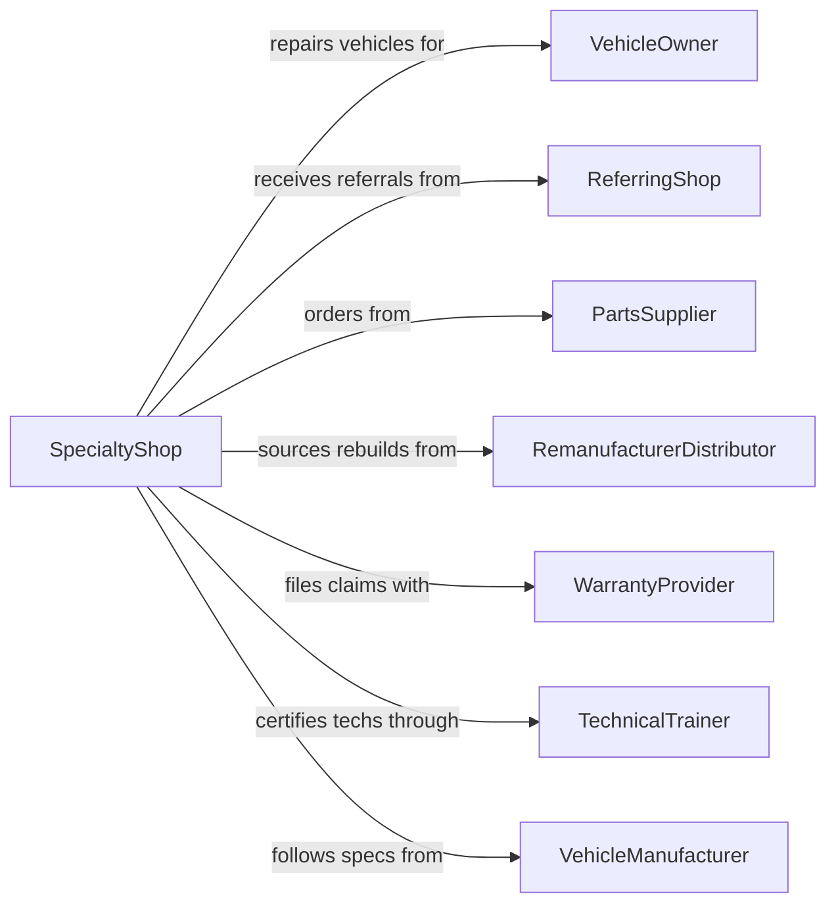

# Specialized Automotive Repair

> Business-as-Code definition for specialized automotive repair operations. Models focused repair services for specific vehicle systems.

## Overview

Specialized automotive repair shops focus on specific vehicle systems including transmissions, brakes, exhaust, electrical, suspension, and tune-ups. This definition exposes actions for specialized diagnostics, system-specific repairs, and component rebuilding, with events for service tracking and searches for technical specifications.

## Actors

| Actor | Description |
|-------|-------------|
| VehicleOwner | Individual seeking specialized repair services |
| ReferringShop | General repair shop referring complex jobs |
| PartsSupplier | Provides system-specific components and rebuild kits |
| RemanufacturerDistributor | Supplies rebuilt transmissions and components |
| WarrantyProvider | Covers extended warranty on specialized repairs |
| TechnicalTrainer | Provides certification and skills training |
| VehicleManufacturer | Source for OEM specifications and parts |

## Roles

| Role | Description |
|------|-------------|
| ShopOwner | Owns and operates the specialty shop |
| MasterTechnician | Expert in specific vehicle systems |
| DiagnosticSpecialist | Performs advanced system diagnostics |
| Rebuilder | Reconstructs transmissions and components |
| ServiceWriter | Documents repairs and communicates with customers |

## Entities

| Entity | Description |
|--------|-------------|
| Vehicle | The car or truck requiring specialized repair |
| Transmission | Automatic or manual gearbox system |
| BrakeSystem | Pads, rotors, calipers, and hydraulics |
| ExhaustSystem | Catalytic converter, muffler, and pipes |
| SuspensionSystem | Shocks, struts, control arms, and bushings |
| ElectricalSystem | Alternator, starter, wiring, and modules |
| DiagnosticCode | OBD trouble codes indicating system faults |
| RebuildKit | Collection of parts for component reconstruction |
| WarrantyClaim | Documentation for covered repairs |
| TechnicalBulletin | Manufacturer service advisories |

## Actions

| Action | Description |
|--------|-------------|
| performSystemDiagnosis | Run specialized tests on specific vehicle system |
| readDiagnosticCodes | Extract and interpret OBD and proprietary codes |
| inspectComponents | Visually examine parts for wear or damage |
| createRepairPlan | Outline required repairs and replacement parts |
| rebuildTransmission | Disassemble, replace worn parts, and reassemble |
| replaceBrakeComponents | Install new pads, rotors, or calipers |
| repairExhaust | Fix or replace exhaust system components |
| alignSuspension | Adjust suspension geometry to specifications |
| repairElectrical | Fix wiring, modules, or electrical components |
| roadTestVehicle | Verify repair quality through driving test |
| documentWarranty | Record warranty terms for completed work |
| orderSpecialtyParts | Source system-specific components |

## Events

| Event | Description |
|-------|-------------|
| diagnosisCompleted | System evaluation has been finished |
| codesRetrieved | Diagnostic codes have been read and recorded |
| repairPlanApproved | Customer has agreed to proposed repairs |
| partsSourced | Required specialty parts have been located |
| rebuildStarted | Component reconstruction has begun |
| rebuildCompleted | Rebuilt component is ready for installation |
| repairCompleted | All system repairs are finished |
| roadTestPassed | Vehicle performed correctly during test drive |
| warrantyIssued | Warranty documentation provided to customer |
| vehicleReturned | Customer has picked up repaired vehicle |

## Searches

| Search | Description |
|--------|-------------|
| findDiagnosticCodes | Look up meaning and solutions for trouble codes |
| getTechnicalBulletins | Retrieve manufacturer service advisories |
| checkPartCompatibility | Verify part fits specific vehicle application |
| getTransmissionSpecs | Retrieve fluid capacity and rebuild specs |
| findWarrantyStatus | Check if repair is under warranty coverage |
| searchRepairHistory | Find previous specialized repairs on vehicle |

## Workflow



## Actor Relationships



## Usage

### Calling Actions

```typescript
import { repairSpecializedAutomotive } from '@headlessly/repair-specialized-automotive'

const shop = repairSpecializedAutomotive()

// Perform transmission diagnosis
const diagnosis = await shop.performSystemDiagnosis({
  vehicleId: 'veh-123',
  system: 'transmission',
  symptoms: ['slipping', 'delayed engagement', 'harsh shifts']
})

// Read and interpret codes
const codes = await shop.readDiagnosticCodes({
  vehicleId: 'veh-123',
  systems: ['transmission', 'engine'],
  includeHistory: true
})

// Rebuild transmission
await shop.rebuildTransmission({
  vehicleId: 'veh-123',
  transmissionType: '6T70',
  rebuildKitId: 'kit-456',
  upgrades: ['performanceClutches', 'heavyDutyBands']
})
```

### Event-Driven Automation

```typescript
// Auto-order parts when diagnosis identifies need
shop.diagnosisCompleted(async ({ vehicleId, findings }) => {
  const criticalParts = findings.filter(f => f.severity === 'critical')
  for (const finding of criticalParts) {
    await shop.orderSpecialtyParts({
      vehicleId,
      partNumbers: finding.recommendedParts,
      priority: 'rush'
    })
  }
})

// Notify referring shop when repair is complete
shop.roadTestPassed(async ({ vehicleId, referralId }) => {
  if (referralId) {
    await shop.notifyReferringShop({
      referralId,
      status: 'completed',
      summary: 'Transmission rebuild successful'
    })
  }
})
```
