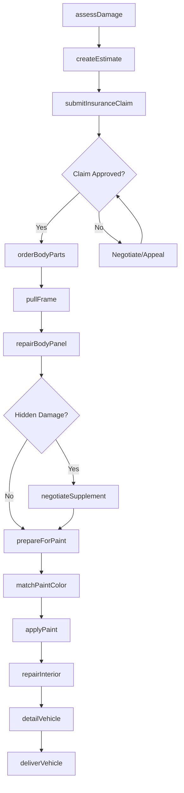
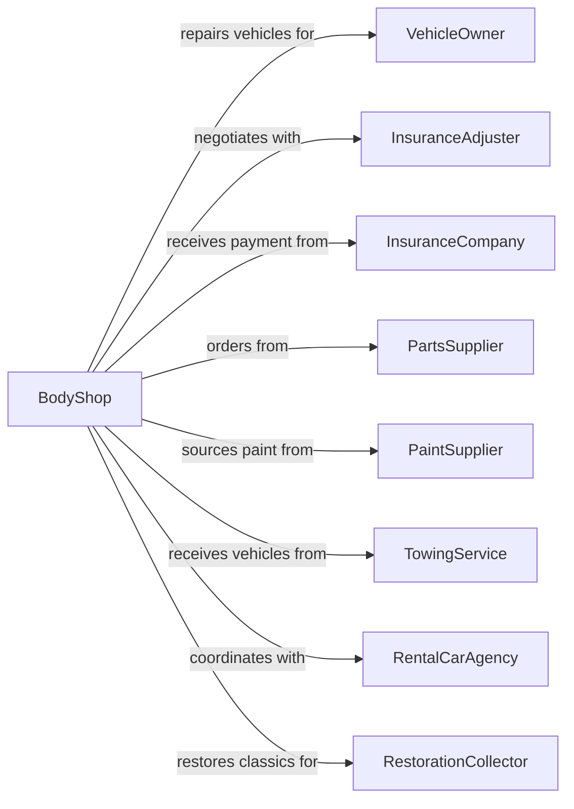

# Automotive Body, Paint, and Interior Repair and Maintenance

> Business-as-Code definition for automotive body, paint, and interior repair operations. Models collision repair and cosmetic restoration services.

## Overview

Automotive body shops provide collision repair, painting, and interior restoration for vehicles and trailers. This definition exposes actions for damage assessment, body repair, paint matching, and interior restoration, with events for insurance coordination and searches for parts and color databases.

## Actors

| Actor | Description |
|-------|-------------|
| VehicleOwner | Individual or business with damaged vehicle |
| InsuranceAdjuster | Evaluates damage and authorizes repair costs |
| InsuranceCompany | Pays for covered collision repairs |
| PartsSupplier | Provides body panels, trim, and hardware |
| PaintSupplier | Supplies automotive paints and coatings |
| TowingService | Delivers collision-damaged vehicles |
| RentalCarAgency | Provides temporary transportation during repairs |
| RestorationCollector | Commissions classic car restorations |

## Roles

| Role | Description |
|------|-------------|
| ShopOwner | Owns the collision center and manages business |
| Estimator | Assesses damage and prepares repair estimates |
| BodyTechnician | Repairs and replaces body panels and structure |
| Painter | Applies primers, basecoats, and clearcoats |
| DetailTechnician | Performs final cleanup and touch-ups |
| InteriorSpecialist | Repairs upholstery, dashboards, and trim |

## Entities

| Entity | Description |
|--------|-------------|
| Vehicle | The car, truck, or trailer being repaired |
| DamageEstimate | Detailed assessment of repair costs |
| InsuranceClaim | Documentation for insurance-covered repairs |
| BodyPanel | Fenders, doors, hoods, and other exterior panels |
| PaintCode | Manufacturer color formula identifier |
| Supplement | Additional damage discovered during repair |
| RepairPlan | Sequence of operations for collision repair |
| Interior | Dashboard, seats, headliner, and trim components |
| FrameMeasurement | Structural alignment specifications |
| FinishQuality | Paint adhesion, color match, and surface standards |

## Actions

| Action | Description |
|--------|-------------|
| assessDamage | Inspect vehicle and document all damage |
| createEstimate | Generate itemized repair cost breakdown |
| submitInsuranceClaim | File claim with customer insurance |
| negotiateSupplement | Request additional funds for hidden damage |
| orderBodyParts | Source replacement panels and components |
| matchPaintColor | Formulate exact color match using spectrophotometer |
| pullFrame | Straighten structural components on frame rack |
| repairBodyPanel | Weld, fill, and reshape damaged panels |
| prepareForPaint | Sand, prime, and mask surfaces |
| applyPaint | Spray basecoat and clearcoat in paint booth |
| repairInterior | Fix upholstery, trim, and dashboard components |
| detailVehicle | Final clean, polish, and quality inspection |
| deliverVehicle | Return repaired vehicle to customer |

## Events

| Event | Description |
|-------|-------------|
| damageAssessed | Initial inspection has been completed |
| estimateCreated | Repair estimate is ready for review |
| claimSubmitted | Insurance claim has been filed |
| claimApproved | Insurance has authorized repair payment |
| supplementApproved | Additional repair funds have been authorized |
| partsReceived | Ordered body parts have arrived |
| frameRepaired | Structural alignment has been corrected |
| bodyworkCompleted | Panel repair and replacement is finished |
| paintApplied | Vehicle has been painted and cleared |
| interiorRestored | Interior repairs have been completed |
| qualityApproved | Final inspection passed all standards |
| vehicleDelivered | Customer has picked up repaired vehicle |

## Searches

| Search | Description |
|--------|-------------|
| findPaintCode | Look up manufacturer paint formula |
| searchPartsAvailability | Check OEM and aftermarket parts stock |
| getInsuranceProcedures | Retrieve carrier-specific claim requirements |
| findFrameSpecs | Get structural dimensions for vehicle |
| getRepairProcedures | Access OEM repair instructions |
| checkJobStatus | View progress on in-process repairs |
| getSupplierPricing | Compare parts prices across vendors |

## Workflow



## Actor Relationships



## Usage

### Calling Actions

```typescript
import { repairBodies } from '@headlessly/repair-bodies'

const shop = repairBodies()

// Assess collision damage
const assessment = await shop.assessDamage({
  vehicleId: 'veh-123',
  damageAreas: ['frontBumper', 'hood', 'leftFender'],
  photos: ['front-view.jpg', 'damage-closeup.jpg'],
  driveable: false
})

// Match paint color precisely
const paintMatch = await shop.matchPaintColor({
  vehicleId: 'veh-123',
  oemPaintCode: 'WA8555',
  scanLocation: 'doorJamb',
  adjustForWeathering: true
})

// Submit insurance claim
const claim = await shop.submitInsuranceClaim({
  vehicleId: 'veh-123',
  estimateId: assessment.estimateId,
  insuranceProvider: 'StateFarm',
  policyNumber: 'SF-987654',
  claimNumber: 'CLM-2024-001'
})
```

### Event-Driven Automation

```typescript
// Auto-order parts when claim is approved
shop.claimApproved(async ({ vehicleId, estimateId }) => {
  const estimate = await shop.getEstimate(estimateId)
  await shop.orderBodyParts({
    vehicleId,
    parts: estimate.requiredParts,
    preferOEM: estimate.insuranceAllowsOEM
  })
})

// Submit supplement when hidden damage found
shop.bodyworkCompleted(async ({ vehicleId, hiddenDamage }) => {
  if (hiddenDamage.length > 0) {
    await shop.negotiateSupplement({
      vehicleId,
      additionalDamage: hiddenDamage,
      additionalCost: hiddenDamage.reduce((sum, d) => sum + d.repairCost, 0)
    })
  }
})
```
