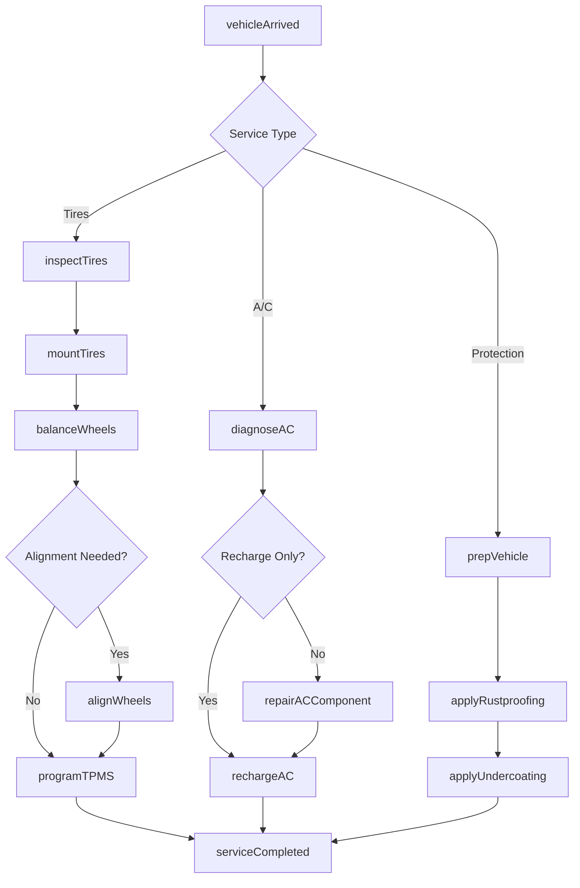
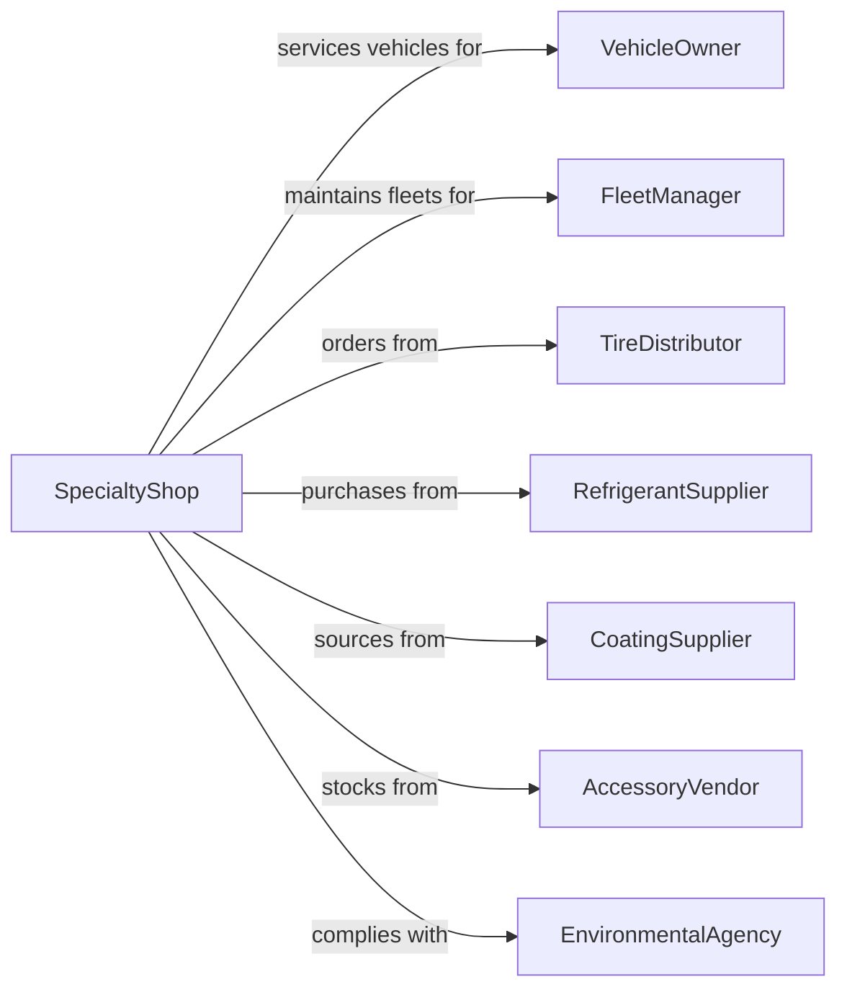

# All Other Automotive Repair and Maintenance

> Business-as-Code definition for specialized automotive services. Models tire, air conditioning, rustproofing, and other specialty vehicle services.

## Overview

This industry includes automotive repair services not classified elsewhere, such as tire repair and installation, air conditioning repair, rustproofing, and undercoating. This definition exposes actions for specialized services, seasonal maintenance, and accessory installation, with events for service completion and searches for parts and service specifications.

## Actors

| Actor | Description |
|-------|-------------|
| VehicleOwner | Individual seeking specialized vehicle services |
| FleetManager | Commercial customer with multiple vehicles |
| TireDistributor | Supplies tires and mounting equipment |
| RefrigerantSupplier | Provides A/C refrigerants and components |
| CoatingSupplier | Provides rustproofing and undercoating materials |
| AccessoryVendor | Supplies aftermarket parts and accessories |
| EnvironmentalAgency | Regulates refrigerant handling and disposal |

## Roles

| Role | Description |
|------|-------------|
| ShopOwner | Owns and manages the specialty service business |
| TireTechnician | Mounts, balances, and repairs tires |
| ACTechnician | Diagnoses and repairs air conditioning systems |
| CoatingSpecialist | Applies rustproofing and protective treatments |
| ServiceAdvisor | Consults with customers and recommends services |

## Entities

| Entity | Description |
|--------|-------------|
| Vehicle | The car, truck, or van being serviced |
| Tire | Rubber wheel covering requiring service |
| Wheel | Rim and assembly for tire mounting |
| ACSystem | Air conditioning compressor, condenser, and evaporator |
| Refrigerant | Cooling agent for A/C systems |
| RustproofCoating | Protective barrier against corrosion |
| Undercoating | Protective layer for vehicle underbody |
| ServiceRecord | Documentation of work performed |
| Alignment | Wheel angle specifications |
| TPMS | Tire pressure monitoring system sensor |

## Actions

| Action | Description |
|--------|-------------|
| inspectTires | Evaluate tread depth, wear patterns, and condition |
| mountTires | Install tires onto wheels |
| balanceWheels | Adjust wheel weights for smooth rotation |
| alignWheels | Adjust suspension to correct wheel angles |
| repairTirePuncture | Patch or plug tire damage |
| diagnoseAC | Test A/C system for leaks and performance |
| rechargeAC | Add refrigerant to A/C system |
| repairACComponent | Replace compressor, condenser, or other parts |
| applyRustproofing | Spray protective coating on body panels |
| applyUndercoating | Coat underbody with protective barrier |
| installAccessory | Add aftermarket parts or equipment |
| programTPMS | Configure tire pressure monitoring sensors |

## Events

| Event | Description |
|-------|-------------|
| tiresInspected | Tire condition has been evaluated |
| tiresMounted | New tires have been installed |
| wheelsBalanced | Wheels have been balanced |
| alignmentCompleted | Wheel alignment has been adjusted |
| punctureRepaired | Tire damage has been patched |
| acDiagnosed | A/C system has been tested |
| acRecharged | Refrigerant has been added |
| acRepaired | A/C component has been replaced |
| rustproofingApplied | Protective coating has been applied |
| undercoatingApplied | Underbody has been protected |
| accessoryInstalled | Aftermarket part has been added |
| serviceCompleted | All requested services are finished |

## Searches

| Search | Description |
|--------|-------------|
| findTireSize | Look up correct tire specifications for vehicle |
| checkTireInventory | Search available tires in stock |
| getAlignmentSpecs | Retrieve alignment angles for vehicle |
| findRefrigerantType | Look up correct A/C refrigerant |
| getServiceHistory | Retrieve previous services for vehicle |
| searchAccessories | Find compatible aftermarket parts |

## Workflow



## Actor Relationships



## Usage

### Calling Actions

```typescript
import { repairVehicles } from '@headlessly/repair-vehicles'

const shop = repairVehicles()

// Tire service workflow
const inspection = await shop.inspectTires({
  vehicleId: 'veh-123',
  checkTPMS: true,
  measureTreadDepth: true
})

await shop.mountTires({
  vehicleId: 'veh-123',
  tirePartNumber: 'P225/60R17',
  quantity: 4,
  includeBalance: true
})

await shop.alignWheels({
  vehicleId: 'veh-123',
  alignmentType: 'fourWheel',
  printReport: true
})

// A/C service
const acDiagnosis = await shop.diagnoseAC({
  vehicleId: 'veh-123',
  testType: 'fullSystem',
  checkForLeaks: true
})
```

### Event-Driven Automation

```typescript
// Auto-recommend alignment after new tires
shop.tiresMounted(async ({ vehicleId, lastAlignmentDate }) => {
  const daysSinceAlignment = daysBetween(lastAlignmentDate, new Date())
  if (daysSinceAlignment > 365) {
    await shop.recommendService({
      vehicleId,
      service: 'wheelAlignment',
      reason: 'Alignment recommended with new tire installation'
    })
  }
})

// Schedule seasonal rustproofing reminder
shop.rustproofingApplied(async ({ vehicleId, applicationDate }) => {
  await shop.scheduleReminder({
    vehicleId,
    triggerDate: addMonths(applicationDate, 12),
    service: 'rustproofing',
    message: 'Annual rustproofing treatment recommended'
  })
})
```
