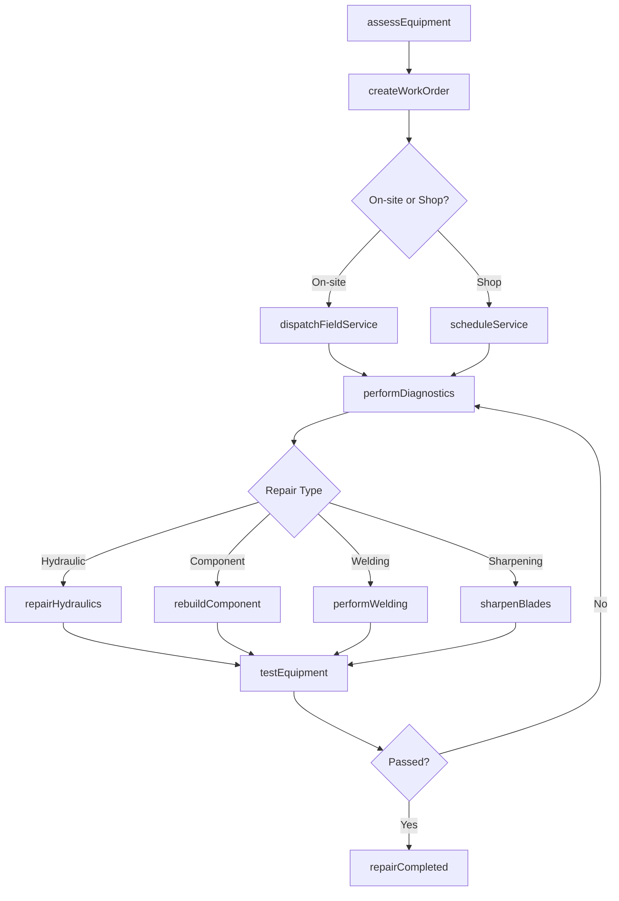
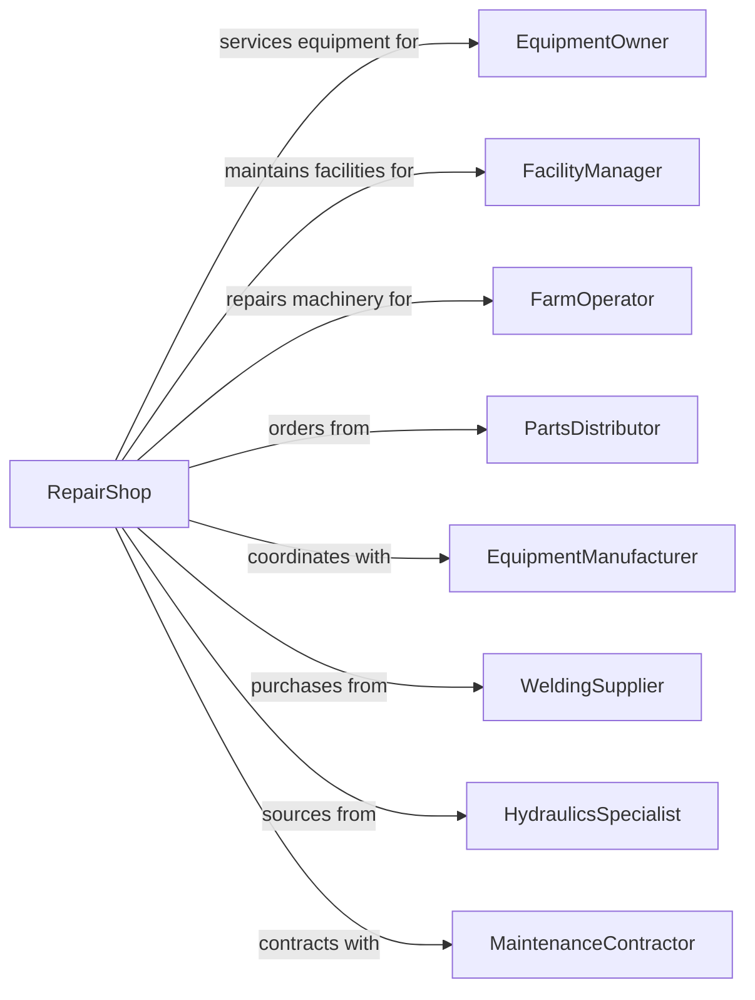

# Commercial and Industrial Machinery and Equipment (except Automotive and Electronic) Repair and Maintenance

> Business-as-Code definition for commercial and industrial machinery repair operations. Models maintenance and repair services for heavy equipment, machine tools, and commercial systems.

## Overview

Commercial and industrial machinery repair establishments service agricultural equipment, forklifts, machine tools, commercial refrigeration, construction equipment, and other heavy machinery. This definition exposes actions for preventive maintenance, emergency repair, and equipment rebuilding, with events for service scheduling and searches for parts and technical specifications.

## Actors

| Actor | Description |
|-------|-------------|
| EquipmentOwner | Business owning machinery requiring service |
| FacilityManager | Oversees equipment at commercial facility |
| FarmOperator | Agricultural customer with farm equipment |
| PartsDistributor | Supplies replacement components |
| EquipmentManufacturer | Provides OEM parts and technical support |
| WeldingSupplier | Supplies welding materials and gases |
| HydraulicsSpecialist | Provides hydraulic components and service |
| MaintenanceContractor | Schedules ongoing preventive maintenance |

## Roles

| Role | Description |
|------|-------------|
| ShopOwner | Owns and operates the repair business |
| FieldServiceTech | Performs on-site repairs at customer locations |
| ShopMechanic | Repairs equipment at the service facility |
| Welder | Performs fabrication and welding repairs |
| HydraulicTech | Services hydraulic systems and components |
| PartsSourcing | Locates and orders replacement parts |

## Entities

| Entity | Description |
|--------|-------------|
| Machine | The equipment being repaired or serviced |
| Forklift | Material handling equipment |
| MachineTools | Lathes, mills, CNC machines |
| RefrigerationUnit | Commercial cooling equipment |
| ConstructionEquipment | Excavators, loaders, and heavy machinery |
| FarmEquipment | Tractors, harvesters, and implements |
| HydraulicSystem | Pumps, cylinders, and fluid systems |
| ServiceContract | Ongoing maintenance agreement |
| WorkOrder | Documentation of repair request |
| PreventiveMaintenance | Scheduled service to prevent failures |

## Actions

| Action | Description |
|--------|-------------|
| assessEquipment | Evaluate machinery condition and issues |
| createWorkOrder | Document repair requirements |
| scheduleService | Book repair appointment or dispatch tech |
| performDiagnostics | Test systems to identify faults |
| repairHydraulics | Service pumps, cylinders, and lines |
| rebuildComponent | Disassemble, replace parts, and reassemble |
| performWelding | Fabricate or repair metal components |
| sharpenBlades | Sharpen cutting implements and saw blades |
| replaceComponent | Swap out failed parts |
| calibrateMachine | Adjust settings for optimal performance |
| performPM | Execute preventive maintenance checklist |
| testEquipment | Verify repairs and operational status |
| dispatchFieldService | Send technician to customer location |

## Events

| Event | Description |
|-------|-------------|
| equipmentAssessed | Initial evaluation has been completed |
| workOrderCreated | Repair documentation has been generated |
| serviceScheduled | Appointment has been booked |
| diagnosticsCompleted | Fault identification is finished |
| hydraulicsRepaired | Hydraulic system has been serviced |
| componentRebuilt | Part has been reconstructed |
| weldingCompleted | Fabrication work is finished |
| bladesSharpened | Cutting implements have been serviced |
| pmCompleted | Preventive maintenance has been performed |
| equipmentTested | Machine has been verified operational |
| fieldServiceDispatched | Technician is en route to customer |
| repairCompleted | All work has been finished |

## Searches

| Search | Description |
|--------|-------------|
| findPartNumber | Look up correct replacement part |
| getServiceManual | Retrieve technical documentation |
| checkPartsInventory | Search available parts in stock |
| findEquipmentHistory | Retrieve service records for machine |
| getMaintenanceSchedule | Look up PM intervals and tasks |
| searchTechAvailability | Find available field service technicians |

## Workflow



## Actor Relationships



## Usage

### Calling Actions

```typescript
import { repairMachinery } from '@headlessly/repair-machinery'

const shop = repairMachinery()

// Create work order for forklift repair
const workOrder = await shop.createWorkOrder({
  equipmentId: 'forklift-123',
  equipmentType: 'forklift',
  make: 'Toyota',
  model: '8FGCU25',
  reportedIssue: 'Hydraulic lift not raising',
  priority: 'urgent',
  customerId: 'cust-456'
})

// Dispatch field service technician
await shop.dispatchFieldService({
  workOrderId: workOrder.id,
  technicianId: 'tech-789',
  customerLocation: '123 Industrial Way',
  estimatedArrival: '2 hours'
})

// Repair hydraulic system
await shop.repairHydraulics({
  workOrderId: workOrder.id,
  components: ['liftCylinder', 'hydraulicPump'],
  fluidChange: true,
  filterReplacement: true
})
```

### Event-Driven Automation

```typescript
// Auto-schedule PM when interval reached
shop.pmCompleted(async ({ equipmentId, pmType }) => {
  const equipment = await shop.getEquipment(equipmentId)
  const nextPMDate = addHours(new Date(), equipment.pmIntervalHours)
  await shop.scheduleService({
    equipmentId,
    serviceType: pmType,
    scheduledDate: nextPMDate,
    automated: true
  })
})

// Alert customer for emergency field service
shop.fieldServiceDispatched(async ({ workOrderId, technicianId, eta }) => {
  const workOrder = await shop.getWorkOrder(workOrderId)
  await shop.notifyCustomer({
    customerId: workOrder.customerId,
    message: `Technician dispatched. ETA: ${eta}. Work order: ${workOrderId}`
  })
})
```
