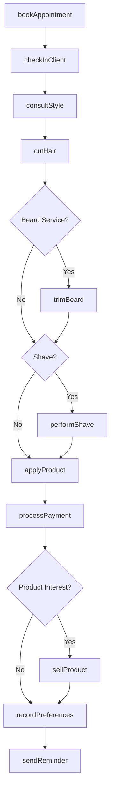
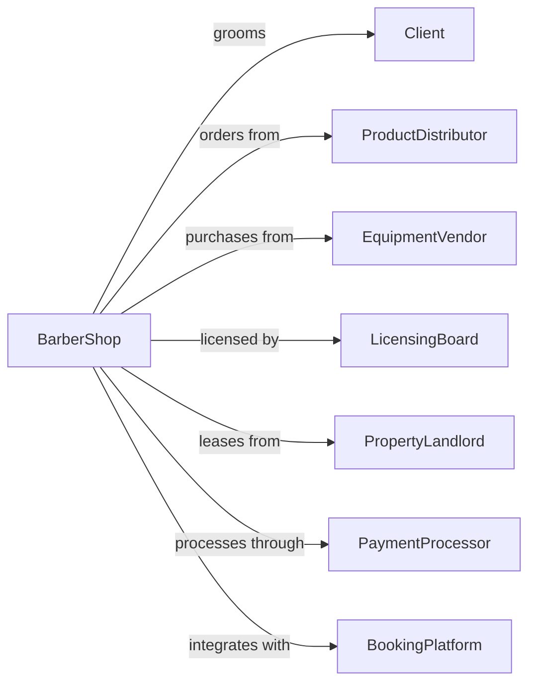

# Barber Shops

> Business-as-Code definition for barber shop operations. Models men's grooming services including haircuts, beard trims, and traditional barbering.

## Overview

Barber shops provide men's hair cutting, styling, beard trimming, and shaving services. This definition exposes actions for appointment scheduling, service delivery, and client management, with events for booking and searches for client preferences.

## Actors

| Actor | Description |
|-------|-------------|
| Client | Individual seeking grooming services |
| ProductDistributor | Supplies grooming products and tools |
| EquipmentVendor | Provides chairs, clippers, and shop equipment |
| LicensingBoard | Regulates barber licensing and shop compliance |
| PropertyLandlord | Provides shop space |
| PaymentProcessor | Handles credit card transactions |
| BookingPlatform | Provides online appointment scheduling |

## Roles

| Role | Description |
|------|-------------|
| ShopOwner | Owns and operates the barber shop |
| MasterBarber | Licensed barber with advanced skills |
| JuniorBarber | Apprentice or newer barber |
| Receptionist | Manages appointments and greets clients |
| ShoeShiner | Provides complementary shoe shine services |

## Entities

| Entity | Description |
|--------|-------------|
| Client | Customer receiving grooming services |
| Appointment | Scheduled time slot for service |
| Haircut | Hair cutting service |
| BeardTrim | Facial hair grooming service |
| Shave | Traditional straight razor shave |
| Style | Specific haircut or beard style |
| Product | Pomade, gel, aftershave, and other items |
| Station | Barber chair and work area |
| Tip | Gratuity for service |
| Membership | Subscription for regular services |

## Actions

| Action | Description |
|--------|-------------|
| bookAppointment | Schedule time slot for service |
| checkInClient | Record client arrival |
| consultStyle | Discuss desired haircut or style |
| cutHair | Perform haircut with clippers and scissors |
| trimBeard | Shape and groom facial hair |
| performShave | Execute straight razor shave |
| applyProduct | Style with pomade, gel, or oil |
| processPayment | Collect payment and tip |
| sellProduct | Retail grooming products to client |
| recordPreferences | Save client style notes |
| sendReminder | Notify client of upcoming appointment |
| enrollMembership | Sign up client for subscription |

## Events

| Event | Description |
|-------|-------------|
| appointmentBooked | Time slot has been reserved |
| clientCheckedIn | Client has arrived |
| consultationCompleted | Style has been discussed |
| haircutCompleted | Hair cutting is finished |
| beardTrimCompleted | Beard grooming is finished |
| shaveCompleted | Straight razor shave is finished |
| serviceCompleted | All requested services are done |
| paymentProcessed | Payment has been collected |
| productSold | Retail item has been purchased |
| membershipEnrolled | Subscription has been activated |

## Searches

| Search | Description |
|--------|-------------|
| getClientHistory | Retrieve previous services and preferences |
| findAvailableSlots | Check appointment availability |
| getBarberSchedule | View barber appointments and availability |
| searchClientNotes | Find saved style preferences |
| getRevenueReport | Retrieve sales and tip data |
| findMembershipStatus | Check client subscription status |

## Workflow



## Actor Relationships



## Usage

### Calling Actions

```typescript
import { groomHair } from '@headlessly/groom-hair'

const shop = groomHair()

// Book an appointment
const appointment = await shop.bookAppointment({
  clientId: 'client-123',
  barberId: 'barber-456',
  services: ['haircut', 'beardTrim'],
  date: '2024-03-15',
  time: '14:00'
})

// Perform haircut
await shop.cutHair({
  appointmentId: appointment.id,
  style: 'fade',
  guardLength: 1,
  topLength: '2 inches',
  lineUp: true
})

// Trim beard
await shop.trimBeard({
  appointmentId: appointment.id,
  style: 'shaped',
  lineUp: true,
  oilFinish: true
})
```

### Event-Driven Automation

```typescript
// Auto-send booking confirmation
shop.appointmentBooked(async ({ appointmentId, clientId, dateTime }) => {
  await shop.notifyClient({
    clientId,
    message: `Your appointment is confirmed for ${dateTime}. See you then!`
  })
})

// Schedule next appointment reminder
shop.serviceCompleted(async ({ appointmentId, clientId }) => {
  const client = await shop.getClient(clientId)
  const nextDate = addWeeks(new Date(), client.preferredInterval || 3)
  await shop.sendReminder({
    clientId,
    triggerDate: addDays(nextDate, -2),
    message: `Time for a fresh cut! Book your next appointment.`
  })
})
```
