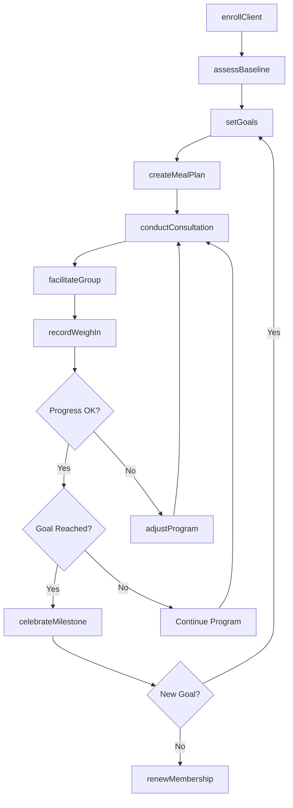
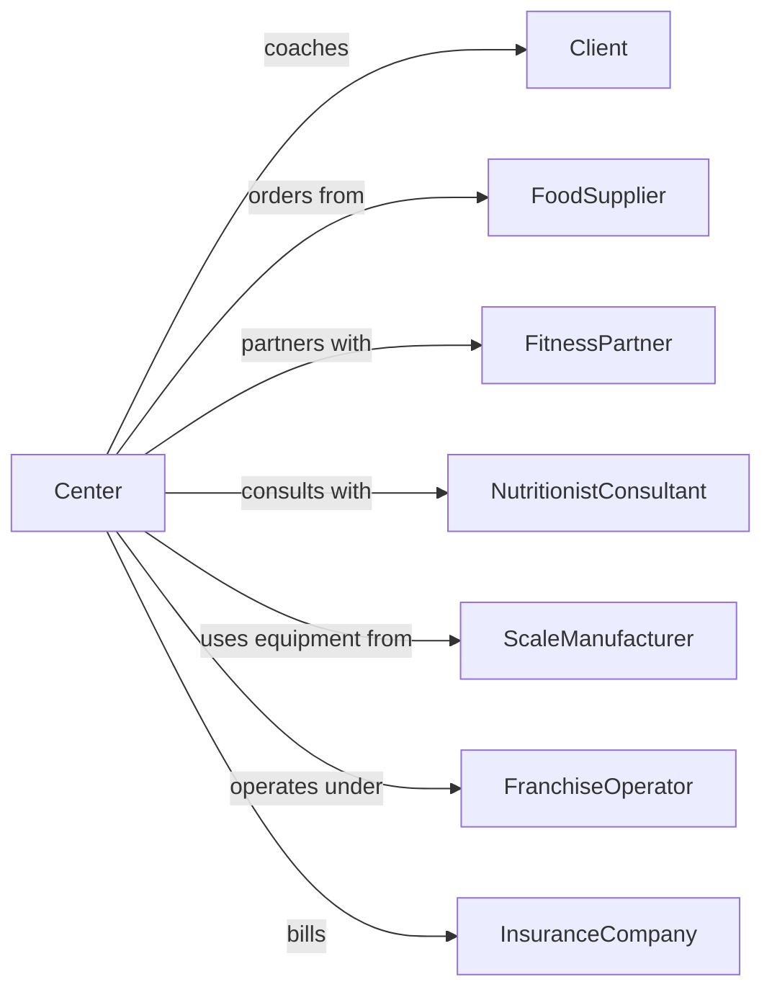

# Diet and Weight Reducing Centers

> Business-as-Code definition for weight loss center operations. Models non-medical weight management programs including counseling, meal planning, and progress tracking.

## Overview

Diet and weight reducing centers provide non-medical weight management services including individual and group counseling, meal planning, exercise guidance, and progress monitoring. This definition exposes actions for client enrollment, program customization, and progress tracking, with events for milestone achievements and searches for program options.

## Actors

| Actor | Description |
|-------|-------------|
| Client | Individual seeking weight management services |
| FoodSupplier | Provides branded meal replacements and supplements |
| FitnessPartner | Gyms and studios offering exercise components |
| NutritionistConsultant | Provides expert dietary guidance |
| ScaleManufacturer | Supplies body composition analysis equipment |
| FranchiseOperator | Provides brand standards and program materials |
| InsuranceCompany | May cover weight management programs |

## Roles

| Role | Description |
|------|-------------|
| CenterManager | Oversees center operations and staff |
| WeightLossConsultant | Provides one-on-one client support |
| GroupLeader | Facilitates group meetings and weigh-ins |
| NutritionCoach | Develops meal plans and dietary guidance |
| SalesAdvisor | Enrolls new members and sells products |

## Entities

| Entity | Description |
|--------|-------------|
| Client | Member enrolled in weight management program |
| Program | Structured weight loss plan with phases |
| Consultation | Individual meeting with consultant |
| GroupMeeting | Weekly group session for support |
| MealPlan | Customized daily eating plan |
| WeighIn | Recorded weight measurement |
| Supplement | Vitamins, shakes, or meal replacements |
| Goal | Target weight or body composition |
| Progress | Tracked metrics over time |
| Membership | Subscription to program services |

## Actions

| Action | Description |
|--------|-------------|
| enrollClient | Sign up new client for program |
| assessBaseline | Record initial weight and measurements |
| setGoals | Define target weight and timeline |
| createMealPlan | Develop customized eating plan |
| conductConsultation | Meet one-on-one with client |
| facilitateGroup | Lead group meeting and discussion |
| recordWeighIn | Document current weight |
| trackMeasurements | Record body measurements |
| adjustProgram | Modify plan based on progress |
| sellProducts | Sell meal replacements and supplements |
| celebrateMilestone | Acknowledge achievement of goal |
| renewMembership | Extend client subscription |

## Events

| Event | Description |
|-------|-------------|
| clientEnrolled | New client has joined program |
| baselineAssessed | Initial measurements have been recorded |
| goalsSet | Target weight has been defined |
| mealPlanCreated | Customized plan has been developed |
| consultationCompleted | One-on-one meeting has occurred |
| groupMeetingHeld | Weekly session has been conducted |
| weighInRecorded | Weight has been documented |
| milestoneReached | Client has achieved a goal |
| programAdjusted | Plan has been modified |
| membershipRenewed | Subscription has been extended |

## Searches

| Search | Description |
|--------|-------------|
| getClientProgress | Retrieve weight and measurement history |
| findProgramOptions | Search available weight loss plans |
| getGroupSchedule | View upcoming group meeting times |
| searchMealPlans | Browse meal plan templates |
| findConsultantAvailability | Check consultant schedules |
| getMilestoneHistory | Retrieve client achievements |

## Workflow



## Actor Relationships



## Usage

### Calling Actions

```typescript
import { coachWeightLoss } from '@headlessly/coach-weight-loss'

const center = coachWeightLoss()

// Enroll new client
const enrollment = await center.enrollClient({
  name: 'Jane Smith',
  email: 'jane@example.com',
  programType: 'comprehensive',
  startDate: '2024-03-15'
})

// Assess baseline measurements
const baseline = await center.assessBaseline({
  clientId: enrollment.clientId,
  weight: 185,
  height: 65,
  measurements: {
    waist: 36,
    hips: 42,
    chest: 40
  },
  bodyFatPercentage: 32
})

// Set weight loss goals
await center.setGoals({
  clientId: enrollment.clientId,
  targetWeight: 155,
  weeklyGoal: 1.5,
  targetDate: '2024-08-15'
})
```

### Event-Driven Automation

```typescript
// Welcome new client with orientation materials
center.clientEnrolled(async ({ clientId, programType }) => {
  await center.sendWelcomePackage({
    clientId,
    materials: ['programGuide', 'mealPlanningKit', 'journalTemplates']
  })
})

// Celebrate milestone achievements
center.milestoneReached(async ({ clientId, milestone, totalLost }) => {
  await center.celebrateMilestone({
    clientId,
    milestone,
    reward: milestone >= 25 ? 'goldStar' : 'silverStar',
    message: `Congratulations! You've lost ${totalLost} pounds!`
  })
})

// Prompt program adjustment when plateauing
center.weighInRecorded(async ({ clientId, weight, previousWeights }) => {
  const recentTrend = calculateTrend(previousWeights.slice(-4))
  if (recentTrend === 'plateau') {
    await center.scheduleConsultation({
      clientId,
      reason: 'plateauReview',
      priority: 'high'
    })
  }
})
```
