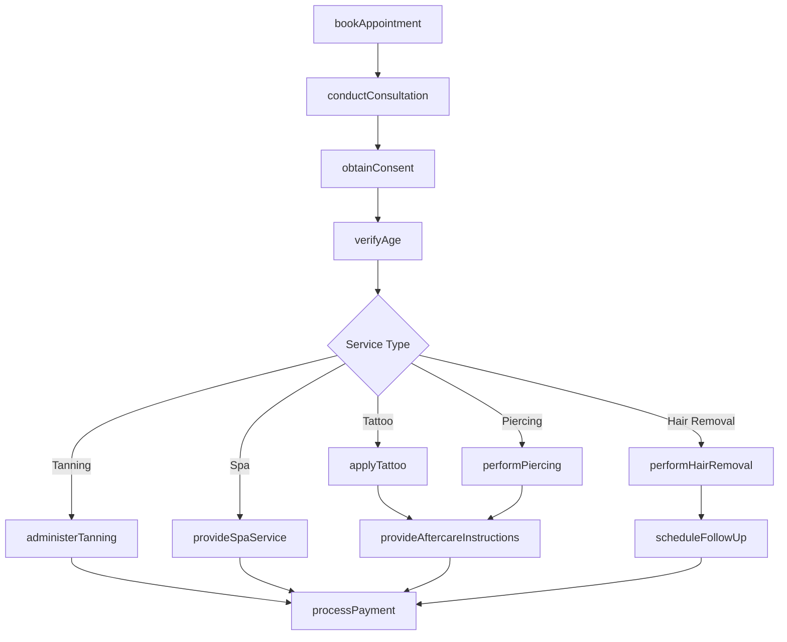
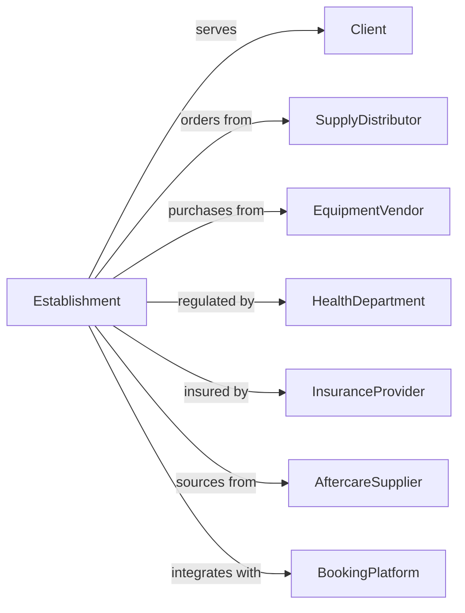

# Other Personal Care Services

> Business-as-Code definition for miscellaneous personal care services. Models day spas, tanning salons, tattoo parlors, piercing studios, and related services.

## Overview

This industry includes day spas, tanning salons, tattoo parlors, piercing studios, hair removal services, steam baths, and other personal care establishments. This definition exposes actions for service delivery, appointment management, and aftercare, with events for booking and searches for service options.

## Actors

| Actor | Description |
|-------|-------------|
| Client | Individual seeking personal care services |
| SupplyDistributor | Provides inks, equipment, and supplies |
| EquipmentVendor | Supplies tanning beds, laser equipment |
| HealthDepartment | Regulates sanitation and safety compliance |
| InsuranceProvider | Covers liability for services |
| AftercareSupplier | Provides healing products and supplies |
| BookingPlatform | Provides online appointment scheduling |

## Roles

| Role | Description |
|------|-------------|
| BusinessOwner | Owns and operates the establishment |
| TattooArtist | Designs and applies tattoos |
| Piercer | Performs body piercings |
| Esthetician | Provides spa and skincare services |
| TanningConsultant | Advises on tanning sessions |
| ElectrologistTech | Performs hair removal services |

## Entities

| Entity | Description |
|--------|-------------|
| Client | Customer receiving services |
| Appointment | Scheduled time slot for service |
| Tattoo | Permanent body art design |
| Piercing | Body modification with jewelry |
| TanningSession | UV or spray tan application |
| SpaService | Massage, body wrap, or treatment |
| HairRemoval | Laser or electrolysis treatment |
| Design | Custom artwork for tattoo |
| Jewelry | Piercing hardware |
| ConsentForm | Required legal documentation |

## Actions

| Action | Description |
|--------|-------------|
| bookAppointment | Schedule time slot for service |
| conductConsultation | Discuss desired service and options |
| obtainConsent | Collect signed consent documentation |
| verifyAge | Confirm client meets age requirements |
| applyTattoo | Execute tattoo application |
| performPiercing | Insert piercing jewelry |
| administerTanning | Conduct tanning session |
| provideSpaService | Execute spa treatment |
| performHairRemoval | Apply laser or electrolysis |
| provideAftercareInstructions | Educate on healing and care |
| processPayment | Collect payment for services |
| scheduleFollowUp | Book touch-up or follow-up appointment |

## Events

| Event | Description |
|-------|-------------|
| appointmentBooked | Time slot has been reserved |
| consultationCompleted | Service options have been discussed |
| consentObtained | Legal documentation has been signed |
| tattooCompleted | Tattoo application is finished |
| piercingCompleted | Piercing has been inserted |
| tanningCompleted | Tanning session is finished |
| spaServiceCompleted | Spa treatment is finished |
| hairRemovalCompleted | Treatment session is finished |
| aftercareProvided | Healing instructions have been given |
| paymentProcessed | Payment has been collected |
| followUpScheduled | Next appointment has been booked |

## Searches

| Search | Description |
|--------|-------------|
| getClientHistory | Retrieve previous services and notes |
| findAvailableSlots | Check appointment availability |
| browseDesignPortfolio | View tattoo design gallery |
| searchJewelryOptions | Find available piercing jewelry |
| getTanningPackages | View tanning session options |
| findSpaServices | Browse spa treatment menu |

## Workflow



## Actor Relationships



## Usage

### Calling Actions

```typescript
import { providePersonalCare } from '@headlessly/provide-personal-care'

const studio = providePersonalCare()

// Book tattoo appointment
const appointment = await studio.bookAppointment({
  clientId: 'client-123',
  serviceType: 'tattoo',
  artistId: 'artist-456',
  date: '2024-03-20',
  estimatedDuration: '3 hours'
})

// Conduct consultation and obtain consent
await studio.conductConsultation({
  appointmentId: appointment.id,
  designDiscussion: true,
  placementConfirmed: 'upper arm',
  sizeApproved: '6 inches'
})

await studio.obtainConsent({
  appointmentId: appointment.id,
  consentType: 'tattoo',
  ageVerified: true,
  medicalQuestionsReviewed: true
})

// Apply tattoo
await studio.applyTattoo({
  appointmentId: appointment.id,
  design: 'customFloral',
  inkColors: ['black', 'red', 'green'],
  placement: 'upperArm',
  actualDuration: '2.5 hours'
})
```

### Event-Driven Automation

```typescript
// Send aftercare reminders
studio.tattooCompleted(async ({ appointmentId, clientId }) => {
  await studio.sendAftercareReminders({
    clientId,
    schedule: [
      { day: 1, message: 'Remove bandage and wash gently with fragrance-free soap.' },
      { day: 3, message: 'Apply thin layer of aftercare ointment twice daily.' },
      { day: 7, message: 'Continue moisturizing. Avoid sun exposure.' }
    ]
  })
})

// Schedule touch-up for tattoos
studio.aftercareProvided(async ({ appointmentId, serviceType }) => {
  if (serviceType === 'tattoo') {
    const appointment = await studio.getAppointment(appointmentId)
    await studio.scheduleFollowUp({
      clientId: appointment.clientId,
      serviceType: 'touchUp',
      suggestedDate: addWeeks(new Date(), 6),
      message: 'Schedule your free touch-up if needed.'
    })
  }
})
```
