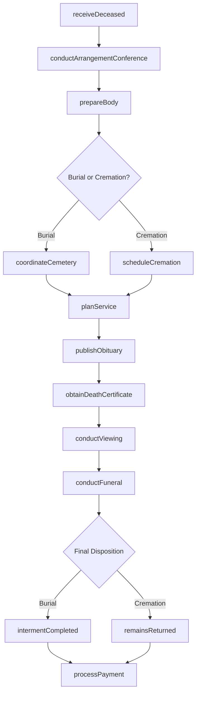
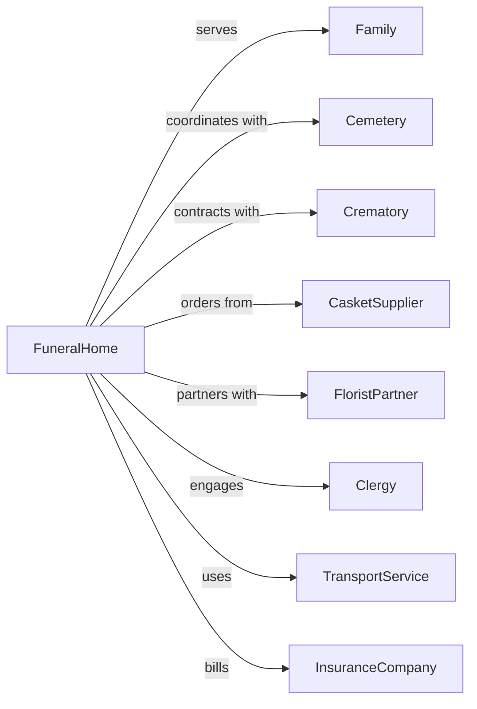

# Funeral Homes and Funeral Services

> Business-as-Code definition for funeral home operations. Models death care services including body preparation, funeral arrangements, and memorial services.

## Overview

Funeral homes provide services for preparing the deceased for burial or cremation, conducting funeral and memorial services, and selling caskets and related merchandise. This definition exposes actions for arrangement conferences, body preparation, and service coordination, with events for service milestones and searches for merchandise and service options.

## Actors

| Actor | Description |
|-------|-------------|
| Family | Surviving family members arranging services |
| Cemetery | Burial site receiving the deceased |
| Crematory | Facility for cremation services |
| CasketSupplier | Provides caskets, urns, and merchandise |
| FloristPartner | Provides flower arrangements |
| Clergy | Officiates funeral and memorial services |
| TransportService | Provides hearse and limousine services |
| InsuranceCompany | Processes pre-need and at-need claims |

## Roles

| Role | Description |
|------|-------------|
| FuneralDirector | Licensed professional overseeing all services |
| Embalmer | Prepares and preserves the deceased |
| ArrangementCounselor | Meets with families to plan services |
| AttendantStaff | Assists during viewings and services |
| OfficeManager | Handles administrative and billing functions |
| DriverAttendant | Operates vehicles and assists with transport |

## Entities

| Entity | Description |
|--------|-------------|
| Deceased | The individual who has passed |
| Family | Surviving relatives making arrangements |
| ArrangementConference | Meeting to plan funeral services |
| FuneralService | Formal ceremony honoring the deceased |
| Viewing | Visitation period for mourners |
| Casket | Container for burial |
| Urn | Container for cremated remains |
| Obituary | Death notice and biography |
| DeathCertificate | Official death documentation |
| PreNeedContract | Pre-arranged funeral plan |

## Actions

| Action | Description |
|--------|-------------|
| receiveDeceased | Accept transfer of remains to funeral home |
| conductArrangementConference | Meet with family to plan services |
| prepareBody | Embalm, dress, and casket the deceased |
| coordinateCemetery | Arrange burial plot and interment |
| scheduleCremation | Arrange cremation with crematory |
| planService | Organize funeral ceremony details |
| publishObituary | Submit death notice to publications |
| obtainDeathCertificate | Secure official death documentation |
| conductViewing | Host visitation for mourners |
| conductFuneral | Execute funeral ceremony |
| processPayment | Collect payment for services |
| fileInsuranceClaim | Submit claim for covered services |

## Events

| Event | Description |
|-------|-------------|
| deceasedReceived | Remains have been transferred to facility |
| arrangementCompleted | Service plans have been finalized |
| bodyPrepared | Deceased has been prepared for viewing |
| cemeteryCoordinated | Burial arrangements are confirmed |
| cremationScheduled | Cremation appointment is set |
| obituaryPublished | Death notice has been submitted |
| deathCertificateObtained | Official documentation is ready |
| viewingConducted | Visitation has taken place |
| funeralConducted | Ceremony has been completed |
| intermentCompleted | Burial or final disposition is finished |
| paymentProcessed | Payment has been received |

## Searches

| Search | Description |
|--------|-------------|
| findCasketOptions | Browse available caskets and prices |
| getServicePackages | View funeral service options |
| findCemeteryOptions | Search nearby cemeteries |
| getCrematorySchedule | Check cremation availability |
| searchFloralArrangements | Browse flower options |
| findPreNeedContracts | Retrieve pre-arranged plans |

## Workflow



## Actor Relationships



## Usage

### Calling Actions

```typescript
import { provideFuneralServices } from '@headlessly/provide-funeral-services'

const funeralHome = provideFuneralServices()

// Receive deceased and begin arrangements
const caseFile = await funeralHome.receiveDeceased({
  deceasedName: 'John Smith',
  dateOfDeath: '2024-03-10',
  nextOfKin: 'Mary Smith',
  transferFrom: 'General Hospital'
})

// Conduct arrangement conference
const arrangements = await funeralHome.conductArrangementConference({
  caseId: caseFile.id,
  familyContact: 'Mary Smith',
  servicePreferences: {
    type: 'traditional',
    viewing: true,
    religiousService: true,
    disposition: 'burial'
  }
})

// Plan funeral service
await funeralHome.planService({
  caseId: caseFile.id,
  serviceDate: '2024-03-15',
  serviceTime: '11:00',
  officiant: 'Rev. Thomas Brown',
  music: ['Amazing Grace', 'How Great Thou Art'],
  readings: ['Psalm 23', 'John 14:1-6']
})
```

### Event-Driven Automation

```typescript
// Auto-coordinate cemetery when burial selected
funeralHome.arrangementCompleted(async ({ caseId, disposition }) => {
  if (disposition === 'burial') {
    const arrangements = await funeralHome.getArrangements(caseId)
    await funeralHome.coordinateCemetery({
      caseId,
      cemetery: arrangements.cemeterySelection,
      intermentDate: arrangements.serviceDate,
      graveSite: arrangements.plotNumber
    })
  }
})

// Send thank you to family after services
funeralHome.intermentCompleted(async ({ caseId }) => {
  const caseFile = await funeralHome.getCase(caseId)
  await funeralHome.sendCondolences({
    familyContact: caseFile.nextOfKin,
    message: 'Thank you for trusting us during this difficult time. We are here if you need anything.'
  })
})
```
