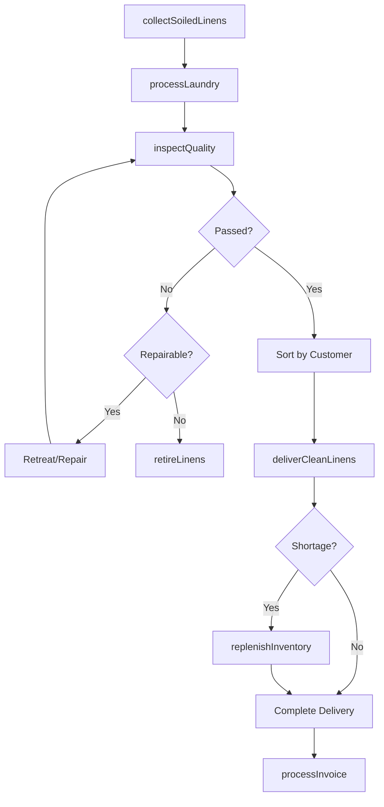
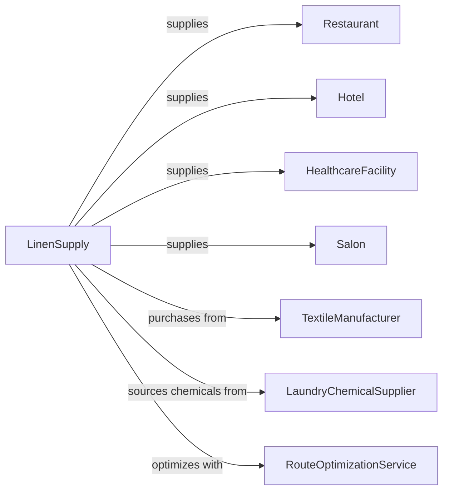

# Linen Supply

> Business-as-Code definition for commercial linen supply operations. Models rental and laundering of table linens, bed linens, towels, and uniforms.

## Overview

Linen supply companies provide rental and laundering services for commercial textiles including table and bed linens, towels, uniforms, and healthcare garments. This definition exposes actions for inventory management, route delivery, and laundering operations, with events for service tracking and searches for product availability.

## Actors

| Actor | Description |
|-------|-------------|
| Restaurant | Hospitality customer needing table linens |
| Hotel | Lodging customer needing bed and bath linens |
| HealthcareFacility | Medical customer needing gowns and scrubs |
| Salon | Beauty business needing towels and capes |
| TextileManufacturer | Supplies new linen inventory |
| LaundryChemicalSupplier | Provides detergents and sanitizers |
| RouteOptimizationService | Optimizes delivery routes |

## Roles

| Role | Description |
|------|-------------|
| BranchManager | Oversees local operations |
| RouteDriver | Delivers clean linens and collects soiled |
| PlantWorker | Processes laundry at the facility |
| SalesRep | Acquires new accounts |
| InventoryManager | Tracks linen stock and replacement |
| QualityInspector | Ensures laundering standards |

## Entities

| Entity | Description |
|--------|-------------|
| Linen | Textile item in rental inventory |
| TableLinen | Tablecloths and napkins |
| BedLinen | Sheets, pillowcases, and blankets |
| Towel | Bath and hand towels |
| Uniform | Work garments for rental |
| Route | Delivery schedule and customer stops |
| SoiledBin | Container for dirty linens |
| CleanStock | Laundered items ready for delivery |
| RentalAgreement | Contract for linen supply services |
| Par | Standard inventory level per customer |

## Actions

| Action | Description |
|--------|-------------|
| deliverCleanLinens | Drop off laundered items to customer |
| collectSoiledLinens | Pick up dirty items from customer |
| processLaundry | Wash, dry, and fold linens |
| inspectQuality | Check for stains, tears, and wear |
| replenishInventory | Add new linens to replace worn items |
| adjustPar | Modify standard inventory levels |
| createRoute | Design delivery schedules |
| onboardCustomer | Set up new account |
| processInvoice | Bill for rental services |
| handleShortage | Address customer inventory issues |
| retireLinens | Remove worn items from circulation |
| trackInventory | Monitor linen counts and locations |

## Events

| Event | Description |
|-------|-------------|
| linensDelivered | Clean items have been dropped off |
| linensCollected | Soiled items have been picked up |
| laundryProcessed | Items have been cleaned |
| qualityPassed | Items have met standards |
| qualityFailed | Items need retreat or retirement |
| inventoryReplenished | New linens have been added |
| parAdjusted | Inventory levels have been changed |
| customerOnboarded | New account has been set up |
| invoiceProcessed | Billing has been completed |
| shortageReported | Customer reported missing items |

## Searches

| Search | Description |
|--------|-------------|
| getRouteSchedule | View delivery routes and times |
| checkInventoryLevels | Monitor linen stock by type |
| findCustomerPar | Retrieve standard levels for account |
| getUsageHistory | View customer usage patterns |
| searchRetiredLinens | Track items removed from service |
| findDeliveryStatus | Check route progress |

## Workflow



## Actor Relationships



## Usage

### Calling Actions

```typescript
import { supplyLinens } from '@headlessly/supply-linens'

const supplier = supplyLinens()

// Onboard new restaurant customer
const account = await supplier.onboardCustomer({
  businessName: 'Fine Dining Restaurant',
  businessType: 'restaurant',
  address: '123 Main Street',
  deliveryDays: ['monday', 'thursday'],
  parLevels: {
    tablecloths: 50,
    napkins: 200,
    barTowels: 30
  }
})

// Deliver clean linens
await supplier.deliverCleanLinens({
  customerId: account.id,
  routeId: 'route-mon-1',
  items: {
    tablecloths: 25,
    napkins: 100,
    barTowels: 15
  }
})

// Collect soiled linens
await supplier.collectSoiledLinens({
  customerId: account.id,
  routeId: 'route-mon-1',
  items: {
    tablecloths: 22,
    napkins: 95,
    barTowels: 15
  }
})
```

### Event-Driven Automation

```typescript
// Auto-replenish when shortage detected
supplier.shortageReported(async ({ customerId, itemType, shortageAmount }) => {
  await supplier.replenishInventory({
    customerId,
    itemType,
    quantity: shortageAmount,
    expedited: true
  })
})

// Alert quality team for failed items
supplier.qualityFailed(async ({ batchId, failureType, quantity }) => {
  await supplier.alertQualityTeam({
    batchId,
    issue: failureType,
    itemCount: quantity,
    action: failureType === 'stain' ? 'retreat' : 'review'
  })
})

// Auto-invoice after delivery
supplier.linensDelivered(async ({ customerId, routeId, items }) => {
  await supplier.processInvoice({
    customerId,
    deliveryDate: new Date(),
    itemsDelivered: items,
    rentalPeriod: 'weekly'
  })
})
```
