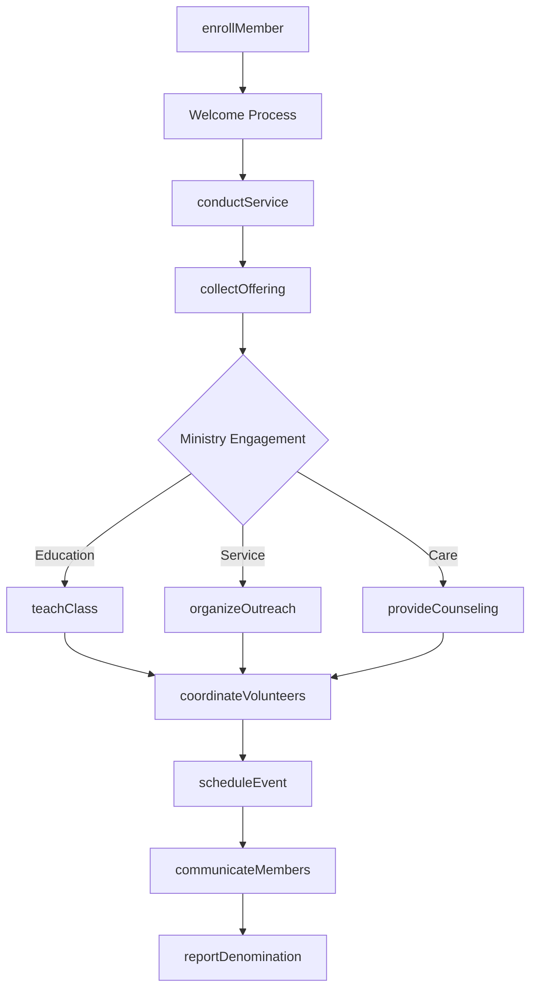
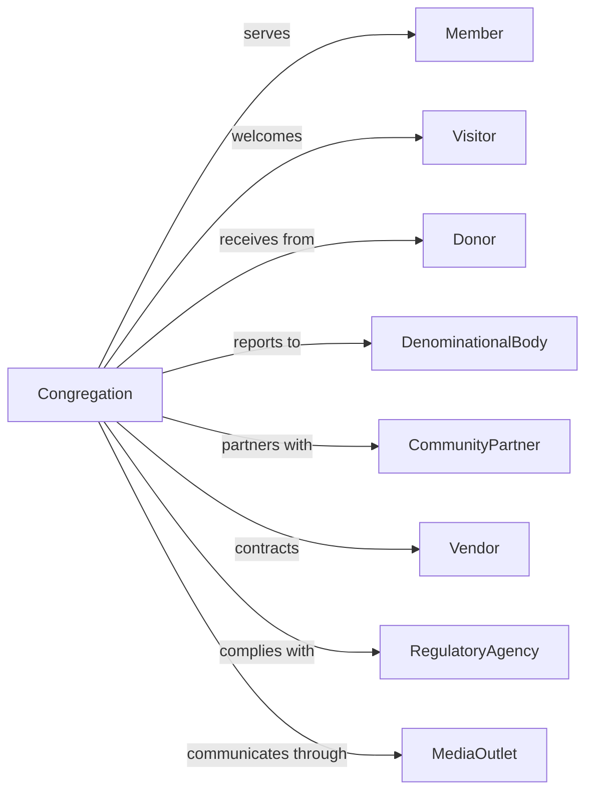

# Religious Organizations

> Business-as-Code definition for religious organization operations. Models churches, temples, mosques, synagogues, and other worship communities providing spiritual services, education, and community support.

## Overview

Religious organizations operate houses of worship and administer religious activities for their congregations and communities. Services include worship services, religious education, pastoral care, life cycle ceremonies, and community outreach. This definition exposes actions for worship programming, events for congregation management, and searches for membership and ministry coordination.

## Actors

| Actor | Description |
|-------|-------------|
| Member | Individual belonging to the congregation |
| Visitor | Guest attending services or events |
| Donor | Contributor of financial resources |
| DenominationalBody | Parent religious organization |
| CommunityPartner | Local organization for joint ministry |
| Vendor | Supplier of goods and services |
| RegulatoryAgency | Government body for tax and nonprofit status |
| MediaOutlet | Organization covering religious events |

## Roles

| Role | Description |
|------|-------------|
| SeniorClergy | Primary spiritual leader |
| AssociateClergy | Supporting religious leader |
| YouthMinister | Leads programs for children and teens |
| MusicDirector | Oversees worship music and choir |
| AdministrativeDirector | Manages business operations |
| EducationDirector | Coordinates religious education |
| FacilitiesManager | Maintains building and grounds |
| VolunteerCoordinator | Organizes congregation volunteers |

## Entities

| Entity | Description |
|--------|-------------|
| Member | Congregation participant record |
| Service | Worship gathering |
| Ceremony | Life cycle ritual (wedding, funeral, baptism) |
| Program | Ministry or educational offering |
| Donation | Financial contribution |
| Pledge | Committed giving promise |
| Facility | Building or space for activities |
| Volunteer | Unpaid service contributor |
| Committee | Governance or ministry group |
| Event | Scheduled gathering or activity |
| Budget | Financial plan |
| Communication | Newsletter or announcement |

## Actions

| Action | Description |
|--------|-------------|
| conductService | Lead worship gathering |
| enrollMember | Register new congregation member |
| performCeremony | Execute life cycle ritual |
| teachClass | Deliver religious education |
| provideCounseling | Offer pastoral care |
| organizeOutreach | Plan community service |
| collectOffering | Receive worship contributions |
| managePledge | Track giving commitments |
| scheduleEvent | Plan congregation activity |
| coordinateVolunteers | Organize service helpers |
| maintainFacility | Care for buildings and grounds |
| communicateMembers | Share news and announcements |
| reportDenomination | Submit to parent body |
| planBudget | Develop financial plan |

## Events

| Event | Description |
|-------|-------------|
| serviceCompleted | Worship gathering concluded |
| memberEnrolled | New participant registered |
| ceremonyPerformed | Life cycle ritual executed |
| classCompleted | Education session finished |
| counselingProvided | Pastoral care given |
| outreachOrganized | Community service held |
| offeringCollected | Contributions received |
| pledgeMade | Giving commitment recorded |
| eventScheduled | Activity planned |
| volunteersCoordinated | Helpers organized |
| facilityMaintained | Building care completed |
| membersCommunicated | News distributed |
| denominationReported | Report submitted |
| budgetApproved | Financial plan adopted |

## Searches

| Search | Description |
|--------|-------------|
| findMembers | List congregation participants |
| getServices | View worship schedule |
| findCeremonies | List upcoming rituals |
| getPrograms | View ministry offerings |
| findDonations | List contributions |
| getVolunteers | View service helpers |
| getEvents | Retrieve scheduled activities |
| getBudgetStatus | Check financial position |

## Workflow



## Actor Relationships



## Usage

### Calling Actions

```typescript
import { worshipFaith } from '@headlessly/worship-faith'

const congregation = worshipFaith()

// Enroll new member
const member = await congregation.enrollMember({
  name: 'Sarah Johnson',
  familyMembers: ['Michael Johnson', 'Emma Johnson'],
  joinDate: '2024-04-07',
  previousChurch: 'First Baptist',
  ministryInterests: ['youthGroup', 'outreach']
})

// Schedule worship service
const service = await congregation.conductService({
  type: 'sundayMorning',
  date: '2024-04-14',
  theme: 'Easter Celebration',
  clergy: 'pastor-001',
  musicSelections: ['hymn-123', 'hymn-456'],
  specialElements: ['choir', 'communion']
})

// Perform ceremony
await congregation.performCeremony({
  type: 'wedding',
  participants: ['bride-id', 'groom-id'],
  date: '2024-06-15',
  officiant: 'pastor-001',
  location: 'mainSanctuary',
  reception: true
})
```

### Event-Driven Automation

```typescript
// Welcome new members
congregation.memberEnrolled(async ({ memberId, name, ministryInterests }) => {
  await congregation.communicateMembers({
    recipients: [memberId],
    type: 'welcomePackage',
    content: generateWelcomeMaterials(ministryInterests)
  })

  await congregation.scheduleEvent({
    type: 'newMemberOrientation',
    invitees: [memberId],
    date: getNextOrientationDate()
  })
})

// Track pledge fulfillment
congregation.monthEnd(async ({ month, year }) => {
  const pledges = await congregation.findPledges({ status: 'active' })

  for (const pledge of pledges) {
    const payments = await congregation.findDonations({
      memberId: pledge.memberId,
      month,
      year
    })

    if (payments.total < pledge.monthlyAmount) {
      await congregation.communicateMembers({
        recipients: [pledge.memberId],
        type: 'pledgeReminder',
        tone: 'gentle'
      })
    }
  }
})
```

## Related

- [Grantmaking Foundations](../8132-GrantmakingAndGivingServices/813211-GrantmakingFoundations.mdx)
- [Civic and Social Organizations](../8134-CivicAndSocialOrganizations/813410-CivicAndSocialOrganizations.mdx)
