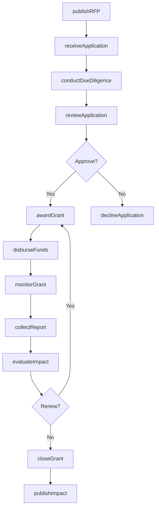
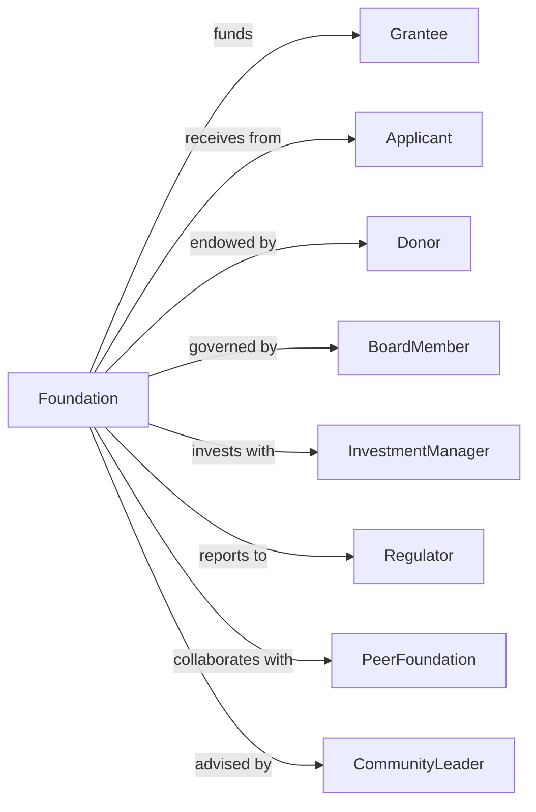

# Grantmaking Foundations

> Business-as-Code definition for grantmaking foundation operations. Models private foundations, community foundations, and charitable trusts that award grants to nonprofit organizations and individuals.

## Overview

Grantmaking foundations award grants from endowment or trust fund assets to support charitable, educational, scientific, and cultural activities. This includes private family foundations, community foundations, corporate foundations, and scholarship trusts. This definition exposes actions for grant program management, events for application tracking, and searches for portfolio and impact reporting.

## Actors

| Actor | Description |
|-------|-------------|
| Grantee | Organization or individual receiving funding |
| Applicant | Entity seeking grant funding |
| Donor | Contributor to foundation assets |
| BoardMember | Governance and grant decision maker |
| InvestmentManager | Oversees endowment investments |
| Regulator | IRS and state nonprofit oversight |
| PeerFoundation | Collaborating funder |
| CommunityLeader | Advisor on local needs |

## Roles

| Role | Description |
|------|-------------|
| ExecutiveDirector | Leads foundation operations |
| ProgramOfficer | Manages grant portfolios |
| GrantsManager | Administers application process |
| FinanceDirector | Oversees investments and disbursements |
| CommunicationsManager | Handles external relations |
| ComplianceOfficer | Ensures regulatory compliance |
| ResearchAnalyst | Evaluates proposals and impact |
| AdministrativeAssistant | Supports operations |

## Entities

| Entity | Description |
|--------|-------------|
| Grant | Funding award |
| Application | Request for funding |
| Grantee | Recipient organization record |
| Program | Focus area for funding |
| Endowment | Investment asset pool |
| Disbursement | Payment to grantee |
| Report | Grantee progress documentation |
| RFP | Request for proposals |
| DueDiligence | Applicant vetting record |
| ImpactMetric | Outcome measurement |
| Budget | Financial allocation plan |
| Form990PF | IRS reporting document |

## Actions

| Action | Description |
|--------|-------------|
| publishRFP | Release request for proposals |
| receiveApplication | Accept funding request |
| conductDueDiligence | Vet applicant organization |
| reviewApplication | Evaluate funding request |
| awardGrant | Approve and commit funding |
| disburseFunds | Transfer money to grantee |
| monitorGrant | Track grantee progress |
| collectReport | Receive grantee documentation |
| evaluateImpact | Assess grant outcomes |
| declineApplication | Reject funding request |
| manageEndowment | Oversee investment assets |
| file990PF | Submit IRS reporting |
| conveneGrantees | Gather recipients for learning |
| publishImpact | Share foundation results |

## Events

| Event | Description |
|-------|-------------|
| rfpPublished | Funding opportunity announced |
| applicationReceived | Request submitted |
| dueDiligenceCompleted | Vetting finished |
| applicationReviewed | Evaluation completed |
| grantAwarded | Funding approved |
| fundsDisbursed | Payment transferred |
| grantMonitored | Progress tracked |
| reportCollected | Documentation received |
| impactEvaluated | Outcomes assessed |
| applicationDeclined | Request rejected |
| endowmentReviewed | Investments assessed |
| form990PFFiled | IRS report submitted |
| granteesConvened | Learning gathering held |
| impactPublished | Results shared publicly |

## Searches

| Search | Description |
|--------|-------------|
| findApplications | List funding requests |
| getGrants | View active awards |
| findGrantees | List recipient organizations |
| getPrograms | View funding focus areas |
| getDisbursements | Track payment history |
| findReports | List grantee documentation |
| getEndowmentStatus | View investment position |
| getImpactMetrics | Retrieve outcome data |

## Workflow



## Actor Relationships



## Usage

### Calling Actions

```typescript
import { grantCauses } from '@headlessly/grant-causes'

const foundation = grantCauses()

// Publish request for proposals
const rfp = await foundation.publishRFP({
  program: 'educationEquity',
  focusAreas: ['earlyChildhood', 'stemAccess', 'collegeReadiness'],
  fundingRange: { min: 25000, max: 100000 },
  deadline: '2024-06-30',
  eligibility: ['501c3', 'publicSchool']
})

// Review application
const review = await foundation.reviewApplication({
  applicationId: 'app-789',
  reviewer: 'po-001',
  scores: {
    alignment: 4.5,
    capacity: 4.0,
    sustainability: 3.5,
    impact: 4.2
  },
  recommendation: 'fund',
  suggestedAmount: 75000
})

// Award grant
await foundation.awardGrant({
  applicationId: 'app-789',
  amount: 75000,
  duration: '12-months',
  paymentSchedule: 'quarterly',
  reportingRequirements: ['interim', 'final'],
  conditions: ['matchingFunds']
})
```

### Event-Driven Automation

```typescript
// Schedule disbursement on grant award
foundation.grantAwarded(async ({ grantId, amount, paymentSchedule }) => {
  const schedule = generatePaymentSchedule(amount, paymentSchedule)

  for (const payment of schedule) {
    await foundation.scheduleDisbursement({
      grantId,
      amount: payment.amount,
      date: payment.date
    })
  }

  await notifyGrantee({
    grantId,
    status: 'awarded',
    firstPayment: schedule[0].date
  })
})

// Request report before next disbursement
foundation.disbursementApproaching(async ({ grantId, disbursementId, dueDate }) => {
  const grant = await foundation.getGrant(grantId)
  const reports = await foundation.findReports({ grantId })

  if (needsReport(grant, reports)) {
    await foundation.requestReport({
      grantId,
      type: 'interim',
      dueDate: addDays(dueDate, -14)
    })
  }
})
```

## Related

- [Voluntary Health Organizations](./813212-VoluntaryHealthOrganizations.mdx)
- [Other Grantmaking and Giving Services](./813219-OtherGrantmakingAndGivingServices.mdx)
