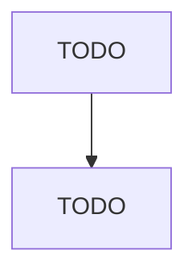

# Grantmaking Foundations

> TODO: Business-as-Code definition

## Overview

This U.S. industry comprises establishments known as grantmaking foundations or charitable trusts. Establishments in this industry award grants from trust funds based on a competitive selection process or the preferences of the foundation managers and grantors; or fund a single entity, such as a museum or university. Illustrative Examples: Community foundations Philanthropic trusts Corporate foundations, awarding grants Scholarship trusts Grantmaking foundations Cross-References.

## Actors

| Actor | Description |
|-------|-------------|
| TODO | TODO |

## Entities

| Entity | Description |
|--------|-------------|
| TODO | TODO |

## Actions

| Action | Description |
|--------|-------------|
| TODO | TODO |

## Events

| Event | Description |
|-------|-------------|
| TODO | TODO |

## Searches

| Search | Description |
|--------|-------------|
| TODO | TODO |

## Workflow

## Actor Relationships

